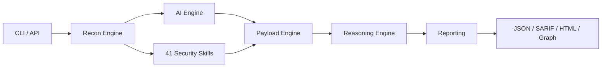

<div align="center">


# ⚔️ HunterX

**AI-Assisted Offensive Security Framework — Observe · Hypothesize · Probe · Verify**

HunterX is an AI-assisted offensive security framework that combines intelligent reconnaissance, adaptive vulnerability discovery, payload orchestration, and explainable security reasoning into a single modular platform.

[](https://github.com/nullc0d30/HunterX/releases)
[](https://pypi.org/project/hunterx/)
[](https://python.org)
[](https://www.apache.org/licenses/LICENSE-2.0)
[](https://github.com/nullc0d30/HunterX/actions)
[](https://github.com/astral-sh/ruff)
[](https://hub.docker.com/r/nullc0d30/hunterx)
[](https://github.com/nullc0d30/HunterX)
[](https://pypi.org/project/hunterx/)

```bash
# One-shot scan
hunterx target.com

# AI-assisted full scan
hunterx scan https://target.com --ai --ai-model llama3.2

# List modules, run diagnostics, view reports
hunterx module list
hunterx doctor
hunterx report

# Start the REST API server
hunterx api --port 8443
```

[Install](#installation) ·
[Why HunterX?](#why-hunterx) ·
[Quick Start](#quick-start) ·
[CLI Reference](#cli-reference) ·
[Comparison](#comparison) ·
[Contributing](#contributing)

</div>

---

## Why HunterX?

Traditional vulnerability scanners rely on brute-force payload matching against known signatures. HunterX approaches security assessment differently — it reasons about what vulnerabilities *might* exist before probing, then verifies with evidence.

**Who should use HunterX?**

Red team operators, penetration testers, bug bounty hunters, security researchers, and DevOps engineers who need an automated, context-aware security assessment platform with safety-by-design guardrails.

**How it works:**



**Key advantages:**

- **Reasoning-driven pipeline** — Observe, Hypothesize, Probe, Verify. HunterX builds a target baseline, forms hypotheses, executes targeted tests, and validates findings with confidence scoring.
- **AI-native integration** — The reasoning engine, skill planner, report generator, and detection pipeline all consume structured AI output. LLM analysis is optional but deeply integrated.
- **41 built-in security skills** — Covering web, API, cloud, network, authentication, and infrastructure security. Each skill carries MITRE ATT&CK, OWASP, CWE, and CAPEC metadata.
- **Multi-agent platform** — 10 specialized agents collaborate through event-driven communication with DAG-based workflows, checkpoint/resume, and isolated memory.
- **Payload Intelligence Platform** — SQLite + FTS5-indexed payload repository with 5-level safety policy, 10-family mutation engine, provenance tracking, and context-aware selection.
- **Enterprise reporting** — JSON, Markdown, SARIF 2.1 (VS Code / GitHub CodeQL), HTML, attack graphs, purple team detection rules, and ZIP evidence packages.
- **REST API** — FastAPI server with 40+ endpoints covering scanning, payload management, agent coordination, reasoning, skills, and system health.
- **Safety-by-design** — Non-bypassable destructive payload blocklist, WAF detection with auto-abort, configurable rate limiting, and policy-driven execution controls.
- **Single codebase, zero dependencies on external scanners** — Pure Python monorepo. No juggling separate tools or piping output between them.

---

## Comparison

HunterX complements existing security tools rather than replacing them. It fills the gap between signature-based scanners and manual penetration testing.

| Tool | Primary Function | AI/Reasoning | Multi-Agent | Payload Intelligence | Reporting |
|---|---|---|---|---|---|
| **HunterX** | AI-assisted vulnerability assessment | LLM-native (multi-provider) | 10 agents, DAG workflows | FTS5-indexed, 5-level policy | SARIF, HTML, graph, purple team |
| **Nmap** | Port scanning + service detection | — | — | — | XML |
| **Nuclei** | YAML template matching | — | — | — | JSON |
| **Metasploit** | Exploit delivery + post-exploitation | — | — | — | Console |
| **Amass** | Subdomain + ASN enumeration | — | — | — | JSON |
| **ffuf** | Fuzzing / wordlist brute-force | — | — | — | JSON |

**When to use HunterX:** Depth-oriented assessments where you need reasoning, context-aware payload selection, and explainable findings — not just a list of matched signatures.

---

## Installation

### Linux (All Distributions)

```bash
# System-wide (requires root)
curl -sSL https://raw.githubusercontent.com/nullc0d30/HunterX/main/install.sh | sudo bash

# User-local (no root)
curl -sSL https://raw.githubusercontent.com/nullc0d30/HunterX/main/install.sh | bash -s -- --user
```

The installer auto-detects your distribution, installs system dependencies, creates a Python virtual environment, and makes the `hunterx` command available globally with case-variant symlinks.

<details>
<summary><b>Per-distribution package details</b></summary>

| Distribution | System Packages | Install Command |
|---|---|---|
| **Ubuntu / Debian** | `python3 python3-pip python3-venv` | `sudo apt-get install -y python3 python3-pip python3-venv` |
| **Fedora / RHEL** | `python3 python3-pip python3-venv` | `sudo dnf install -y python3 python3-pip python3-venv` |
| **Arch** | `python python-pip` | `sudo pacman -S --noconfirm python python-pip` |
| **Alpine** | `python3 py3-pip` | `sudo apk add python3 py3-pip` |
| **openSUSE** | `python3 python3-pip python3-venv` | `sudo zypper install -y python3 python3-pip python3-venv` |

</details>

### pip / pipx

```bash
pip install hunterx
pipx install hunterx           # Isolated environment
pip install hunterx[all]       # With all optional extras
```

### Docker

```bash
docker pull nullc0d30/hunterx:latest
docker run --rm nullc0d30/hunterx:latest scan target.com
docker run --rm -p 8443:8443 nullc0d30/hunterx:latest api --port 8443
```

### From Source

```bash
git clone https://github.com/nullc0d30/HunterX.git
cd HunterX
pip install .
```

---

## Quick Start

```bash
# Scan a target with default settings
hunterx example.com

# Explicit scan with options
hunterx scan https://target.com --profile bounty --preset full

# List scan modules
hunterx module list

# Run diagnostics
hunterx doctor

# View reports
hunterx report

# Start API server
hunterx api --port 8443

# Show version
hunterx --version
```

<details>
<summary><b>Profiles & presets</b></summary>

```bash
hunterx scan target.com --profile internal   # Comprehensive
hunterx scan target.com --profile bounty     # Bug-bounty balanced
hunterx scan target.com --profile gov        # Strict compliance
hunterx scan target.com --preset quick       # Common vectors
hunterx scan target.com --preset full        # All skills
hunterx scan target.com --preset stealth     # Low noise
```

</details>

<details>
<summary><b>Authentication scanning</b></summary>

```bash
hunterx scan target.com --auth basic --username admin --password secret
hunterx scan target.com --auth bearer --token eyJhbGciOiJIUzI1NiIs...
hunterx scan target.com --auth cookie --cookie-file cookies.json
hunterx scan target.com --auth form --username admin --login-url https://target.com/login
```

</details>

<details>
<summary><b>AI-assisted scanning</b></summary>

```bash
hunterx scan target.com --ai --ai-model llama3.2   # Local Ollama
hunterx scan target.com --ai --ai-model gpt-4       # OpenAI
```

</details>

---

## CLI Reference

### Global Usage

```
hunterx [--help] [--version] [-v] [-q] <command> [options]
```

| Flag | Description |
|---|---|
| `--help` | Show help and exit |
| `--version` | Show version and exit |
| `-v`, `--verbose` | Verbose output (`-v`: INFO, `-vv`: DEBUG) |
| `-q`, `--quiet` | Errors only |

### Commands

| Command | Description |
|---|---|
| `scan` | Vulnerability scan against a target |
| `module` | List and search scan modules |
| `report` | View scan reports and system overview |
| `doctor` | Run system diagnostics |
| `config` | View configuration |
| `update` | Update payloads and modules |
| `api` | Start REST API server |
| `payload` | Payload Intelligence Platform |
| `agents` | Multi-agent platform management |
| `workflow` | Workflow management |
| `reasoning` | Reasoning engine interaction |
| `skills` | Security Skills Framework |
| `ai` | AI provider management |

### Scan Options

<details>
<summary><b>Target & execution</b></summary>

| Argument | Description | Default |
|---|---|---|
| `target` | Target URL or domain | Required |
| `-p`, `--payload-dir` | Payload directory | `payloads/` |
| `-o`, `--output-dir` | Output directory | `reports/` |
| `-c`, `--config` | YAML config file | `hunterx.yaml` |
| `--profile` | Operator profile: `internal`, `bounty`, `gov` | `bounty` |
| `--preset` | Scan preset: `quick`, `full`, `stealth` | — |
| `--stealth` | Evasion level: `low`, `medium`, `high` | `medium` |
| `--threads` | Concurrent threads | `5` |
| `--category` | Comma-separated skill categories | all |
| `--dry-run` | Verify logic, no requests sent | — |
| `--passive-only` | Reconnaissance stage only | — |
| `--insecure` | Disable TLS verification | — |

</details>

<details>
<summary><b>Authentication</b></summary>

| Argument | Description |
|---|---|
| `--auth` | Auth type: `none`, `basic`, `bearer`, `cookie`, `form` |
| `--username` | Username for basic/form auth |
| `--password` | Password for basic/form auth |
| `--token` | Bearer or session token |
| `--cookie-file` | Path to JSON cookie file |
| `--login-url` | Form-based login URL |
| `--login-data` | Form fields as `key=value,key2=value2` |

</details>

<details>
<summary><b>AI, OOB & advanced</b></summary>

| Argument | Description |
|---|---|
| `--ai` | Enable AI/LLM analysis |
| `--ai-model` | AI model name (default: `llama3.2`) |
| `--ai-endpoint` | AI provider API endpoint |
| `--oob` | Enable out-of-band detection |
| `--collaborator` | OOB collaborator callback URL |
| `--no-cluster` | Disable AI finding clustering |
| `--visual` | Visualization: `cli`, `web`, `off` |
| `--evidence-level` | Evidence detail: `low`, `medium`, `high` |
| `--min-confidence` | Confidence threshold (0.0–1.0) |
| `--sarif` | Generate SARIF 2.1 report |
| `--graph` | Build knowledge graph |
| `--attack-graph` | Generate attack graph |
| `--threat-model` | Generate threat model |
| `--risk` | Run risk analysis |
| `--purple` | Generate purple team rules |
| `--explain` | Generate AI explanations |
| `--browser` | Enable browser intelligence |
| `--risk-profile` | Risk scoring profile |
| `--memory-db` | SQLite adaptive memory |
| `--plugin-dirs` | Plugin directories |

</details>

### Subcommand Reference

<details>
<summary><b>module</b> — List and search scan modules</summary>

```bash
hunterx module list              # All modules
hunterx module info <id>         # Module details
hunterx module search <query>    # Search modules
```

</details>

<details>
<summary><b>report</b> — View scan reports</summary>

```bash
hunterx report                   # Overview
hunterx report -o <dir>          # Custom directory
hunterx report --json            # Raw JSON
```

</details>

<details>
<summary><b>config</b> — View configuration</summary>

```bash
hunterx config --show            # Current config
```

</details>

<details>
<summary><b>update</b> — Update payloads and modules</summary>

```bash
hunterx update                   # Everything
hunterx update --force           # Re-download
hunterx update --release         # Release archive
hunterx update --payloads        # Payloads only
```

</details>

<details>
<summary><b>payload</b> — Payload Intelligence Platform</summary>

```bash
hunterx payload sync             # Download payloads
hunterx payload index            # Build search index
hunterx payload search <query>   # Search payloads
hunterx payload info <id>        # Payload reasoning
hunterx payload stats            # Index statistics
hunterx payload top              # Top performers
hunterx payload feedback         # Feedback stats
hunterx payload policy           # Safety policy
hunterx payload provenance <q>   # Provenance history
```

</details>

<details>
<summary><b>agents</b> — Multi-agent platform</summary>

```bash
hunterx agents list              # All agents
hunterx agents status            # Agent health
hunterx agents enable <id>       # Enable agent
hunterx agents disable <id>      # Disable agent
```

</details>

<details>
<summary><b>workflow</b> — Workflow management</summary>

```bash
hunterx workflow run <id>        # Execute workflow
hunterx workflow inspect <id>    # Inspect workflow
hunterx workflow graph <id>      # Dependency graph
```

</details>

<details>
<summary><b>reasoning</b> — Reasoning engine</summary>

```bash
hunterx reasoning inspect <goal_id>   # Inspect result
hunterx reasoning validate            # Validate output
```

</details>

<details>
<summary><b>skills</b> — Security Skills Framework</summary>

```bash
hunterx skills list              # All skills
hunterx skills info <id>         # Skill details
hunterx skills search <query>    # Search skills
hunterx skills install <path>    # Install skill
hunterx skills uninstall <id>    # Remove skill
hunterx skills enable <id>       # Enable skill
hunterx skills disable <id>      # Disable skill
hunterx skills verify <id>       # Verify integrity
hunterx skills doctor            # Diagnostics
hunterx skills export <id>       # Export package
hunterx skills stats             # Telemetry
```

</details>

<details>
<summary><b>ai</b> — AI provider management</summary>

```bash
hunterx ai providers             # List providers
hunterx ai health                # Check health
hunterx ai config                # View config
hunterx ai cache                 # Cache stats
hunterx ai metrics               # Usage metrics
hunterx ai test                  # Test provider
hunterx ai models                # List models
```

</details>

<details>
<summary><b>api</b> — Start REST API server</summary>

```bash
hunterx api --port 8443                 # Port 8443
hunterx api --host 0.0.0.0 --port 8080  # Custom
```

</details>

---

## Examples

### Basic Reconnaissance

```bash
hunterx scan target.com --passive-only       # Recon only
hunterx scan target.com --stealth high --threads 2  # Stealth
hunterx scan target.com --dry-run            # Logic check
```

### Advanced Scanning

```bash
hunterx scan https://target.com --profile internal --preset full \
    --auth bearer --token $TOKEN --oob
hunterx scan target.com --profile bounty --preset quick \
    --category injection,authentication
hunterx scan api.target.com --category api,cloud --evidence-level high --sarif
```

### AI-Powered Analysis

```bash
hunterx scan target.com --ai --ai-model llama3.2
hunterx scan target.com --ai --ai-model gpt-4 --ai-endpoint https://my-proxy.example.com
hunterx scan target.com --ai --explain
```

### Reporting

```bash
hunterx scan target.com --sarif                # SARIF for CodeQL
hunterx scan target.com --attack-graph          # Attack graph
hunterx scan target.com --threat-model          # Threat model
hunterx scan target.com --purple                # Purple team rules
hunterx scan target.com --graph                 # Knowledge graph
```

---

## Configuration

HunterX reads `hunterx.yaml` from the current directory by default.

| Section | Purpose |
|---|---|
| `profile` | Operator profile (internal, bounty, gov) |
| `stealth` | Evasion timing and delays |
| `auth` | Authentication settings |
| `ai` | AI provider, model, endpoint |
| `oob` | Out-of-band detection |
| `presets` | Scan presets (quick, full, stealth) |

Override: `hunterx scan target.com -c /path/to/config.yaml`

---

## Updating

```bash
hunterx update                      # Payloads + modules
hunterx update --force              # Full re-download
pip install --upgrade hunterx       # Package itself
```

---

## Uninstall

```bash
# pip / pipx
pip uninstall hunterx
pipx uninstall hunterx

# install.sh (system)
curl -sSL https://raw.githubusercontent.com/nullc0d30/HunterX/main/install.sh | sudo bash -s -- --uninstall
```

---

## Project Structure

```
hunterx/
├── cli.py              # CLI entry point (13 command groups)
├── api/                 # FastAPI REST server
├── engines/             # Scan orchestration engine
├── core/                # Core subsystems
│   ├── agents/          # 10-agent platform
│   ├── ai/              # AI provider abstraction
│   ├── reasoning/       # Reasoning engine (18 goal types)
│   ├── skills/          # 41 security skills framework
│   ├── auth/            # Authentication providers
│   └── protocols/       # WebSocket, GraphQL testers
├── modules/             # Pluggable modules
│   ├── intelligence/    # Knowledge graph, threat modeling
│   └── payloads/        # Payload Intelligence Platform
├── reporting/           # Report generation
├── plugins/             # User-extensible plugins
├── utils/               # Logging, plugin loader
└── config/              # Configuration
```

---

## Troubleshooting

<details>
<summary><b>Command not found</b></summary>

Ensure the install directory is in PATH:

```bash
export PATH="$PATH:/usr/local/bin"      # system install
export PATH="$PATH:$HOME/.local/bin"    # user install
```

</details>

<details>
<summary><b>pip install fails</b></summary>

```bash
python3 -m pip install --upgrade pip
python3 -m venv venv && source venv/bin/activate && pip install hunterx
```

</details>

<details>
<summary><b>AI provider errors</b></summary>

```bash
hunterx ai health          # Check connectivity
hunterx ai providers       # List configured providers
hunterx ai test            # Send test prompt
```

</details>

---

## FAQ

<details>
<summary><b>What makes HunterX different from other scanners?</b></summary>

HunterX uses a reasoning-driven pipeline (Observe → Hypothesize → Probe → Verify) rather than blind payload spraying. It integrates AI-assisted analysis, a multi-agent platform, skills framework, knowledge graph, and enterprise reporting into a single platform.

</details>

<details>
<summary><b>Do I need an AI provider?</b></summary>

No. AI analysis is optional. All 41 skills run without AI. Enable it with `--ai` when LLM-assisted analysis is desired.

</details>

<details>
<summary><b>Is HunterX free?</b></summary>

Yes. Open-source under Apache 2.0. Free to use, modify, and distribute.

</details>

<details>
<summary><b>Can I add custom skills?</b></summary>

Yes. See `docs/SKILL_SDK.md` and `docs/PLUGIN_DEVELOPMENT.md` for the plugin system.

</details>

<details>
<summary><b>How do I report a security vulnerability?</b></summary>

Use GitHub Private Vulnerability Reporting: https://github.com/nullc0d30/HunterX/security/advisories/new

</details>

---

## Roadmap

- **v6.x** — Community skill repository, Anthropic/Gemini/Bedrock providers, provider failover
- **v7.x** — CI/CD integrations (GitHub Actions, GitLab CI, Jenkins), SIEM connectors, collaborative scanning
- **Long-term** — Skill marketplace, enterprise features (RBAC, SSO), package managers (Homebrew, apt)

---

## Contributing

HunterX is Apache 2.0 licensed and welcomes contributions.

```bash
git clone https://github.com/YOUR_USERNAME/HunterX.git
cd HunterX
python -m venv venv && source venv/bin/activate
pip install -e ".[all]"
git checkout -b feat/your-feature
pytest tests/ -v              # Run tests
ruff check .                  # Check style
git commit -s -m "feat(area): description"
git push origin feat/your-feature
```

See [CONTRIBUTING.md](CONTRIBUTING.md) for the full guide.

---

## License

```
Copyright 2026 Ahmed Awad (NullC0d3)

Licensed under the Apache License, Version 2.0 (the "License");
you may not use this file except in compliance with the License.
You may obtain a copy of the License at

    http://www.apache.org/licenses/LICENSE-2.0

Unless required by applicable law or agreed to in writing, software
distributed under the License is distributed on an "AS IS" BASIS,
WITHOUT WARRANTIES OR CONDITIONS OF ANY KIND, either express or implied.
See the License for the specific language governing permissions and
limitations under the License.
```

---

<div align="center">

**HunterX** — *Observe. Hypothesize. Probe. Verify.*

[GitHub](https://github.com/nullc0d30/HunterX) ·
[Docker Hub](https://hub.docker.com/r/nullc0d30/hunterx) ·
[Issues](https://github.com/nullc0d30/HunterX/issues) ·
[Discussions](https://github.com/nullc0d30/HunterX/discussions)

</div>
