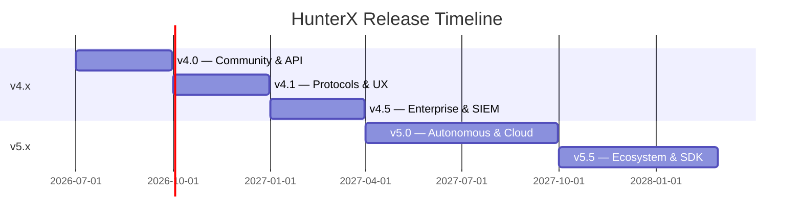

---
Copyright (c) 2026 Ahmed Awad (NullC0d3)
All Rights Reserved.
---

# HunterX Roadmap

> *Last updated: July 2026*

This roadmap outlines the planned direction for HunterX. It is a living document — priorities may shift based on community feedback, emerging threats, and contributor availability.

---

## Current Version: v4.0

**Released:** July 2026
**Focus:** API, Auth, AI/ML, Plugins, Protocols, Enhanced Detection

### v4.0 Highlights

| Track | Feature | Status |
|-------|---------|--------|
| 1 | REST API server (FastAPI) | ✅ Done |
| 2 | Auth support (Basic, Bearer, Cookie, Form) | ✅ Done |
| 3 | Enhanced detection (200+ signatures) | ✅ Done |
| 4 | Payload intelligence (mutation engine, remote repo) | ✅ Done |
| 5 | Plugin system (detectors, reporters, hooks) | ✅ Done |
| 6 | YAML config + env var overrides | ✅ Done |
| 7 | SARIF 2.1 reporting | ✅ Done |
| 8 | DevOps (graceful shutdown, JSON logs, Docker) | ✅ Done |
| 9 | Protocol expansion (WebSocket, GraphQL) | ✅ Done |
| 10 | AI/ML (LLM analysis, anomaly clustering) | ✅ Done |

---

## v4.1 — Community Edition (Q3 2026)

| Priority | Feature | Description |
|----------|---------|-------------|
| 🥇 | gRPC protocol testing | gRPC reflection, message fuzzing |
| 🥇 | OAuth2 auth flow | Full OAuth2 / OIDC support |
| 🥇 | Persistent job queue | Redis-backed queue for API mode |
| 🥈 | Payload marketplace | Community-contributed payload packs |
| 🥈 | Interactive TUI | Text-based user interface with live dashboards |
| 🥉 | Multi-report format | PDF, HTML, DOCX export via plugins |
| 🥉 | Internationalization | i18n foundation for CLI and reports |

---

## v4.5 — Enterprise (Q4 2026)

| Priority | Feature | Description |
|----------|---------|-------------|
| 🥇 | Team collaboration | Multi-user API with RBAC |
| 🥇 | SIEM integration | Splunk, ELK, QRadar connectors |
| 🥇 | Scheduled scanning | Cron-based recurring assessments |
| 🥈 | Advanced AI models | Local LLM fine-tuning, RAG pipelines |
| 🥈 | Attack graph generation | Full kill-chain visualization |
| 🥉 | Compliance reporting | PCI-DSS, HIPAA, SOC2 report templates |

---

## v5.0 — Horizon (H1 2027)

| Area | Initiative | Description |
|------|-----------|-------------|
| 🧠 | Autonomous Agent | AI-driven autonomous penetration testing |
| 🌐 | Cloud Scanner | Native AWS, Azure, GCP scanning profiles |
| 🔌 | SDK & API v2 | Official client libraries for Python, Go, JS |
| 📊 | Analytics Platform | Cloud-based result aggregation and trending |
| 🛡 | Active Defense | Integration with honeypots and deception tech |
| 🤝 | Bug Bounty Integration | Direct API connections to HackerOne, Bugcrowd |

---

## Community Goals

| Goal | Target | Status |
|------|--------|--------|
| 100 GitHub stars | Q3 2026 | ⏳ |
| 500 GitHub stars | Q4 2026 | ⏳ |
| 20+ contributors | Q4 2026 | ⏳ |
| 50+ plugin ecosystem | H1 2027 | ⏳ |
| OWASP Integration | v4.5 | ⏳ |
| CVE citation readiness | v5.0 | ⏳ |

---

## Performance Targets

| Metric | Current (v4.0) | Target (v5.0) |
|--------|----------------|---------------|
| Requests per second | ~10 | 100+ |
| Memory per scan | ~150MB | < 50MB |
| Cold start time | ~2s | < 500ms |
| Test coverage | 78% | 95%+ |
| Plugin load time | ~100ms | < 10ms |

---

## Contributing to the Roadmap

The roadmap is shaped by community input. You can influence priorities by:

- Voting on feature requests with 👍 reactions
- Submitting detailed feature proposals via issues
- Sponsoring specific features or modules
- Joining roadmap discussions in GitHub Discussions

---

## Version Timeline

---

> *This roadmap is aspirational and subject to change. We prioritize based on community needs, security research trends, and contributor capacity. If you'd like to help accelerate any item, reach out!*
