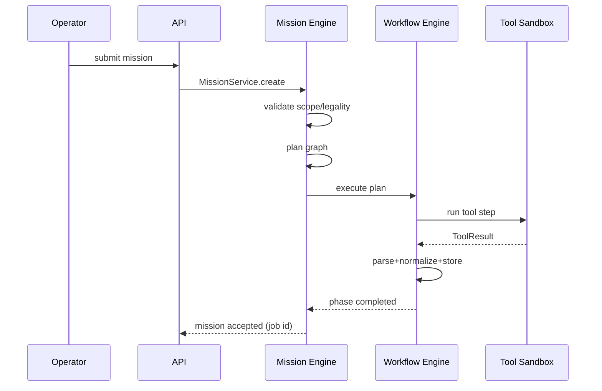

# 16 — Documentation Standards

**Status:** Ratified
**Version:** 1.0.0
**Applies to:** All documentation in the repo: Bible, project docs, API docs, tool docs, examples

---

## 1. Purpose

Documentation is a **first-class deliverable**. Code is not "done" until its
documentation meets these standards. This document defines Markdown conventions,
diagram formats, API documentation, and versioning for all HunterX docs.

---

## 2. Markdown Standards

- **Format:** GitHub-flavored Markdown (GFM).
- **Heading hierarchy:** one `#` per document title; `##` sections; `###`
  subsections; avoid `####`+ where possible (prefer tables/bullets).
- **Tables** for structured comparisons, contracts, and field lists.
- **Code blocks** must declare language (```yaml, ```json, ```python,
  ```text, ```mermaid, ```plantuml).
- **Line length:** hard-wrap prose at ~100 chars where feasible.
- **Links:** relative links between Bible docs (`02 - Architecture.md`); no
  absolute repo links in cross-doc refs.
- **Front matter:** project docs use the Jekyll front matter block
  (`layout`, `title`, `description`, `permalink`) when inside `docs/` site.

---

## 3. Required Sections Per Document

Every Bible / engineering document MUST include:

| Section | Requirement |
|---------|-------------|
| Title + status header | `# <n> — <Name>` + Status/Version block |
| Purpose/Scope | What and for whom |
| Contracts | Mandatory/optional fields or interfaces |
| Rules | Enforceable statements (SHALL/MAY/MUST) |
| References | Cross-links to related Bible docs |

Keywords MUST/SHOULD/MAY are used per RFC 2119 and enforced in review.

---

## 4. Architecture Diagrams

- **Default language:** Mermaid (renders on GitHub and the docs site).
- **Fallback:** ASCII diagrams (fixed-width) for plain-text embeds.
- Required diagram types where relevant:
  - C4-context / container / component for architecture docs.
  - Sequence diagrams for key flows (mission, tool execution, AI reasoning).
  - State diagrams for state machines (mission, workflow, plugin).
- Every diagram must have an accompanying textual description (accessibility +
  greppability).
- Diagrams are stored **inline** in the owning doc; shared complex diagrams may
  live in `docs/assets/diagrams/` and be referenced.

### 4.1 Mermaid Example



---

## 5. Sequence Diagrams

- Use Mermaid `sequenceDiagram`.
- Scope: only the interactions relevant to the doc section; avoid mega-diagrams.
- Include correlation/approval gates and failure branches where meaningful.

---

## 6. Flowcharts

- Use Mermaid `flowchart TD/LR`.
- Use for: workflows, decision trees, pipelines, state transitions.
- Terminal nodes: start/end; decision nodes diamond; process nodes rectangle.

---

## 7. Examples

- Every public capability ships with at least one runnable example under
  `examples/` mirroring the docs.
- Examples are tested (smoke) in CI; docs examples must match tested code
  (doctest or explicit review).
- Sanitize all examples: no real domains/IPs that belong to third parties;
  use reserved example namespaces (`example.com`, `192.0.2.x`, `203.0.113.x`).

---

## 8. API Documentation

- **Source of truth:** OpenAPI 3.1 generated from the FastAPI app
  (`docs/api/` or the `/openapi.json` endpoint).
- Each route documented with: purpose, auth requirements, request/response
  schemas, error responses, pagination, rate limits.
- Generated API docs are refreshed on every release; manual hand-edited API
  docs are discouraged (drift).
- CLI documentation: generated reference (`hunterx --help`) mirrored to
  `docs/cli/`; manual pages explain intent and examples.

---

## 9. Versioning of Documentation

- Bible documents: `Version` + `Status` header (Ratified/In Review/Draft).
- Change log per doc: keep a `## Changelog` section listing `vX.Y.Z` notes, or
  link to the global `CHANGELOG.md`.
- The Bible itself is versioned as a corpus: `docs/bible/README.md` records the
  current Bible version and per-doc versions.
- Docs referencing behavior pin the schema/knowledge version they describe.

---

## 10. Documentation Ownership

- Every document has an owner (module lead) named in the status block.
- Docs are reviewed in the same PR that changes behavior; **behavior change
  without doc change is a failed review** (`24 - Quality Assurance.md`).
- Doc quality is part of Definition of Done (`01 - Vision.md` §9).

---

## 11. References

- `24 - Quality Assurance.md` (review of docs)
- `23 - Development Workflow.md` (PR/doc change workflow)
