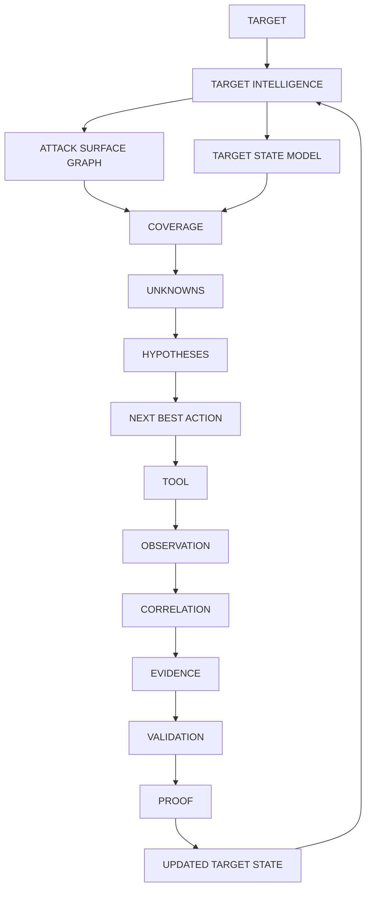

# HunterX v7 Adaptive Target Intelligence & Attack-Surface Graph — Architecture & Reference

**Status:** Ratified (Sprint 026)
**Version:** 1.0.0
**Owner:** HunterX Architecture Council

---

## 1. Purpose / Scope

Previous sprints gave HunterX a topology (Sprint 017), evidence and proof
planes (Sprint 021/022), a tool intelligence layer (Sprint 023) and universal
tool mastery (Sprint 025). Sprint 026 changes *what HunterX thinks a target is*:

- **Before:** a target was `domain + list of URLs`.
- **After:** a target is a **continuously evolving TARGET INTELLIGENCE GRAPH**
  of assets, relationships, observations, technologies, APIs, cloud resources,
  certificates, vulnerabilities, evidence and proofs — with explicit coverage,
  explicit uncertainty, hypotheses to validate and an explainable next-action
  engine that selects the **smallest justified tool set**.

The layer is a pure-domain capability (`hunterx.domain.target_intelligence`),
orchestrated by `TargetIntelligenceEngine`
(`hunterx.engines.target_intelligence`) and exposed through the application
services (`hunterx.application.target_intelligence`). It is safe to run in CI
and at startup: the engines never execute a binary themselves. Tools are
executed only through the existing SDK/execution framework and Sprint 025
selector.

Scope: `src/hunterx/domain/target_intelligence/*`, the engine facade, the
application services, the TIDB entities/ORM models/migration and the golden,
unit, component, integration, architecture, security, performance and
acceptance tests.

Out of scope: binary execution, real tool integration packs and reporting
pipelines.

---

## 2. Design Goals

1. **Intelligence over automation.** Never execute tools simply because they
   exist — execute them because the current intelligence state justifies them.
2. **Observations are immutable.** Every tool result becomes one or more
   observations; corrections produce new observations that supersede.
3. **Explicit coverage.** Coverage is a `Target × Asset × Capability × Tool ×
   State` matrix — never "number of tools executed".
4. **Explicit uncertainty.** Missing information is `UNKNOWN`/`NOT_ASSESSED`,
   never negative information. Every unknown becomes an `InformationGap`.
5. **Hypotheses before conclusions.** Scanners produce hypotheses; validation
   and proof confirm. Novel behavior enters the hypothesis engine without
   requiring a CVE.
6. **Explainable decisions.** Every adaptive decision carries rationale,
   alternatives, evidence and the policies applied.
7. **Adaptive, not scripted.** No hardcoded universal tool sequence; the
   next-action engine ranks actions from the current intelligence state.
8. **Replayable.** The entire pipeline (artifact → parser → observation →
   correlation → hypothesis → action) is replayable from stored artifacts
   without rerunning external tools.
9. **Isolated.** Target intelligence is isolated by tenant, mission, scope and
   authorization context. No cross-target leakage, no cross-mission
   contamination.

---

## 3. Architecture



The loop never stops because a tool "returned nothing found" — it stops when
the intelligence state demonstrates sufficient coverage, evidence, validation,
proof, or a justified terminal condition.

---

## 4. Data Model

All models live in `hunterx.domain.target_intelligence.models` and are pure,
read-only dataclasses. Persistence is normalized into the TIDB (never a JSON
dump of the whole graph).

| Model | Purpose |
|---|---|
| `IntelligenceTarget` | Canonical target entity (never a bare hostname): kind, value, mission, scope, status, phase, confidence, tenant. |
| `IntelligenceAsset` | Independent graph node reusing topology `EntityKind` (domain, subdomain, ip, port, service, url, endpoint, api, graphql, cert, cloud resource, ...). |
| `Observation` | Immutable, provenance-carrying tool result: tool, tool_version, capability, type, value, confidence, source, raw_artifact_ref, evidence_ref, asset_key, dedup_key. |
| `IntelligenceEvidence` | WHAT / WHERE / WHEN / HOW / SOURCE / WHY_TRUST / REPRODUCIBILITY plus tool, command, artifact, parser & normalizer provenance. |
| `TargetHistoryEntry` | Append-only history fact: attribute, kind, previous/new value, source, confidence, changed_at. |
| `IntelligenceChange` | Detected change: NEW / REMOVED / CHANGED / REAPPEARED / EXPIRED / RECLASSIFIED / CORROBORATED / CONFLICTED. |
| `CoverageEntry` / `CoverageMatrix` | One (asset, capability) cell / the full matrix with `state()`, `by_asset()`, `uncovered()`, `coverage_ratio()`. |
| `InformationGap` | Concrete question to answer: category, importance, required_capability, candidate_tools, cost, risk, blocking. |
| `Hypothesis` | Conjecture to validate: category, statement, supporting/contradicting observations, required evidence, validation & proof strategies, confidence, priority, status. |
| `IntelligenceAction` | Explainable next action: objective, type, capability, tool, reason, expected information gain, evidence, cost, risk, preconditions, stop conditions, fallback, priority. |
| `IntelligenceDecision` | Explainable decision: rationale, evidence, alternatives, why rejected, policies applied, AI advisory flags. |
| `NegativeResult` | Scoped negative: tested_capability + tool + scope + conditions + coverage; never "not vulnerable" globally. |
| `IntelligenceConflict` | Preserved contradiction between tools, escalated for better evidence — never averaged. |
| `IntelligenceScore` | Explainable multi-dimension score with recorded weights. |
| `TargetIntelligenceState` | Point-in-time snapshot aggregating the above. |

### Enums

`hunterx.domain.target_intelligence.enums` defines the canonical vocabulary:
`IntelligenceTargetStatus`, `IntelligenceTargetKind`, `IntelligencePhase`
(DISCOVERY → ENUMERATION → MAPPING → ANALYSIS → HYPOTHESIS → VALIDATION →
PROOF → REPORTING), `ObservationType`, `CoverageCapability`,
`CoverageState` (UNKNOWN / NOT_ASSESSED / CANDIDATE / TESTED / VALIDATED /
PROVED / NOT_APPLICABLE), `UnknownCategory`, `InformationGapCategory`,
`HypothesisType` (incl. `UNKNOWN_BEHAVIOR` and `NOVEL_VARIANT`),
`HypothesisStatus`, `ActionType`, `ActionStatus`, `ChangeKind`,
`IntelligenceDimension`, `ConflictState`, `StopCondition`.

---

## 5. Graph Model

`AttackSurfaceGraph` (`hunterx.domain.target_intelligence.graph`) composes with
the existing `TopologyGraph` and adds intelligence queries:

- `upsert_asset`, `add_relationship` — mutation.
- `assets()`, `assets_of_kind()`, `coverage_targets()`, `subtree()`,
  `subgraph_dict()` — reads.
- `neighbors()`, `descendants()`, `ancestors()` — topology traversal.
- `to_dict()` — JSON-safe serialization.

The graph is always *derived* from canonical state and never holds the source
of truth, so it can be backed by in-memory, SQL or a future graph database
behind the same interface.

---

## 6. Observation Lifecycle

1. A tool result arrives as raw output.
2. The parser/normalizer (Sprint 023) converts it into normalized
   observations.
3. `TargetIntelligenceEngine.ingest_observations` scope-checks, deduplicates by
   canonical `dedup_key`, persists to the `ObservationStore` (immutable) and
   materializes assets + coverage cells.
4. Corrections are new observations that `supersede` older ones — never in-place
   edits.

---

## 7. Coverage

`CoverageEngine` (`coverage.py`) records cells and derives the matrix and the
score dimensions. `assign_to_assets` primes `NOT_ASSESSED` cells for every
testable asset so the matrix is explicit about what has *not* been tried.
Negative results are ingested as `TESTED` cells with recorded conditions —
never as global "not vulnerable".

## 8. Unknowns & Information Gaps

`UnknownsEngine` (`unknowns.py`) walks assets, observations and coverage and
produces `InformationGap` records: technology not fingerprinted, auth/authorization
boundaries unmapped, API/GraphQL behavior unknown, service versions unknown,
vulnerability state unassessed, etc. Gaps carry candidate tools and importance,
which feed the next-action engine.

## 9. Hypotheses

`HypothesisEngine` (`hypotheses.py`) generates hypotheses from technology +
known CVEs, parameterized endpoints (injection/XSS/SSRF), auth/authorization
surfaces, GraphQL endpoints, cloud exposure, secrets, JavaScript-referenced
routes, unknown behavior and preserved conflicts. Rules are pluggable: subclass
`HypothesisRule` and override `rules()` without touching the engine core.

## 10. Adaptive Planning & Tool Selection

`NextActionEngine` (`actions.py`) is the central decision engine. It receives
the target state, coverage, gaps, hypotheses, mission objective, available
tools and safety ceiling, then ranks actions with configurable, explainable
weights:

```text
priority = information_gain + hypothesis_relevance + coverage_gap
         + evidence_value + proof_value
         - execution_cost - risk - redundancy
```

Tool selection delegates to a `ToolSelectorAdapter` — wired to the Sprint 025
`MissionAwareToolSelector` in the application service. No universal hardcoded
sequence exists.

## 11. Adaptive Recon, Validation & Proof

The loop is state-driven:

- **Adaptive recon:** start with current knowledge, identify missing
  information, select the smallest tool set to close important gaps, reassess.
- **Adaptive vulnerability testing:** prioritize tests using technology,
  endpoint behavior, parameters, responses, known CVEs and cloud exposure.
- **Adaptive proof (Sprint 021/022):** when a hypothesis reaches sufficient
  evidence, switch DISCOVER → VALIDATE → PROVE and stop redundant discovery
  once proof is justified.

Every action carries stop conditions (`StopCondition`) and a fallback.

## 12. Conflict Handling

`IntelligenceConflictDetector`/`IntelligenceConflictManager` (`conflicts.py`)
preserve contradictions between different tools on the same (asset, capability)
instead of averaging them, and escalate them for higher-quality evidence
collection.

## 13. History & Change Detection

`TargetHistory` records append-only facts; `TargetChangeDetector`
(`history.py`) diffs asset snapshots and classifies changes. Detected changes
influence future mission planning (e.g. a new subdomain re-opens discovery).

## 14. Correlation

`IntelligenceCorrelationEngine` (`correlation.py`) correlates observations
across tools, time and assets into `CorrelatedObservation` chains and hands
genuine disagreements to the conflict detector.

## 15. Scoring

`IntelligenceScoreEngine` (`state.py`) computes the explainable multi-dimension
score (`asset_coverage`, `service_coverage`, `web_coverage`, `api_coverage`,
`cloud_coverage`, `vulnerability_coverage`, `evidence_quality`,
`proof_coverage`, `historical_coverage`, `unknown_ratio`) with recorded weights
— never a single opaque number.

## 16. Mission State

`recommend_phase` derives the next `IntelligencePhase` from coverage, unknowns
and hypothesis state, allowing transitions in both directions (a new asset
re-opens discovery).

## 17. Replay

`IntelligenceReplayRunner` (`replay.py`) replays artifact → observation →
correlation → hypothesis → action recommendation purely from stored artifacts
without rerunning external tools.

## 18. Persistence (TIDB)

Normalized entities in `hunterx.domain.entities.tidb.target_intelligence`,
ORM models in `hunterx.infrastructure.db.sql.tidb_models.target_intelligence_models`
and the migration `alembic/versions/f7aed8a3dfc0_adaptive_target_intelligence_tables.py`.

| Table | Entity |
|---|---|
| `tidb_intelligence_targets` | `IntelligenceTargetRecord` |
| `tidb_intelligence_assets` | `IntelligenceAssetRecord` |
| `tidb_intelligence_observations` | `ObservationRecord` |
| `tidb_intelligence_evidence` | `IntelligenceEvidenceRecord` |
| `tidb_intelligence_history` | `TargetHistoryRecord` |
| `tidb_intelligence_changes` | `IntelligenceChangeRecord` |
| `tidb_intelligence_coverage` | `CoverageRecord` |
| `tidb_intelligence_gaps` | `InformationGapRecord` |
| `tidb_intelligence_hypotheses` | `HypothesisRecord` |
| `tidb_intelligence_actions` | `IntelligenceActionRecord` |
| `tidb_intelligence_decisions` | `IntelligenceDecisionRecord` |
| `tidb_intelligence_negatives` | `NegativeResultRecord` |
| `tidb_intelligence_conflicts` | `IntelligenceConflictRecord` |
| `tidb_intelligence_scores` | `IntelligenceScoreRecord` |

Indexes cover the canonical query paths (target scoping, asset keys,
capabilities, states, dedup keys) so thousands of assets and millions of
observations stay queryable without full scans.

## 19. Security

- Tenant/mission/scope isolation is enforced on every ingestion
  (`TargetIntelligenceScopeEnforcer`); reads without an explicit target scope
  never leak across targets.
- Observations are immutable; corrections supersede.
- Action risk above the safety ceiling is blocked or re-tooled.
- AI output is advisory and never overrides scope, authorization, safety or
  proof policy (all decisions record `ai_assisted` / `ai_overridden`).
- All target-derived data is untrusted; raw artifacts are referenced, never
  executed.

## 20. Performance

- Stores stream in batches; `TargetIntelligenceState` carries counts rather
  than embedding high-volume data.
- Dedup keys make observation ingestion O(1) per batch.
- Graph queries are indexed adjacency walks (no full scans).
- Coverage cells are keyed by `asset|capability` for O(1) state lookups.

## 21. Testing

| Suite | File |
|---|---|
| unit | `tests/unit/test_target_intelligence_domain.py` |
| unit (engine) | `tests/unit/test_target_intelligence_engine.py` |
| component | `tests/component/test_target_intelligence_service.py` |
| acceptance | `tests/acceptance/test_target_intelligence_acceptance.py` |
| architecture | `tests/architecture/test_target_intelligence_architecture.py` |
| security | `tests/security/test_target_intelligence_security.py` |
| performance | `tests/performance/test_target_intelligence_benchmarks.py` |
| golden | `tests/golden/test_target_intelligence_golden.py` |
| integration | `tests/integration/test_target_intelligence_platform.py` |

## 22. Extension Model

- **Hypothesis rules:** subclass `HypothesisRule` and override `rules()`.
- **Coverage capabilities:** add members to `CoverageCapability`.
- **Tool selection:** provide a `ToolSelectorAdapter` (the platform wires the
  Sprint 025 mission-aware selector).
- **Persistence:** the TIDB entities + ORM models + migration are additive; the
  application service maps domain ↔ records.
- **Graph storage:** implement `AttackSurfaceGraph` ports for SQL or a graph
  database without changing the engines.

## 23. Machine-Readable Contract

`capabilities/adaptive-target-intelligence.json` ratifies entity kinds,
relationship kinds, observation types, coverage states/capabilities,
information gap categories, hypothesis types/statuses, action types/statuses,
change kinds, intelligence dimensions and decision policies.
