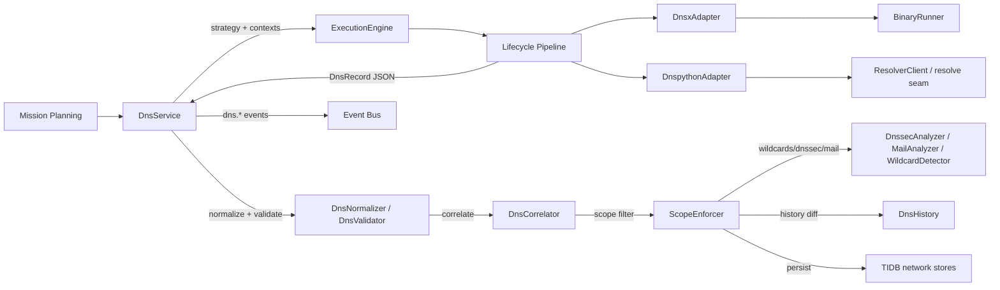

# HunterX v7 DNS Intelligence Capability — Architecture & Reference

**Status:** Ratified (Sprint 008)
**Version:** 1.0.0
**Owner:** HunterX Architecture Council

---

## 1. Purpose / Scope

The **DNS Intelligence Capability** turns raw DNS observations into validated,
correlated, historical Target Intelligence. It is the second production
capability built on the v7 Tool Integration SDK, after Reconnaissance.

It has two mandates:

1. **Collect.** `DnsService` (the application use-case) selects the registered
   DNS tools from a mission's target and posture, runs each through the guarded
   SDK lifecycle, and collects a single canonical `DnsRecord` per observation —
   regardless of whether the tool is an external binary (dnsx) or an in-process
   resolver (dnspython).
2. **Turn observations into intelligence.** Records are validated, normalized,
   correlated across tools with a defensible confidence score, checked for
   wildcard poisoning, scoped to the mission, analyzed for DNSSEC and mail
   infrastructure posture, diffed against historical state, persisted into the
   TIDB `network` entity set and reported through the `dns.*` event stream.

Hard constraints (mirroring Reconnaissance):

- **SDK-only execution.** No DNS adapter or service invokes `subprocess`
  directly. External execution flows through
  `hunterx.tools.recon.runner.BinaryRunner`; in-process resolution goes through
  the injectable `resolve` seam on `ResolverClient`.
- **No direct Core access.** Adapters and the service depend on ports, domain
  models and the SDK only.
- **Golden-data tested.** The dnsx adapter is exercised against checked-in
  golden output (`tests/golden/dns/`); no real external tool is required in CI.

Scope: `src/hunterx/domain/dns/`, `src/hunterx/tools/dns/`,
`src/hunterx/application/dns.py`, the `dns.*` event catalog and the platform
wiring in `src/hunterx/platform/assembler.py`.

Out of scope: active exploitation, reverse-DNS sweep orchestration, reporting,
and the v6 `ReconAgent`. The TIP knowledge plane is described in
`docs/v7-tool-intelligence-platform.md`.

---

## 2. Design Goals

- **One canonical record.** Every tool — a JSONL binary or an in-process
  resolver — is parsed into a single `DnsRecord` shape, so correlation and
  persistence never branch on tool-specific formats.
- **Tool-agnostic correlation.** Records merge on a canonical key; two tools
  observing `www.example.com A 1.2.3.4` are one record, not two, and a value
  disagreement is surfaced as an explicit conflict rather than silently kept.
- **Defensible confidence.** Every record carries a score that is a pure
  function of tool reliability, validation status, corroboration count, resolver
  agreement, freshness and historical stability — comparable across runs and
  tools.
- **Wildcard-safe persistence.** Wildcard-poisoned answers are detected and
  never persisted as real assets.
- **Binary-free tests.** Both adapters are covered by unit tests that inject a
  fake runner or a fake `resolve` callable.

---

## 3. Architecture

Data flow for one run:

1. `DnsService.run(mission_id, target, mode, tools, ...)` builds a `DnsStrategy`
   (record types, active resolvers, analysis flags) and selects the registered
   DNS tools (`ExecutionEngine.adapter_for`).
2. A shared correlation id is generated; per tool an `ExecutionContext` is built
   with mission, target, `dns` profile, `("network",)` permissions and the
   merged parameters (mode, target id, record types, resolvers).
3. `ExecutionEngine.execute` runs the guarded lifecycle; on success the adapter's
   JSON payload (`records`) is rebuilt into typed `DnsRecord` objects.
4. Records are normalized (`DnsNormalizer`) and validated (`DnsValidator`), then
   correlated across tools by `DnsCorrelator` and filtered through
   `ScopeEnforcer`.
5. When enabled, `WildcardDetector`, `DnssecAnalyzer`, `MailAnalyzer` and
   `DnsHistory` produce the analytical findings; conflicts and changes are
   surfaced on the batch and as events.
6. When a `TidbRepositoryFactory` is injected, records are persisted into the
   TIDB `network` entity set.
7. The `dns.*` event stream is published at every stage.

---

## 4. Domain Models

`src/hunterx/domain/dns/models.py`

| Model | Purpose |
|---|---|
| `DnsRecordType` | Canonical RR types: `A`, `AAAA`, `CNAME`, `MX`, `NS`, `TXT`, `SOA`, `PTR`, `SRV`, `CAA`, `DS`, `DNSKEY`, `RRSIG`, `NSEC`, `NSEC3`, `TLSA`, `NAPTR`, `ANY`, `OTHER`. |
| `DnsTarget` | A target (`value`, `target_type` in `domain`/`host`/`ip`, optional persisted `target_id`). |
| `DnsRecord` | One observation: owner name (normalized), RR type, value, `raw_value`, TTL, priority, source, tool id, resolver, timestamps, correlation/execution/target ids, validation status, confidence. Immutable. |
| `DNSResolution` | Per-name resolution outcome: status (`resolved`/`nxdomain`/`error`/`skipped`), record types, addresses, CNAMEs, duration. |
| `DNSConflict` | A value disagreement for one name/RR type: sources, selected value, reason, confidence. |
| `DNSChange` | A historical diff entry: name, RR type, change kind, old/new value, detected-at, tool id. |
| `DNSSECInfo` / `MailInfrastructure` | Posture findings for DNSSEC and mail (SPF/DMARC/DKIM). |
| `WildcardFinding` | Wildcard probe outcome: probed names, matching signatures, verdict. |
| `DnsExecutionSummary` | Per-tool outcome: status, record count, duration, error. |
| `DnsBatch` | The run result: correlated records, resolutions, conflicts, changes, findings, summaries, mission/correlation ids, target, mode. |

Helper `make_record(...)` and `records_from_payload(...)` build records from
adapter payloads.

---

## 5. Confidence Policy

`src/hunterx/domain/dns/confidence.py`

Base reliability per tool (unknown tools score `0.2`):

| Tool | Base |
|---|---|
| dnsx | 0.92 |
| dnspython | 0.85 |

Scoring factors:

- **Validation status** — multiplicative factor: `valid` 1.0, `unknown` 0.75,
  `invalid` 0.3.
- **Resolver agreement** — `+0.05` per distinct agreeing resolver beyond the
  first (a record observed via 3 resolvers scores higher than one via 1).
- **Corroboration** — `+0.08` per corroborating tool beyond the strongest
  (`merged_confidence`).
- **Historical stability** — `historical_confidence(base, observations, stable)`
  grows with observation count and rewards stable records.
- **Freshness** — `freshness_confidence(base, age_hours)` decays toward a floor
  of `0.5 * base` after 24h.

Scores are pure functions — the same inputs always yield the same output — and
clamp to `[0, max_confidence]`.

---

## 6. Correlation, Conflicts & Scope

`src/hunterx/domain/dns/correlator.py`, `conflicts.py`, `scope.py`

- `DnsCorrelator.correlate(records)` groups by `(name, record_type)` and merges
  corroborating observations (folding sources, resolvers, tools and the merged
  confidence). Value disagreements within a group are reported as
  `DnsConflict`s, resolved deterministically by the configured strategy
  (`most-recent`, `most-sources` or `highest-confidence`).
- `ScopeEnforcer` enforces a `ScopePolicy`:
  - `roots` — an allow-list of domains; out-of-scope names are denied.
  - `root_cidrs` — an allow-list of address spaces; out-of-scope addresses are
    denied.
  - An empty policy (no roots configured) is fail-open: nothing is out of scope.
  - `filter_records(records)` drops denied records before persistence.
- `DnsConflictResolver` (`conflicts.py`) picks the surviving value and records
  the reason, so downstream consumers can trace why one answer won.

---

## 7. Tool Matrix

Both adapters live in `src/hunterx/tools/dns/`, declare a `ToolDescriptor`
(pinned versions, `network` permission, capability IDs) and are registered by
`register_dns_adapters(engine)` in `registry.py`.

| Tool | Version | Mode | Execution | Emits records |
|---|---|---|---|---|
| dnsx | 1.1.9 | external binary | `BinaryRunner`, JSONL via `-json` | A, AAAA, CNAME, MX, NS, TXT, SOA, PTR, SRV, CAA, DS, DNSKEY, ANY (per `DnsStrategy` selection) |
| dnspython | 2.8.0 | in-process | `DnspythonAdapter` over injectable `ResolverClient.resolve(name, record_type, resolver, tool_id)` | same RR set, resolved live per record type |

Shared capabilities: `dns-records`, `dns-resolution`, `dnssec`. Both adapters
accept `record_types` and `resolvers` parameters; the dnsx adapter maps them to
CLI flags (`-a`, `-aaaa`, `-cname`, `-mx`, `-ns`, `-txt`, `-soa`, `-ptr`, `-srv`,
`-caa`, `-ds`, `-dnskey`, `-any`, `-r`).

The `ResolverClient` (`resolver.py`) adds deduplication and an injectable
`CachePort` (target-scoped cache keys, so one target's answers never leak into
another), plus per-resolver error isolation.

TIP registration (`src/hunterx/tools/dns/tip.py`, `register_dns_tools`) registers
the same two tools with taxonomy capability IDs (`dns-records`, `dns-resolution`,
`dnssec`) so the Planner and selection engines can recommend them, and versions
stay in sync with the SDK adapters. dnspython declares an in-process `python`
capability dependency (it is imported in-process rather than run as a binary).

---

## 8. Event Catalog

`EventCategory.DNS = "dns"` (INFO severity). Ten catalogued event types:

| Event | Payload highlights |
|---|---|
| `dns.intelligence.started` | correlation_id, target, mode, tools |
| `dns.phase.started` | phase (`collection`, `resolution`, `normalization`, `validation`, `correlation`, `analysis`, `persistence`) |
| `dns.resolution.started` | name, record_types |
| `dns.resolution.completed` | name, status, records, duration_ms |
| `dns.resolution.failed` | name, error |
| `dns.record.discovered` | name, record_type, value, tool_id |
| `dns.conflict.detected` | name, record_type, values, selected |
| `dns.change.detected` | name, record_type, change, old_value, new_value |
| `dns.correlation.completed` | raw_records, correlated_records, conflicts |
| `dns.intelligence.completed` | target, records, distinct |

Typed event classes live in `src/hunterx/domain/events/types.py`; the `dns.#`
pattern matches the whole category for subscribers.

---

## 9. TIDB Persistence

`DnsService` persists only when a `TidbRepositoryFactory` is injected. Records
map to the TIDB `network` entities:

| DnsRecord | Entity | Rows |
|---|---|---|
| any RR type | `DNSRecord` (name, type, value, ttl, priority) | 1 |

`target_id` propagates from the `DnsTarget` into persisted rows. Wildcard-
poisoned answers never reach persistence because the scope/correlation pipeline
drops them first.

---

## 10. Platform Wiring

`build_platform` in `src/hunterx/platform/assembler.py`:

1. Registers the DNS tools into TIP (`register_dns_tools`).
2. Registers the two adapters on the `ExecutionEngine`
   (`register_dns_adapters`).
3. Builds the TIDB factory: `SqlTidbRepositoryFactory` when a SQL session is
   configured, else `InMemoryTidbRepositoryFactory`.
4. Wires `DnsService(engine, stores, event_bus, scope)` and registers it — plus
   the `TidbRepositoryFactory` port — in the dependency container.
5. Exposes `Platform.dns_service` and `Platform.tidb`.

---

## 11. Testing Strategy

- `tests/unit/test_dns_domain.py` — models, normalization, validation,
  confidence, wildcard detection, DNSSEC, mail analysis, correlation, conflict
  resolution, scope enforcement, strategy, history (63 tests).
- `tests/unit/test_dns_adapters.py` — dnsx argv generation and golden-output
  parsing via `FakeRunner`, dnspython in-process fake `resolve`,
  `ResolverClient` dedup/cache/error isolation, one adapter exercised
  end-to-end through the real SDK pipeline.
- `tests/unit/test_dns_service.py` — tool selection (and `ValueError` for
  unregistered tools), correlation, validation status, DNSSEC/mail analysis,
  TIDB persistence via `InMemoryTidbRepositoryFactory`, `dns.*` event stream
  ordering, history comparison, failure path (`dns.resolution.failed`).
- `tests/unit/test_dns_tip.py` — TIP registration, capability providers,
  recommendation, metadata-adapter sync.
- `tests/security/test_dns_security.py` — argv injection resistance (shell
  metacharacters, flag injection, credential parameters never landing in argv),
  scope safety, cross-target cache isolation, untrusted/malformed output never
  executed.
- `tests/performance/test_benchmarks.py` — DNS normalize/validate, correlate,
  confidence, scope and validator throughput benchmarks for the performance
  quality gate.
- `tests/unit/test_platform.py` — DNS wiring in the composed platform.
- Golden data lives in `tests/golden/dns/`.

All run under the default pytest gate (`-m 'not tools'`); tests that would
invoke real external binaries require the `tools` marker.

---

## 12. Extending the Capability

To add a new DNS tool:

1. Add `src/hunterx/tools/dns/<tool>.py` with an adapter subclassing
   `DnsToolAdapter` (declare `descriptor`, implement `build_argv` and
   `parse_output` — or, for in-process tools, a run path over the injectable
   `resolve` seam).
2. Register it in `registry.py` (`DNS_TOOL_IDS`, `DnsAdapterFactory`).
3. Add a goldens file under `tests/golden/dns/` and an adapter test.
4. Add a base-reliability entry in `confidence.py` and, if it exercises new
   taxonomy capabilities, an entry in `tip.py`.
5. Run `pytest`, `python -m ruff check src tests`, `python -m mypy src`.
