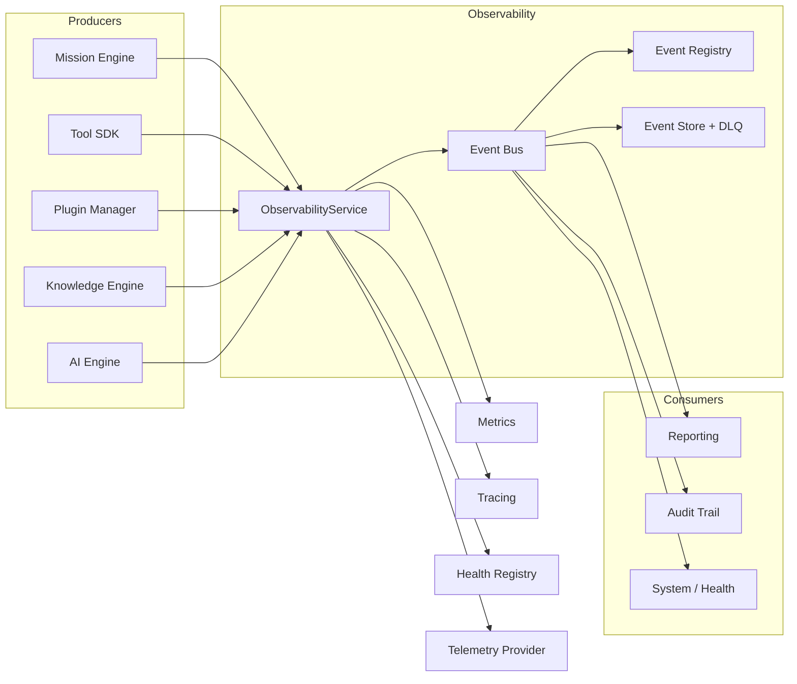
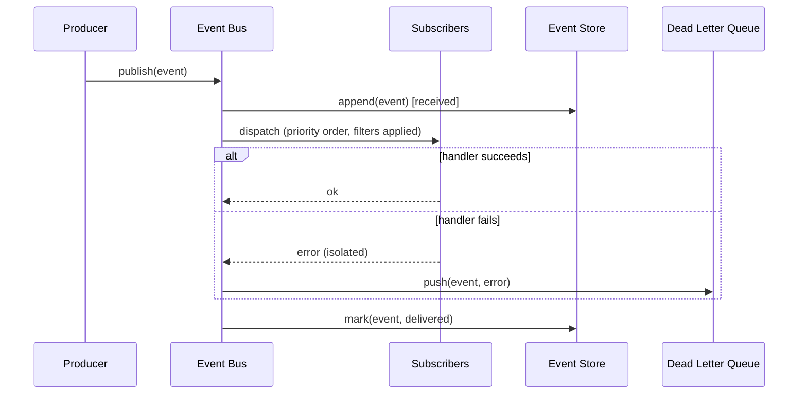

# HunterX v7 Event Bus & Observability — Architecture & Reference

**Status:** Ratified (Sprint 006.85)
**Version:** 1.0.0
**Owner:** HunterX Architecture Council

---

## 1. Purpose / Scope

This sprint builds the **event-driven communication backbone** and the
**observability platform** every HunterX v7 subsystem uses. It delivers:

1. **Event Bus** — publish/subscribe with routing, filtering, priorities,
   persistence, dead-letter queue, replay and event versioning.
2. **Event Catalog** — canonical event types across 13 subsystems.
3. **Logging** — structured JSON with correlation ids, context propagation,
   enrichment, sensitive-data masking and rotation.
4. **Metrics** — counters, gauges and histograms covering the 12 canonical
   platform metrics.
5. **Tracing** — distributed span hierarchy with context propagation.
6. **Telemetry** — Memory, OpenTelemetry and Prometheus-compatible providers.
7. **Audit** — typed audit events for the 7 audit kinds.
8. **Health** — unified probes for the 10 platform components.
9. **Observability API** — one internal service for events, metrics, tracing,
   health and telemetry.
10. **Dashboard data models** — storage-agnostic shapes for future dashboards.

Hard constraints:

- **No business capabilities.** Recon, tool integration and Mission behavior
  are untouched; the suite of pre-existing tests stays green.
- **Domain purity.** The domain layer defines ports and event models only;
  infrastructure implements the adapters; the composition root wires them.
- **Zero external services required.** The default Memory provider makes the
  platform fully operational with no OpenTelemetry, Prometheus or database.

Scope: `src/hunterx/domain/events/`, `src/hunterx/domain/ports/observability.py`,
`src/hunterx/domain/entities/dashboard.py`,
`src/hunterx/application/observability.py`,
`src/hunterx/infrastructure/event_bus/`, `.../metrics/`, `.../tracing/`,
`.../health/`, `.../logging/`, `.../telemetry/providers.py`,
`src/hunterx/observability.py` and the platform wiring in
`src/hunterx/platform/`.

Out of scope: the Knowledge Graph, object store, cache and queue; specific
dashboards UI; OTLP/prometheus wire implementations that require third-party
dependencies.

---

## 2. Design Goals

1. **Every subsystem communicates through events.** Engines, tools, plugins
   and schedulers publish and consume canonical events; they never call each
   other directly for cross-cutting concerns.
2. **One observability API.** The `ObservabilityService` is the single entry
   point for publishing, subscribing, metrics, tracing, health and telemetry.
3. **Replayable history.** Every published event is persisted and can be
   replayed, optionally filtered by type, so state can be reconstructed.
4. **Failures are quarantined, not silent.** A failing subscriber isolates its
   error, other subscribers still run, and the event goes to the dead-letter
   queue for inspection and requeue.
5. **Versioned payloads.** The catalog records the current payload version of
   every event type so producers and consumers can assert compatibility.

---

## 3. Architecture



---

## 4. Event Model

### 4.1 Envelope (`domain/events/`)

Every event is a frozen `DomainEvent` carrying the full metadata envelope:

| Field | Type | Purpose |
|---|---|---|
| `event_id` | `str` | ULID, auto-generated |
| `event_type` | `str` | stable machine name, e.g. `"mission.started"` |
| `occurred_at` | `str` | UTC ISO-8601 timestamp |
| `source` / `producer` | `str` | producing component |
| `payload` | `dict` | JSON-serializable data |
| `correlation_id` | `str | None` | logical workflow correlation |
| `causation_id` | `str | None` | event that caused this one |
| `mission_id` | `str | None` | scoping mission |
| `execution_id` | `str | None` | scoping execution |
| `consumer` | `str | None` | target consumer |
| `severity` | `EventSeverity` | debug/info/notice/warning/error/critical |
| `category` | `EventCategory` | one of the 13 categories |
| `payload_version` | `int` | payload schema version |

`to_dict()` serializes the full envelope; legacy construction
(`DomainEvent(event_type=..., payload=...)`) remains unchanged.

### 4.2 Categories (`EventCategory`)

`mission`, `execution`, `tool`, `plugin`, `database`, `knowledge`, `ai`,
`workflow`, `security`, `reporting`, `system`, `configuration`, `user`.

### 4.3 Priorities (`EventPriority`)

`LOW` (0) < `NORMAL` (1) < `HIGH` (2) < `CRITICAL` (3). Higher-priority
subscribers are invoked first; equal priorities preserve subscription order.

---

## 5. Event Catalog & Registry

`domain/events/spec.py` defines `EventSpec` (event type, category, default
severity, payload version, description, version history) and `EventRegistry`
(register, get, require, list by category, unknown-type detection).

`domain/events/catalog.py` builds the canonical catalog of **52 event types**
across all 13 categories via `build_registry()`. Event types follow the
`<category>.<action>` convention; consumers subscribe exactly
(`"mission.started"`) or by category prefix (`"mission.*"`).

**Event versioning** is registry-driven: each spec records its current
`payload_version`; `EventSpec.supports(version)` asserts whether a given
payload version is compatible.

---

## 6. Event Bus

### 6.1 Port (`domain/ports/observability.py`)

`ObservabilityEventBusPort` extends the legacy messaging `EventBusPort` with:

- `publish(event, priority=...)`,
- `subscribe(event_type, handler, priority=..., filter=...)`,
- `unsubscribe(event_type, handler)`,
- `subscriptions()` — introspection snapshot.

Supporting ports: `EventStorePort` (append/mark/get/list/count/replay),
`DeadLetterQueuePort` (push/list/count/requeue).

### 6.2 Implementation (`infrastructure/event_bus/`)

`InMemoryEventBus` is the shipped adapter. Behaviors:

- **Routing** — exact types and category prefixes (`mission.*`, `tool.#`).
- **Filtering** — per-subscriber predicates decide delivery per event.
- **Priorities** — delivery ordered by subscriber priority.
- **Persistence** — when an `InMemoryEventStore` is attached, every published
  event is appended and marked `received` then `delivered`.
- **Dead-lettering** — a handler failure is isolated, other handlers run, the
  failure is re-raised (legacy contract), and the event is quarantined in the
  `InMemoryDeadLetterQueue` with the error message.
- **Replay** — the store rebuilds `DomainEvent` instances, optionally filtered
  by exact type or category prefix, with an optional limit.

### 6.3 Event Lifecycle



---

## 7. Logging Framework

`infrastructure/logging/__init__.py`:

- `JsonFormatter` — single-line JSON records with level, logger, message,
  module, line, correlation context, enriched fields and exception traces.
- **Sensitive masking** — keys like `password`, `token`, `api_key`,
  `authorization`, `cookie`, `credential`, `private_key` are masked
  recursively in nested mappings and lists.
- **Context propagation** — `set_correlation(correlation_id=..., mission_id=...)`
  sets a thread-local context that flows into every subsequent log record.
- `JsonRotatingFileHandler` — size-based rotation (`max_bytes`, `backup_count`).
- `LoggingManager` — idempotent root configuration, JSON or text output,
  optional rotating file sink, child loggers per subsystem.

---

## 8. Metrics

`infrastructure/metrics/__init__.py` provides `InMemoryMetrics` with three
kinds — counters, gauges and histograms — plus tag dimensions and a
Prometheus-compatible text renderer.

The **metrics reference** (12 canonical metrics):

| Metric | Kind | Notes |
|---|---|---|
| `execution_duration_seconds` | histogram | tool execution duration |
| `tool_runtime_seconds` | histogram | per-tool runtime |
| `queue_size` | gauge | pending jobs |
| `mission_duration_seconds` | histogram | mission wall time |
| `error_rate` | gauge | share of errored operations |
| `success_rate` | gauge | share of successful operations |
| `failure_rate` | gauge | share of failed operations |
| `retry_count` | counter | retried executions |
| `memory_usage_bytes` | gauge | process memory |
| `cpu_usage_percent` | gauge | process CPU |
| `database_latency_seconds` | histogram | DB round-trip latency |
| `cache_hit_ratio` | gauge | cache effectiveness |

`render_prometheus()` normalizes names for the exposition format
(`hunterx_<name>`) so the same collector can be scraped.

---

## 9. Tracing

`infrastructure/tracing/__init__.py` provides `InMemoryTracer`:

- `start_span(name, trace_id=..., parent_span_id=..., attributes=...)` — starts
  a child of the current span by default, making it current.
- `end_span(attributes=...)` — ends the current span, restoring the parent.
- `current_span()` — introspection of the active span.
- `trace(trace_id)` — the full span list of a trace in start order.

Spans form a **hierarchy** via `parent_span_id`; a thread-local context
propagates the trace/span id across components on the same thread, enabling
**execution timelines** and **mission timelines** by filtering a trace's
attributes.

---

## 10. Telemetry Providers

`infrastructure/telemetry/providers.py` provides three providers behind
`TelemetryProviderPort`:

| Provider | Export |
|---|---|
| `MemoryTelemetryProvider` | default; Prometheus text of current metrics |
| `PrometheusTelemetryProvider` | Prometheus text exposition |
| `OpenTelemetryTelemetryProvider` | OTLP when `opentelemetry` extras are installed; degrades to in-memory otherwise |

`build_provider(kind)` selects by name (`memory` | `prometheus` | `otel` /
`opentelemetry`); unknown kinds fall back to memory.

The pre-existing `MemoryTelemetry` (`TelemetryPort`) is preserved unchanged
for backward compatibility.

---

## 11. Audit Events

`domain/events/audit.py` provides `AuditEventFactory` with the seven audit
kinds: authentication, authorization, configuration changes, mission
lifecycle, tool execution, plugin lifecycle and database changes. Audit
events ride the same bus as every other event and are therefore persisted by
the event store.

---

## 12. Health Monitoring

`infrastructure/health/__init__.py` provides `HealthProbe`,
`HealthRegistry.register_callable` and `check_all()` (returns
`{component: {status, detail}}`) plus a dashboard-friendly `summary()`.

The platform registers **ten canonical probes**: `core_engine`,
`mission_engine`, `database`, `tool_sdk`, `plugin_manager`, `knowledge_engine`,
`ai_engine`, `cache`, `queue`, `scheduler`. Probes degrade gracefully: a probe
exception reports status `down` rather than raising.

---

## 13. Observability API

`application/observability.py` exposes `ObservabilityService` — the single
internal API:

- **Events** — `publish`, `subscribe`, `unsubscribe`, `event_catalog`.
- **Metrics** — `increment`, `gauge`, `histogram`, `duration`,
  `metrics_snapshot`.
- **Tracing** — `start_span`, `end_span`, `trace`.
- **Health** — `check_health`.
- **Persistence** — `persisted_events`, `replay`,
  `dead_letter_events`, `requeue_dead_letter`.
- **Telemetry** — `export_telemetry`.

`src/hunterx/observability.py` is the facade re-exporting the public surface
for subsystems.

---

## 14. Dashboard Data Models

`domain/entities/dashboard.py` defines storage-agnostic shapes —
`DashboardQuery`, `MetricSeries`, `DashboardPanel`, `DashboardModel` — and
four reference definitions (`overview`, `missions`, `health`, `events`) via
`dashboard_definitions()`. Future dashboards hydrate these models at runtime.

---

## 15. Platform Wiring

`src/hunterx/platform/` wires the observability stack:

- `_build_observability` constructs the registry, store, DLQ, metrics, tracer,
  health registry and telemetry provider; the event bus is bound to the store
  and DLQ.
- `_register_health_probes` registers the ten component probes.
- `_register_ports` registers `ObservabilityEventBusPort`, `MetricsPort`,
  `TracerPort`, `HealthRegistryPort`, `EventStorePort`, `DeadLetterQueuePort`
  and `ObservabilityService` in the dependency container.
- The `Platform` dataclass exposes `observability`, `event_registry`,
  `metrics`, `tracer`, `health`, `event_store` and `dead_letter`.

The pre-existing `event_bus` (`EventBusPort`) still resolves so all legacy
wiring and tests remain valid.

---

## 16. Developer Guide

Publishing an event:

```python
from hunterx.domain.events import DomainEvent
from hunterx.domain.events.enums import EventCategory, EventSeverity

event = DomainEvent(
    event_type="mission.started",
    payload={"mission_id": "m1"},
    category=EventCategory.MISSION,
    severity=EventSeverity.INFO,
)
platform.observability.publish(event)
```

Subscribing with a filter and priority:

```python
from hunterx.domain.events.enums import EventPriority

platform.observability.subscribe(
    "mission.*",
    lambda e: handle(e),
    priority=EventPriority.HIGH,
    filter=lambda e: e.payload.get("mission_id") == "m1",
)
```

Recording a metric:

```python
platform.observability.duration("database_latency_seconds", 0.012, tags={"op": "select"})
```

Tracing an operation:

```python
platform.observability.start_span("mission.run", attributes={"mission_id": "m1"})
try:
    ...
finally:
    platform.observability.end_span()
```

Checking health and exporting telemetry:

```python
report = platform.observability.check_health()
text = platform.observability.export_telemetry()  # Prometheus text
```

Auditing an event:

```python
from hunterx.domain.events.audit import AuditEventFactory
platform.observability.publish(AuditEventFactory.authentication("alice", succeeded=True))
```

Replaying a category:

```python
for event in platform.observability.replay(event_type="mission.*"):
    print(event.event_type, event.payload)
```

---

## 17. Verification

- `python -m pytest tests/unit tests/integration tests/component` — **652
  passed** (576 baseline + 76 observability tests).
- `python -m ruff check src/hunterx tests alembic` — clean.
- Observability tests: `tests/unit/test_observability_events.py`,
  `tests/unit/test_observability_event_bus.py`,
  `tests/unit/test_observability_adapters.py`,
  `tests/unit/test_observability_metrics_reference.py`,
  `tests/integration/test_observability_platform.py`.

---

## 18. References

- `docs/bible/18 - Logging Standards.md` — structured logging
- `docs/bible/14 - Performance Standards.md` — metrics reference
- `docs/bible/02 - Architecture.md` §5.15–5.16 — TIDB & cache/queue
- `docs/v7-foundation.md` — core foundation module reference
- `docs/v7-tidb.md` — Target Intelligence Database
