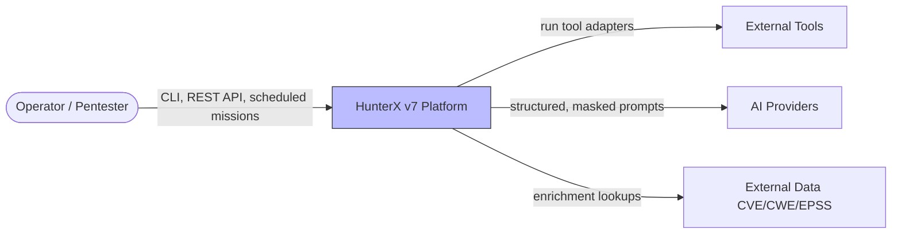
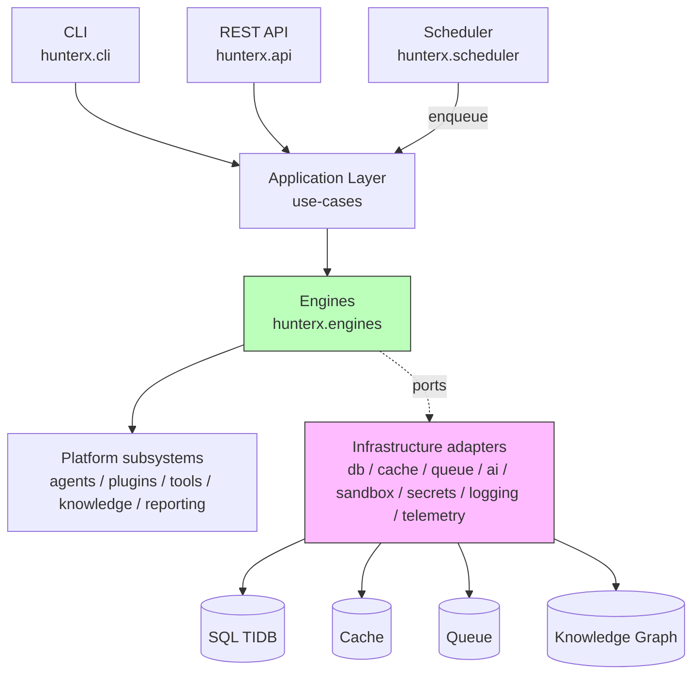
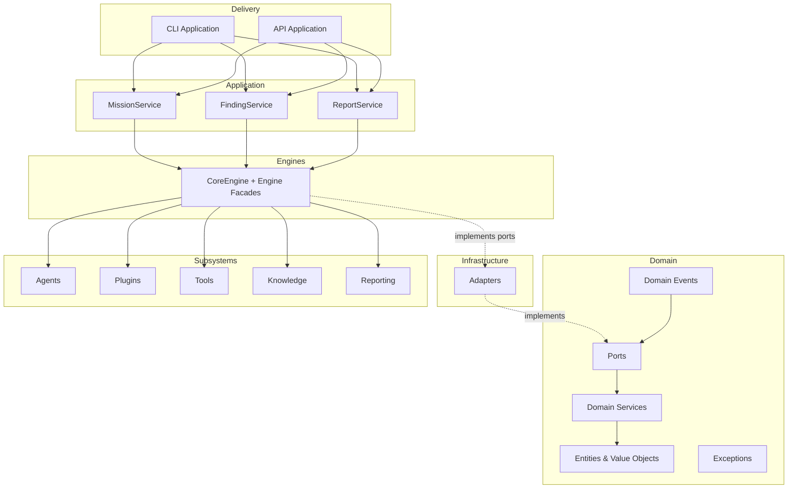
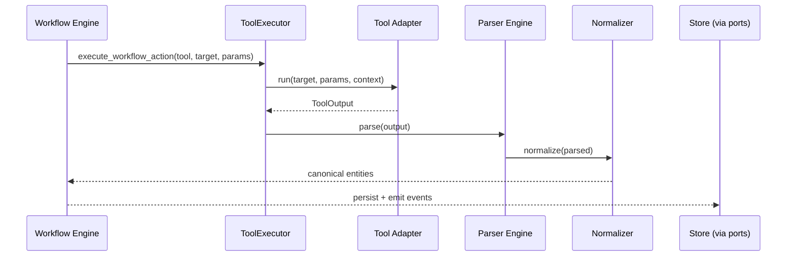

# HunterX v7 Core Foundation — Architecture & Module Reference

**Status:** Ratified (Foundation Sprint 001)
**Version:** 1.0.0
**Owner:** HunterX Architecture Council

---

## 1. Purpose / Scope

This document describes the **HunterX v7 Core Foundation** package
(`src/hunterx/`), the Clean Architecture backbone of the platform. It is a
**module reference** and **architecture guide** for engineers building on the
foundation. It SHALL be read together with the Development Bible
(`docs/bible/`), which remains the specification of record; where this document
conflicts with a Bible document, the Bible wins (`docs/bible/README.md`,
Binding Status).

Scope:

- What lives in the package and why (layer responsibilities).
- The public API of every subsystem (classes, key methods, contracts).
- Dependency and composition rules enforced by the architecture.
- Diagram coverage: context, container, and layered component views.

Out of scope: tool implementations, plugin packages, AI models, deployment
topologies, and business workflows — those belong to later sprints and to the
Bible docs (`02 - Architecture.md`, `05`, `06`, `07`, `25`).

---

## 2. Package Overview

The foundation implements the ratified target layout from
`docs/bible/03 - Folder Structure.md` §3. The package root (`src/hunterx/`)
is a **side-effect-free** package: importing `hunterx` imports no submodules
(`src/hunterx/__init__.py`), keeping import cost low and startup deterministic.

| Layer / area | Modules | Responsibility |
|---|---|---|
| Domain | `hunterx.domain` | Pure entities, value objects, ports, services, events, exceptions |
| Application | `hunterx.application` | Use-case services and DTOs |
| Infrastructure | `hunterx.infrastructure` | Adapters implementing domain ports |
| Engines | `hunterx.engines` | Engine facades: mission, workflow, planner, reasoning, correlation, report, risk, dedup |
| Delivery | `hunterx.api`, `hunterx.cli` | REST API framework + CLI framework |
| Platform | `hunterx.agents`, `hunterx.plugins`, `hunterx.tools`, `hunterx.knowledge`, `hunterx.scheduler`, `hunterx.reporting` | Subsystems behind ports |
| Cross-cutting | `hunterx.config`, `hunterx.shared`, `hunterx.security`, `hunterx.managers`, facade modules | Configuration, DI, security, manager facades |

**Dependency rule:** Delivery → Application → Domain. Infrastructure implements
domain ports and is injected upward at composition time. Nothing in the Domain
layer imports `fastapi`, `sqlalchemy`, `requests`, or any framework library.

---

## 3. System Context (C4 Level 1)

The operator drives the platform through the CLI, the REST API, or scheduled
missions. The platform executes tools through the tool runtime, calls AI
providers only through the AI port abstraction, and enriches findings from
external data sources. Tools, providers, and data sources are all behind
interfaces; no subsystem depends on a concrete integration.

---

## 4. Container View (C4 Level 2)

Engines are facades over the platform subsystems. They depend on domain ports;
concrete adapters from `hunterx.infrastructure` are injected at composition
time (the `CoreEngine` dataclass in `hunterx.engines.core` is the composition
root). The agent and workflow engines additionally consume the
`ExecutorPort` contract so workflow steps can invoke tools.

---

## 5. Layered Component View (C4 Level 3)

**Rules enforced by design (see §8):**

1. Domain layer imports nothing outside `hunterx.domain` + `hunterx.shared`.
2. Application layer imports domain + shared only; never infrastructure directly.
3. Engines compose subsystems and adapters through ports.
4. CLI/API never import each other's internals.

---

## 6. Key Runtime Flow — Tool Execution

Tool output is always wrapped in `ToolOutput`; tool failures never raise —
errors are captured inside the output (`hunterx/tools/executor.py:53`).

---

## 7. Module Reference

This section documents every top-level subsystem under `src/hunterx/`.

### 7.1 `hunterx.domain` — Pure Domain Layer

The domain layer SHALL contain no framework or I/O imports.

| Module | Contents |
|---|---|
| `domain/entities/` | `Target`, `TargetKind`, `Scan`, `ScanStatus`, `Asset`, `Finding`, `Evidence`, `EvidenceKind`, `Mission`, `MissionStatus`, `MissionKind`, `MissionPriority`, `Report`, `ReportKind`, `ReportStatus`, `DashboardQuery`, `MetricSeries`, `DashboardPanel`, `DashboardModel` |
| `domain/value_objects/` | `IPAddress`, `DomainName`, `Hostname`, `URL`, `Protocol`, `Port`, `Service`, `AssetIdentifier`, `Scope`, `Severity`, `RiskScore` |
| `domain/ports/` | Repository, service, store, and messaging ports (see §7.1.1) |
| `domain/services/` | `PlannerService`, `Plan`, `PlannedStep`, `CorrelatorService`, `CorrelationGroup`, `DeduplicatorService`, `RiskScorerService` |
| `domain/services/validation.py` | `TidbValidator`, `EnvelopeTidbValidator`, `EntityTidbValidator` (TIDB validation) |
| `domain/events/` | `DomainEvent` (full metadata envelope) + typed events (`MissionStartedEvent`, `MissionCompletedEvent`, `MissionFailedEvent`, `FindingCreatedEvent`, `ToolExecutedEvent`, `PluginLoadedEvent`), `EventCategory`/`EventSeverity`/`EventPriority`/`EventStatus` (enums), `EventSpec`/`EventRegistry`, 52-event catalog (`catalog.build_registry`), `AuditEventFactory` (7 audit kinds) — see `docs/v7-event-bus-observability.md` |
| `domain/exceptions/` | `HunterXError` + `HunterXErrorCode`; category subtrees: config, domain, infrastructure, operation |
| `domain/plugins.py` | `PluginDescriptor` |
| `domain/tools.py` | `ToolDescriptor` |

Key invariants: `Finding` computes a deterministic content hash
(`compute_content_hash`) for dedup; `Mission` models lifecycle status, kind,
and priority; `Scope.allows` gates target validity at the domain edge.

#### 7.1.1 Ports

All ports are abstract base classes in `hunterx/domain/ports/`:

- **Repositories** (`repositories.py`): `Repository` (save/delete/get/list)
  plus `MissionRepository`, `FindingRepository`, `TargetRepository`,
  `ScanRepository`, `AssetRepository`, `ReportRepository` — each refines the
  generic contract with domain-typed overrides (e.g.
  `FindingRepository.exists_by_content_hash`).
- **TIDB repositories** (`tidb_repositories.py`): `TidbRepository` — generic
  CRUD + `stream` for any TIDB entity; `TidbRepositoryFactory` — see
  `docs/v7-tidb.md`.
- **Stores** (`stores.py`): `ObjectStorePort`, `EvidenceStore`,
  `KnowledgeGraphPort`.
- **Services** (`services.py`): `AIPort`, `SandboxPort`, `SecretsPort`,
  `TelemetryPort`, `PluginRegistryPort`, `ToolRegistryPort`.
- **Messaging** (`messaging.py`): `CachePort`, `QueuePort`, `EventBusPort`,
  `Handler`.
- **Observability** (`observability.py`): `ObservabilityEventBusPort`,
  `EventStorePort`, `DeadLetterQueuePort`, `MetricsPort`, `TracerPort`,
  `HealthRegistryPort`, `HealthProbePort`, `TelemetryProviderPort` — see
  `docs/v7-event-bus-observability.md`.

### 7.2 `hunterx.application` — Use-Case Layer

| Module | Contents |
|---|---|
| `application/missions.py` | `MissionService` — mission use-cases |
| `application/findings.py` | `FindingService` — finding use-cases |
| `application/reports.py` | `ReportService` — report use-cases |
| `application/observability.py` | `ObservabilityService` — unified events/metrics/tracing/health/telemetry API |
| `application/dto.py` | `CreateMissionRequest`, `CreateFindingRequest`, `CreateReportRequest` |
Application services SHALL depend only on domain ports; concrete adapters are
injected through the container.

### 7.3 `hunterx.engines` — Engine Facades

| Module | Contents |
|---|---|
| `engines/core.py` | `CoreEngine` — composition root aggregating all engines and renderers |
| `engines/mission.py` | `MissionEngine` — mission lifecycle orchestration |
| `engines/workflow.py` | `WorkflowEngine`, `WorkflowDefinition`, `WorkflowStep`, `ExecutorPort` — DAG execution |
| `engines/planner.py` | `DeterministicPlanner` — template planning |
| `engines/reasoning.py` | `ReasoningEngine` — AI-assisted analysis (behind `AIPort`) |
| `engines/correlation.py` | `TargetCorrelator` — finding correlation |
| `engines/risk.py` | `DefaultRiskScorer` — risk scoring |
| `engines/deduplicator.py` | `ContentDeduplicator` — content-hash dedup |
| `engines/report.py` | `ReportEngine` — report assembly |

The workflow engine consumes `ExecutorPort` so steps can invoke tools through
the `ToolExecutor` without depending on the tool subsystem directly.

### 7.4 `hunterx.infrastructure` — Adapters

Adapters implement the domain ports. All are swappable at composition time.

| Module | Adapters |
|---|---|
| `infrastructure/cache/` | `MemoryCache`, `NullCache` (`CachePort`) |
| `infrastructure/queue/` | `MemoryQueue`, `NullQueue` (`QueuePort`) |
| `infrastructure/event_bus/` | `InMemoryEventBus` (`EventBusPort`) |
| `infrastructure/event_bus/store.py` | `InMemoryEventStore`, `InMemoryDeadLetterQueue` (persistence, DLQ, replay) |
| `infrastructure/metrics/` | `InMemoryMetrics` (counters, gauges, histograms, Prometheus render) |
| `infrastructure/tracing/` | `InMemoryTracer`, `Span` (span hierarchy, propagation) |
| `infrastructure/health/` | `HealthProbe`, `HealthRegistry` (unified component probes) |
| `infrastructure/logging/` | `JsonFormatter`, `JsonRotatingFileHandler`, `LoggingManager`, correlation + masking |
| `infrastructure/ai/` | `NullAIClient` (`AIPort`) |
| `infrastructure/sandbox/` | `SubprocessSandbox` (`SandboxPort`) |
| `infrastructure/secrets/` | `EnvironmentSecrets`, `InMemorySecrets` (`SecretsPort`) |
| `infrastructure/telemetry/` | `MemoryTelemetry` (`TelemetryPort`) |
| `infrastructure/db/sql/` | SQLAlchemy `Base`/models, `SessionFactory`, `Sql*Repository` for all six entities |
| `infrastructure/db/sql/tidb_models/` | 87 TIDB ORM models (`TidbModelMixin` + 11 model modules); see `docs/v7-tidb.md` |
| `infrastructure/db/sql/registry.py` | TIDB entity ↔ model registry |
| `infrastructure/db/sql/mapping.py` | `RowMapper` — entity/row coercion |
| `infrastructure/db/sql/crud.py` | `SqlCrudRepository`, `SqlTidbRepositoryFactory` (generic TIDB CRUD) |
| `infrastructure/db/sql/memory.py` | `InMemoryCrudRepository`, `InMemoryTidbRepositoryFactory` |
| `infrastructure/db/sql/versioning.py` | `VersioningListener`, `install_versioning` (audit/history trail) |
| `infrastructure/db/graph/` | `InMemoryKnowledgeGraph` (`KnowledgeGraphPort`) |
| `infrastructure/db/object_store/` | `FileSystemObjectStore`, `FileSystemEvidenceStore` |
| `infrastructure/db/search/` | `InMemorySearchIndex` |

SQLAlchemy imports are lazy (`infrastructure/db/sql/factory.py`) so the
foundation works without a database driver installed.

### 7.5 `hunterx.agents` — Multi-Agent Platform

| Module | Contents |
|---|---|
| `agents/base.py` | `AgentCapability` (enum), `SecurityAgent` (abstract contract) |
| `agents/registry.py` | `AgentRegistry` |
| `agents/orchestrator.py` | `AgentOrchestrator` |
| `agents/coordinator.py` | `AgentCoordinator` |
| `agents/scheduler.py` | `AgentSchedule`, `AgentScheduler` |
| `agents/memory.py` | `AgentMemory` |
| `agents/context.py` | `AgentContext` |
| `agents/events.py` | `message_to_event` bridging messages to domain events |
| `agents/messaging.py` | `AgentMessage` |
| `agents/state.py` | `AgentState` (enum) |
| `agents/capabilities.py` | `CapabilitySet` |

Agents express goals; they never call AI providers directly — reasoning goes
through the `ReasoningEngine` and `AIPort` only.

### 7.6 `hunterx.plugins` — Plugin System + SDK

| Module | Contents |
|---|---|
| `plugins/manifest.py` | `PluginKind`, `PermissionFlag`, `PluginManifest` |
| `plugins/registry.py` | `PluginRegistry` (`PluginRegistryPort`) |
| `plugins/loader.py` | `PluginLoader` |
| `plugins/manager.py` | `PluginManager` — lifecycle: dependency resolve → load → version check → permission grant → activate |
| `plugins/lifecycle.py` | `LifecycleHooks` (plain mixin, no-op defaults) |
| `plugins/permissions.py` | `PluginPermissions` |
| `plugins/sandbox.py` | `SandboxPolicy` |
| `plugins/versioning.py` | `check_platform_compatibility` |
| `plugins/dependencies.py` | `resolve_load_order` |
| `plugins/sdk/` | Public SDK: `PluginContext`, `PluginSession`, `PluginResult`, `FindingResult`, `EvidenceResult`, `emit` |

Plugin code SHALL import only the public SDK (`hunterx.plugins.sdk`) and MUST
NOT import private internals of the foundation.

### 7.7 `hunterx.tools` — Tool Runtime

| Module | Contents |
|---|---|
| `tools/adapter.py` | `BaseTool`, `ToolContext`, `ToolOutput` |
| `tools/categories.py` | `ScannerTool`, `CrawlerTool`, `EnumeratorTool`, `AnalyzerTool`, `ReporterTool` |
| `tools/executor.py` | `ToolExecutor` — run tools by name, expose descriptors |
| `tools/parser.py` | `ParserEngine` |
| `tools/normalizer.py` | `NormalizerEngine` |
| `tools/validation.py` | `ToolValidator` |
| `tools/registry.py` | `ToolRegistry` (`ToolRegistryPort`) |
| `tools/discovery.py` | `ToolDiscovery` |
| `tools/sandbox.py` | `ToolSandboxPolicy` |

### 7.8 `hunterx.knowledge` — Knowledge Base

| Module | Contents |
|---|---|
| `knowledge/registry.py` | `KnowledgeRecord`, `KnowledgeRegistry` |
| `knowledge/loader.py` | `KnowledgeLoader` |
| `knowledge/graph.py` | `KnowledgeGraph` |
| `knowledge/engine.py` | `KnowledgeEngine` — facade answering lookup/explain/link questions |

### 7.9 `hunterx.scheduler` — Scheduler

| Module | Contents |
|---|---|
| `scheduler/jobs.py` | `Job`, `JobStatus`, `Schedule` |
| `scheduler/service.py` | `SchedulerService` — register schedules, fire jobs into the queue |

The scheduler is independent from the agent scheduler: it handles
mission-level operations; `AgentScheduler` handles recurring agent dispatches.

### 7.10 `hunterx.reporting` — Reporting

| Module | Contents |
|---|---|
| `reporting/views.py` | `FindingView`, `MissionView`, `ReportView`, `build_report_view` |
| `reporting/renderers.py` | `Renderer` (ABC), `JsonRenderer`, `MarkdownRenderer` |
| `reporting/evidence.py` | Evidence packaging |

### 7.11 `hunterx.config` — Configuration

| Module | Contents |
|---|---|
| `config/settings.py` | pydantic settings: `Settings`, `DatabaseSettings`, `CacheSettings`, `QueueSettings`, `SecuritySettings`, `ApiSettings`, `AppConfig` |
| `config/loader.py` | `load_default_settings`, `ConfigurationManager` |

### 7.12 `hunterx.shared` — Cross-Cutting Helpers

| Module | Contents |
|---|---|
| `shared/di.py` | `Container` — thread-safe service container with parent chains and singletons |
| `shared/ids.py` | `generate_id`, `generate_content_id`, `is_ulid` |
| `shared/masking.py` | `mask_secret`, `mask_value` |
| `shared/result.py` | `Result`, `Success`, `Failure` |
| `shared/time.py` | `utcnow`, `utcnow_iso` |

### 7.13 `hunterx.security` — Security Services

| Module | Contents |
|---|---|
| `security/policies.py` | `SecurityPolicy` |
| `security/manager.py` | `SecurityManager`, `Actor`, `Permission`, `Role`, `PermissionDeniedError` |

`SecurityManager.authorize` raises `PermissionDeniedError` unless any of the
actor's roles grants the required permission; `resolve_secret` requires the
`secrets.read` permission and delegates to `SecretsPort`.

### 7.14 `hunterx.managers` — Manager Facades

| Module | Contents |
|---|---|
| `managers.py` | `CacheManager`, `QueueManager`, `EventBus`, `DependencyManager` |

Each facade wraps a port (`CachePort`, `QueuePort`, `EventBusPort`) or the
`Container`, keeping backends swappable. Convenience re-export facades:
`hunterx.cache`, `hunterx.queue`, `hunterx.events`, `hunterx.logging`,
`hunterx.telemetry`, `hunterx.observability`, `hunterx.models`,
`hunterx.exceptions`, `hunterx.utils`.

### 7.15 `hunterx.api` — REST API Framework

| Module | Contents |
|---|---|
| `api/app.py` | `create_app(settings, *, register_health, platform)` — FastAPI app factory (lazy import); builds and wires a `Platform` when omitted |
| `api/router.py` | `ApiRouter`, `RouteSpec` — routing structure without FastAPI import |
| `api/middleware.py` | `register_exception_handlers`, `_status_for` |
| `api/deps.py` | `AppContainer`, `get_container`, `configure_container` |
| `api/schemas.py` | `APIModel`, `ErrorResponse` |

FastAPI is an optional extra; importing `hunterx.api` does not require it.

### 7.16 `hunterx.cli` — CLI Framework

| Module | Contents |
|---|---|
| `cli/app.py` | `CliApplication`, `main` — command dispatcher, no third-party arg parsing |
| `cli/registry.py` | `Command`, `CommandRegistry` |
| `cli/commands.py` | `register_default_commands` |
| `cli/render.py` | `OutputRenderer` |

---

## 8. Architecture Rules

Keywords follow RFC 2119.

1. The **domain layer** (`hunterx.domain`) MUST NOT import any framework,
   infrastructure, engine, API, or CLI module.
2. The **application layer** MUST depend only on `hunterx.domain` and
   `hunterx.shared`; it MUST NOT import `hunterx.infrastructure` directly.
3. Subsystems MUST communicate through ports, the event bus, and the message
   bus; no subsystem SHALL import another subsystem's internals.
4. AI providers MUST be reachable only through `AIPort`. Agents MUST NOT call
   LLMs directly.
5. Concrete adapters MUST be wired at composition time (via
   `CoreEngine`, `Container`, or constructors); the foundation SHALL ship
   in-memory adapters so it runs with zero external services.
6. Every public contract SHALL have a docstring; the package SHALL lint clean
   under the configured ruff gates and pass the test suite before a sprint is
   marked done.
7. New modules MUST follow the dependency rules in
   `docs/bible/03 - Folder Structure.md` §7.

---

## 9. Verification

The foundation is gated by:

- `python -m ruff check src` — lint gate (0 errors).
- `python -m compileall -q src` — import/compile smoke.
- `python -m pytest -q` — unit/component/integration/golden/security/
  acceptance/performance suites (72 tests at Sprint 001 close).

Tests live under `tests/` (unit, component, integration, golden, security,
acceptance, performance, framework) with in-memory fakes
(`tests/framework/inmemory.py`, `tests/framework/fakes.py`).

---

## 10. References

- `docs/bible/01 - Vision.md` — platform mission and Definition of Done
- `docs/bible/02 - Architecture.md` — system architecture, C4 views, ADRs
- `docs/bible/03 - Folder Structure.md` — layout, dependency rules (§7)
- `docs/bible/16 - Documentation Standards.md` — this document's governing standard
- `docs/bible/README.md` — Bible index and binding status
