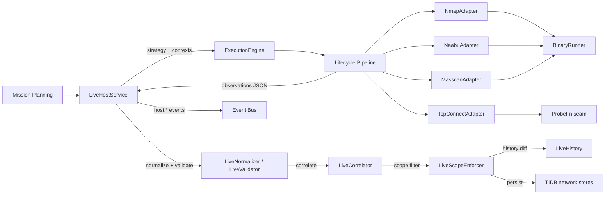

# HunterX v7 Live Host & Service Discovery Capability — Architecture & Reference

**Status:** Ratified (Sprint 009)
**Version:** 1.0.0
**Owner:** HunterX Architecture Council

---

## 1. Purpose / Scope

The **Live Host & Service Discovery Capability** turns raw reachability, port
state, service fingerprint and TLS/HTTP surface observations into validated,
correlated, historical Target Intelligence. It is the third production
capability built on the v7 Tool Integration SDK, after Reconnaissance and DNS
Intelligence.

It has two mandates:

1. **Collect.** `LiveHostService` (the application use-case) selects the
   registered live discovery tools from a mission's target and posture, runs
   each through the guarded SDK lifecycle, and collects canonical observations
   — regardless of whether the tool is an external binary (nmap, naabu,
   masscan) or an in-process probe (tcp-connect).
2. **Turn observations into intelligence.** Hosts, ports, services, TLS
   certificates and HTTP surfaces are validated, normalized, correlated across
   tools with a defensible confidence score, scoped to the mission, diffed
   against historical state, persisted into the TIDB `network` entity set and
   reported through the `host.*` event stream.

Hard constraints (mirroring Reconnaissance and DNS Intelligence):

- **SDK-only execution.** No live discovery adapter or service invokes
  `subprocess` directly. External execution flows through
  `hunterx.tools.recon.runner.BinaryRunner`; the in-process probe goes through
  an injectable `ProbeFn = Callable[[str, int, float], tuple[PortState, int]]`
  seam.
- **No direct Core access.** Adapters and the service depend on ports, domain
  models and the SDK only.
- **Golden-data tested.** The binary adapters are exercised against checked-in
  golden output (`tests/golden/livehost/`); no real external tool is required
  in CI.

Scope: `src/hunterx/domain/livehost/`, `src/hunterx/tools/livehost/`,
`src/hunterx/application/livehost.py`, the `host.*` event catalog and the
platform wiring in `src/hunterx/platform/assembler.py`.

Out of scope: active exploitation, vulnerability validation, reporting, and
the v6 `ReconAgent`. The TIP knowledge plane is described in
`docs/v7-tool-intelligence-platform.md`.

---

## 2. Design Goals

- **One canonical observation shape per kind.** Every tool — a binary parser
  or an in-process probe — is parsed into the same `LiveHost`,
  `PortFinding`, `ServiceFinding`, `TlsFinding` and `HttpFinding` shapes, so
  correlation and persistence never branch on tool-specific formats.
- **Tool-agnostic correlation.** Observations merge on a canonical key (e.g.
  `address|tcp|22` for ports); two tools observing the same open port are one
  finding, not two, and a state/fingerprint disagreement is surfaced as an
  explicit `DiscoveryConflict` rather than silently kept.
- **Defensible confidence.** Every observation carries a score that is a pure
  function of tool reliability, validation status, reachability method, port
  state, fingerprint method, corroboration count and freshness — comparable
  across runs and tools.
- **Binary-free tests.** All four adapters are covered by unit tests that
  inject a fake binary runner or a fake probe callable.
- **Posture-aware collection.** Passive runs fail closed: they select no live
  tools (`LiveStrategyBuilder.tools_for(PASSIVE) == ()`).

---

## 3. Architecture

Data flow for one run:

1. `LiveHostService.run(mission_id, target, mode, tools, ...)` builds a
   `LiveStrategy` (target kind, ports, protocol, feature flags) and selects the
   registered live discovery tools (`ExecutionEngine.adapter_for`).
2. A shared correlation id is generated; per tool an `ExecutionContext` is
   built with mission, target, `livehost` profile, `("network",)` permissions
   and the merged parameters (mode, target id, ports, protocol, service
   detection, TLS/HTTP flags).
3. `ExecutionEngine.execute` runs the guarded lifecycle; on success the
   adapter's JSON payload (`observations` with a `type` discriminator) is
   rebuilt into typed observations via `observations_from_payload`.
4. Observations are normalized (`LiveNormalizer`) and validated
   (`LiveValidator`), then correlated across tools by `LiveCorrelator` and
   filtered through `LiveScopeEnforcer`.
5. When enabled, `LiveHistory` diffs current observations against `historical`;
   conflicts and changes are surfaced on the batch and as events.
6. When a `TidbRepositoryFactory` is injected, observations are persisted into
   the TIDB `network` entity set.
7. The `host.*` event stream is published at every stage.

---

## 4. Domain Models

`src/hunterx/domain/livehost/models.py`

| Model | Purpose |
|---|---|
| `LiveTarget` | A target (`value`, `target_type` in `ip`/`cidr`/`host`/`domain`, optional persisted `target_id`). |
| `LiveHost` | One reachability observation: canonical address, IP version, hostname, state (`reachable`/`unreachable`/`unknown`), reachable flag, methods (`tcp-syn`/`tcp-connect`/`icmp`/`dns`/`application`), RTT, tool id, source, confidence, timestamps, execution/correlation/target ids. Immutable. |
| `PortFinding` | One port state observation: address, port, protocol, state (`open`/`closed`/`filtered`/`unknown`), reason, tool id, confidence, ids. |
| `ServiceFinding` | One service fingerprint: service/product/version, extrainfo, banner, fingerprint method (`probed`/`matched`/`syn-ack`/`unknown`), evidence (CPEs), confidence, ids. |
| `TlsFinding` | One TLS certificate observation: subject/issuer, serial, SHA-256, SANs, validity window, TLS version, ciphers. |
| `HttpFinding` | One HTTP surface observation: scheme, host, status code, server, title, redirect target, tech hints. |
| `ReachabilityResult` | A per-address reachability outcome (address, reachable, method, RTT, error). |
| `DiscoveryConflict` | A disagreeing observation group: kind, key, observations, reason, selected value, confidence. |
| `LiveChange` | A historical diff entry: kind, key, change type, old/new value, detected-at, source. |
| `LiveExecutionSummary` | Per-tool outcome: status, record/host/port/service counts, duration, error. |
| `LiveBatch` | The run result: correlated hosts, ports, services, TLS/HTTP findings, reachability, changes, conflicts, summaries, mission/correlation ids, target, mode. |
| `LiveStrategy` | The collection plan: target, kind, mode, ports, protocol, feature flags, tools, concurrency ceiling. |

Helpers `make_host(...)`, `make_port(...)`, `make_service(...)`, `make_tls(...)`,
`make_http(...)` and `observations_from_payload(...)` build observations from
adapter payloads.

---

## 5. Confidence Policy

`src/hunterx/domain/livehost/confidence.py`

Base reliability per tool (unknown tools score `0.2`):

| Tool | Base |
|---|---|
| nmap | 0.95 |
| masscan | 0.90 |
| naabu | 0.88 |
| tcp-connect | 0.80 |

Scoring factors:

- **Validation status** — multiplicative factor: `valid` 1.0, `unknown` 0.75,
  `invalid` 0.3.
- **Reachability method** — `tcp-syn`/`tcp-connect`/`application` 1.0, `icmp`
  0.9, `dns` 0.7.
- **Port state** — `open` 1.0, `closed` 0.9, `unfiltered` 0.8, `filtered` 0.7,
  `unknown` 0.4.
- **Fingerprint method** — `probed` 1.0, `matched` 0.95, `syn-ack` 0.7,
  `unknown` 0.5.
- **Corroboration** — `+0.08` per corroborating observation beyond the
  strongest (`merged_confidence`).
- **Freshness** — `freshness_confidence(base, age_hours)` decays toward a
  floor of `0.5 * base` after 24h.

Scores are pure functions — the same inputs always yield the same output — and
clamp to `[0, max_confidence]`.

---

## 6. Correlation, Conflicts & Scope

`src/hunterx/domain/livehost/correlator.py`, `conflicts.py`, `scope.py`

- `LiveCorrelator.correlate(...)` groups observations by canonical key per kind
  (hosts by address, ports by `address|protocol|port`, services/TLS/HTTP by
  their own keys) and merges corroborating observations (folding sources,
  methods, evidence and the merged confidence). State/fingerprint disagreements
  within a group are reported as `DiscoveryConflict`s, resolved
  deterministically by the configured strategy (`most-confident` default).
- `LiveScopeEnforcer` enforces a `LiveScopePolicy`:
  - `roots` — an allow-list of names.
  - `root_cidrs` — an allow-list of address spaces; out-of-scope addresses are
    denied.
  - `excludes` / `excluded_cidrs` — explicit deny lists.
  - `excluded_ip` / `excluded_ports` — per-address and per-port denies.
  - An empty policy (no roots/cidrs configured) is fail-open: nothing is out of
    scope.
  - `filter_observations(observations)` drops denied observations before
    persistence.
- `LiveConflictResolver` (`conflicts.py`) picks the surviving value and records
  the reason, so downstream consumers can trace why one answer won.

---

## 7. Tool Matrix

All adapters live in `src/hunterx/tools/livehost/`, declare a
`ToolDescriptor` (pinned versions, `network` permission, capability IDs) and
are registered by `register_live_adapters(engine)` in `registry.py`.

| Tool | Version | Mode | Execution | Emits observations |
|---|---|---|---|---|
| nmap | 7.95 | external binary | `BinaryRunner`, XML via `-oX -` | host, port, service, tls, http (with `-sV` + `--script ssl-cert`) |
| naabu | 2.3.4 | external binary | `BinaryRunner`, JSONL via `-json` | host, port |
| masscan | 1.3.2 | external binary | `BinaryRunner`, line-delimited JSON | host, port |
| tcp-connect | 1.0.0 | in-process | `TcpConnectAdapter` over injectable `ProbeFn` | host, port |

Shared capabilities: `host-discovery`, `port-scanning`; nmap adds
`service-fingerprint`. The adapters accept `ports`, `protocol`
(`tcp`/`udp`/`both`), `service_detection`, `with_tls`, `with_http`,
`host_discovery_only`, `rate_limit` and `min_hostgroup` parameters; each maps
them to its CLI contract (e.g. nmap `-sT`/`-sU`/`-sV`/`-p`/`-sn`,
masscan `-sS`/`-sU`/`-p`, naabu `-p`). The `TcpConnectAdapter` performs
in-process TCP connects (a refused/closed port still proves the host is up);
timeouts yield `filtered` ports and an `unknown` host.

TIP registration (`src/hunterx/tools/livehost/tip.py`, `register_live_tools`)
registers the same four tools with taxonomy capability IDs
(`host-discovery`, `port-scanning`, `service-fingerprint`) so the Planner and
selection engines can recommend them, and versions stay in sync with the SDK
adapters. tcp-connect declares an in-process `python` capability dependency
(it is imported in-process rather than run as a binary).

---

## 8. Event Catalog

`EventCategory.HOST = "host"` (INFO severity). Thirteen catalogued event types:

| Event | Payload highlights |
|---|---|
| `host.discovery.started` | correlation_id, target, mode, tools |
| `host.phase.started` | phase (`collection`, `normalization`, `validation`, `correlation`, `history`, `persistence`) |
| `host.host.discovered` | kind, key, tool_id |
| `host.port.discovered` | kind, key, tool_id |
| `host.service.discovered` | kind, key, tool_id |
| `host.tls.discovered` | kind, key, tool_id |
| `host.http.discovered` | kind, key, tool_id |
| `host.conflict.detected` | kind, key, values, selected |
| `host.change.detected` | kind, key, change_type, old_value, new_value |
| `host.correlation.completed` | raw_observations, correlated_observations, conflicts, hosts, ports, services |
| `host.tool.failed` | target, tool_id, error |
| `host.discovery.completed` | target, hosts, ports, services |
| `host.discovery.failed` | target, error |

Typed event classes live in `src/hunterx/domain/events/types.py`; the `host.#`
pattern matches the whole category for subscribers.

---

## 9. TIDB Persistence

`LiveHostService` persists only when a `TidbRepositoryFactory` is injected.
Observations map to the TIDB `network` entities:

| Live model | Entity | Rows |
|---|---|---|
| `LiveHost` | `HostObservation` (address, ip_version, hostname, state, reachable, methods, rtt_ms) | 1 |
| `PortFinding` | `PortObservation` (address, port, protocol, state, reason) | 1 |
| `ServiceFinding` | `ServiceObservation` (address, port, service, product, software_version, extrainfo, banner, fingerprint_method, evidence) | 1 |
| `LiveChange` | `LiveChange` (kind, key, change_type, old/new value) | 1 |
| `DiscoveryConflict` | `DiscoveryConflict` (kind, key, observations, selected, reason, confidence) | 1 |

`target_id` propagates from the `LiveTarget` into persisted rows. Out-of-scope
observations never reach persistence because the scope/correlation pipeline
drops them first.

---

## 10. Platform Wiring

`build_platform` in `src/hunterx/platform/assembler.py`:

1. Registers the live discovery tools into TIP (`register_live_tools`).
2. Registers the four adapters on the `ExecutionEngine`
   (`register_live_adapters`).
3. Builds the TIDB factory: `SqlTidbRepositoryFactory` when a SQL session is
   configured, else `InMemoryTidbRepositoryFactory`.
4. Wires `LiveHostService(engine, stores, event_bus, scope)` and registers it —
   plus the `TidbRepositoryFactory` port — in the dependency container.
5. Exposes `Platform.livehost_service` and `Platform.tidb`.

---

## 11. Testing Strategy

- `tests/unit/test_livehost_domain.py` — models, normalization, validation,
  confidence, correlation, conflict resolution, scope enforcement, strategy,
  history (71 tests).
- `tests/unit/test_livehost_adapters.py` — nmap argv generation and golden-XML
  parsing, naabu JSONL, masscan JSON, tcp-connect probe outcomes via
  `FakeRunner`/injected `ProbeFn`, registry/TIP binding, one adapter exercised
  end-to-end through the real SDK pipeline.
- `tests/unit/test_livehost_service.py` — tool selection (and `ValueError` for
  unregistered tools), multi-tool correlation, normalization/validation
  outcomes, TIDB persistence via `InMemoryTidbRepositoryFactory`, `host.*`
  event stream ordering, history comparison, passive posture selection, failure
  path (`host.discovery.failed`).
- `tests/unit/test_livehost_tip.py` — TIP registration, capability providers,
  recommendation, metadata-adapter sync.
- `tests/security/test_livehost_security.py` — argv injection resistance
  (shell metacharacters, flag injection, credential parameters never landing in
  argv), scope safety, excluded ports, untrusted/malformed output never
  executed.
- `tests/performance/test_benchmarks.py` — live normalize/validate, correlate,
  confidence, scope and validator throughput benchmarks for the performance
  quality gate.
- `tests/unit/test_platform.py` — live discovery wiring in the composed
  platform.
- Golden data lives in `tests/golden/livehost/`.

All run under the default pytest gate (`-m 'not tools'`); tests that would
invoke real external binaries require the `tools` marker.

---

## 12. Extending the Capability

To add a new live discovery tool:

1. Add `src/hunterx/tools/livehost/<tool>.py` with an adapter subclassing
   `LiveToolAdapter` (declare `descriptor`, implement `build_argv` and
   `parse_output` — or, for in-process tools, a run path over the injectable
   probe seam).
2. Register it in `registry.py` (`LIVE_TOOL_IDS`, `LiveAdapterFactory`).
3. Add a goldens file under `tests/golden/livehost/` and an adapter test.
4. Add a base-reliability entry in `confidence.py` and, if it exercises new
   taxonomy capabilities, an entry in `tip.py`.
5. Run `pytest`, `python -m ruff check src tests`, `python -m mypy src`.
