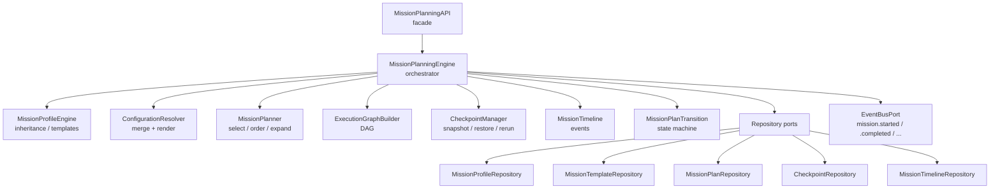
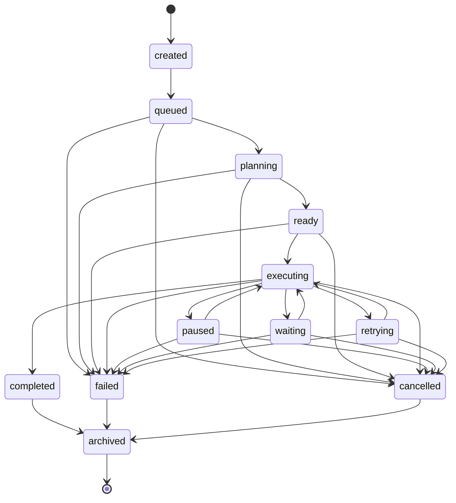
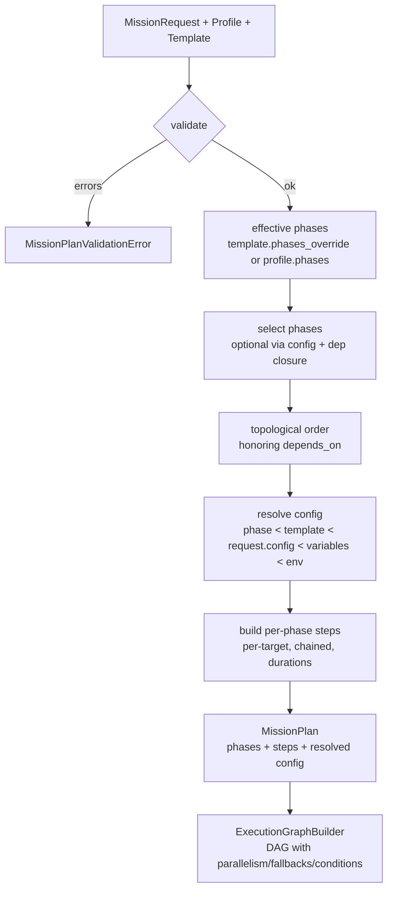
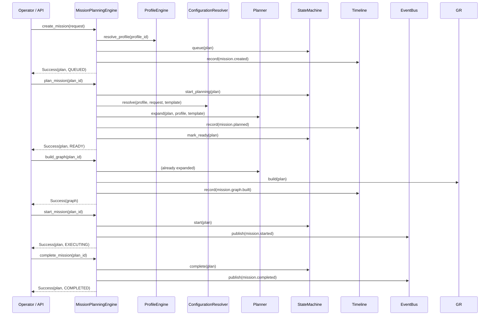

# HunterX v7 Mission Planning Engine — Architecture & Reference

**Status:** Ratified (Sprint 005)
**Version:** 1.0.0
**Owner:** HunterX Architecture Council

---

## 1. Purpose / Scope

This document defines the **Mission Planning Engine** — the subsystem that
turns an operator's high-level request into an executable, dependency-aware
mission plan.

It has two mandates:

1. **Plan — create the blueprint.** A `MissionRequest` (profile + targets +
   variables + config) is validated against a ratified
   [`MissionProfile`](#41-missionprofile) and expanded into an ordered set of
   phases, per-target steps, duration estimates and a resolved configuration.
2. **Govern — run the lifecycle.** The engine owns the ratified mission state
   machine, checkpoints for safe resume, and a timeline of every lifecycle
   event, publishing milestones to the event bus.

Hard constraints:

- **Planning only.** No tool is executed; no tool adapter is invoked. The
  output is a `MissionPlan` and an `ExecutionGraph` for an execution engine
  (Sprint 004 SDK) to consume.
- **Bible-compliant profiles.** Profiles mirror the ratified mission-profile
  spec in `docs/bible/12 - Mission Profiles.md`.
- **Pure transitions.** State transitions never mutate a plan; every
  transition returns a new `MissionPlan`.
- **Strict configuration.** Unresolved `{{ variable }}` placeholders raise so
  plans never ship with holes.

Scope: `src/hunterx/domain/mission_planning.py`,
`src/hunterx/domain/exceptions/planning.py`,
`src/hunterx/domain/ports/mission_planning.py` and
`src/hunterx/engines/mission_planning/`.

Out of scope: tool adapters and execution (Sprint 004),
workflow/reporting engines, AI reasoning, persistence adapters (only ports +
in-memory test doubles ship), and scheduling of when missions actually run.

---

## 2. Design Goals

1. **Profile-first.** A mission is the instantiation of a ratified profile;
   the planner never hard-codes a phase sequence.
2. **Inheritance over duplication.** Profiles inherit from parents and
   override per-phase; templates override phases and inject variables.
3. **Explicit graph.** The planner emits a DAG (`ExecutionGraph`) with
   parallelism, fallbacks, conditions and retry hints that an executor can
   honor without re-deriving structure.
4. **Resumable.** Checkpoints capture full plan state and support partial
   rerun from any step; nothing is lost on a paused or failed mission.
5. **Auditable.** Every lifecycle event lands on a per-mission timeline and
   milestones are published to the event bus.

---

## 3. Package Overview

```
src/hunterx/
├── domain/
│   ├── mission_planning.py          # mission domain models + DAG algorithms
│   ├── exceptions/planning.py       # planning exception hierarchy (code MISSION)
│   └── ports/mission_planning.py    # repository ports
└── engines/
    └── mission_planning/
        ├── state.py                 # MissionStateMachine / MissionPlanTransition
        ├── profiles.py              # MissionProfileEngine, profile inheritance
        ├── config.py                # ConfigurationResolver
        ├── planner.py               # MissionPlanner
        ├── graph.py                 # ExecutionGraphBuilder
        ├── checkpoints.py           # CheckpointManager
        ├── timeline.py              # MissionTimeline + event constants
        ├── engine.py                # MissionPlanningEngine (composition root)
        └── api.py                   # MissionPlanningAPI (facade)
```



---

## 4. Domain Models

Defined in `src/hunterx/domain/mission_planning.py` (frozen, slotted
dataclasses unless noted).

### 4.1 MissionType

`external_pentest`, `internal_pentest`, `web_application_pentest`,
`network_assessment`, `cloud_assessment`, `wireless_assessment`,
`social_engineering`, `purple_team`, `red_team`, `security_review`.
`MissionProfile.supports(type)` gates which profiles accept a request.

### 4.2 MissionPhaseKind

`reconnaissance`, `crawling`, `fingerprinting`, `enumeration`, `exploitation`,
`vulnerability_assessment`, `validation`, `post_exploitation`,
`privilege_escalation`, `persistence`, `lateral_movement`,
`exfiltration`, `reporting`, `cleanup`, `custom`.

### 4.3 MissionPlanningStatus

The lifecycle states:

```
created → queued → planning → ready → executing
                                        ├→ paused ↔ executing
                                        ├→ waiting ↔ executing
                                        ├→ retrying ↔ executing
                                        ├→ completed → archived
                                        ├→ cancelled → archived
                                        └→ failed → archived
```

Properties: `is_active`, `is_terminal`.

### 4.4 MissionPhaseState

`pending`, `ready`, `running`, `paused`, `blocked`, `completed`, `skipped`,
`failed`, `cancelled`.

### 4.5 MissionApprovalLevel

`auto`, `operator`, `supervisor`, `director` (increasing strictness).

### 4.6 MissionProfile

The ratified profile record. Fields: `profile_id`, `name`, `description`,
`version`, `mission_types`, `phases`, `objectives`, `allowed_tools`
(`{"include": [...], "exclude": [...]}`), `expected_outputs`, `approval_level`,
`risk_model`, `constraints`, `compliance_map`, `parent` (optional inheritance).
Helper: `phase(phase_id)`, `supports(mission_type)`.

### 4.7 MissionTemplate

A reusable bundle binding a profile with overrides: `template_id`, `name`,
`profile_id`, `description`, `version`, `variables`, `phases_override`,
`active`. Templates drive `MissionTemplateRepository`-backed workflows and the
planner's phase override.

### 4.8 MissionRequest

The input to creation: `profile_id`, `mission_type`, `name`, `targets`,
`template_id`, `variables`, `config`, `priority`. Validated at creation time.

### 4.9 MissionPlan

The executable blueprint. Fields: `plan_id`, `mission_id`, `profile_id`,
`template_id`, `mission_type`, `name`, `status`, `phases`, `targets`,
`variables`, `config` (fully resolved), `priority`, `approval_level`,
`progress`, `estimated_duration_seconds`, timestamps. Helpers: `phase(id)`,
`total_steps`.

`PlannedPhase` adds runtime state to a profile phase: `phase_id`, `kind`,
`name`, `status`, `optional`, `depends_on`, `estimated_duration_seconds`,
`steps`, `expected_outputs`, `approval_required`, `parallel`, timestamps.

`PlanStep` is a single per-target unit: `step_id`, `action`, `target`,
`parameters`, `phase_id`, `depends_on` (previous step within the phase),
`estimated_duration_seconds`, `approval_required`.

### 4.10 Checkpoint

A named point-in-time snapshot of a plan: `checkpoint_id`, `plan_id`,
`label`, `created_at`, `rerun_from` (optional step to restart from),
`snapshot` (JSON-safe serialized plan).

### 4.11 MissionTimelineEntry

`entry_id`, `mission_id`, `event_type`, `timestamp`, `plan_id`, `payload`.

### 4.12 ExecutionGraph

The DAG an executor consumes. `ExecutionNode` carries `node_id`, `action`,
`target`, `parameters`, `phase_id`, `phase_kind`, `depends_on`, `parallel`,
`conditional`, `condition`, `retryable`, `approval_required`,
`estimated_duration_seconds`. `ExecutionGraph` validates
uniqueness/unknown-dependencies/cycles on construction and exposes
`topological_order`, `parallel_groups`, `rollback_scope(node_id)` (dependant
closure for recovery), `recovery_path(node_id)` and `total_duration_seconds`.

---

## 5. State Machine

`MissionStateMachine` owns pure transition validation; `MissionPlanTransition`
adds fluent named operations (`queue`, `plan`, `start`, `pause`, `resume`,
`wait`, `unwait`, `retry`, `resume_retry`, `complete`, `cancel`, `fail`,
`archive`). `cancel`/`fail` are permitted from any active state; every terminal
state admits only `archive`. `apply()` always returns a **new** plan and stamps
`started_at` on entry to `executing` and `completed_at` on terminal states.



### Transition table (source → targets)

| Source | Targets |
|---|---|
| `created` | `queued` |
| `queued` | `planning`, `cancelled`, `failed` |
| `planning` | `ready`, `cancelled`, `failed` |
| `ready` | `executing`, `cancelled`, `failed` |
| `executing` | `paused`, `waiting`, `retrying`, `completed`, `cancelled`, `failed` |
| `paused` | `executing`, `cancelled`, `failed` |
| `waiting` | `executing`, `cancelled`, `failed` |
| `retrying` | `executing`, `cancelled`, `failed` |
| `completed` | `archived` |
| `failed` | `archived` |
| `cancelled` | `archived` |
| `archived` | — |

---

## 6. Planning Flow

The planner (`MissionPlanner.expand`) is the core algorithm:



Phase selection rules (`_include_phase`):

- Required phases always run.
- Optional phases run by default and are skipped when named under
  `config["phases"]["disabled"]`, excluded from
  `config["phases"]["enabled"]`, or set to `false` in `config["phases"]`.
- The dependency closure only pulls in dependencies that themselves pass the
  inclusion check, so a disabled optional phase is not resurrected by a
  dependent phase; that dependent simply drops the edge.
- A cyclic dependency between phases raises `MissionPlanValidationError`.

Steps are expanded **per target**: phase `actions` are chained sequentially,
each `PlanStep.depends_on` pointing at the previous step. Phase durations are
divided evenly across actions and summed into `estimated_duration_seconds`.

### Configuration precedence (lowest → highest)

```
1. phase.variables (profile defaults)
2. template.variables
3. request.config
4. request.variables
5. MISSION_<KEY> environment overrides
```

`{{ name }}` and `{{ env.VAR }}` placeholders are rendered strictly; an
undefined variable or unset environment value raises `MissionPlanningError`.

### Profile inheritance

`MissionProfileEngine.resolve_profile` walks the `parent` chain and merges
with `merge_profiles`: child phases override same-id parent phases (child
order first, then parent-only phases), dict fields merge key-by-key, list
fields are child-first unions, and `approval_level` is inherited unless the
child explicitly sets a non-default level. Cycles are detected at
registration time among registered profiles and raise
`MissionPlanningError`; parents not yet registered are tolerated and surface
as `MissionProfileNotFoundError` when the chain is resolved.

---

## 7. Lifecycle Sequence



---

## 8. Checkpoints & Resume

`CheckpointManager.create` snapshots a plan (phases, steps, statuses,
config, timestamps) into a JSON-safe `Checkpoint`. `restore` rebuilds the
plan. `resume(plan, from_step_id)` implements **partial rerun**:

- Phases strictly before the target step keep their completed state.
- The phase containing the target step and everything after reset to pending.

This lets an operator re-run a failed step without redoing earlier
phases. `CheckpointNotFoundError` guards unknown identifiers.

---

## 9. Timeline & Events

Every lifecycle change is recorded on a per-mission timeline
(`MissionTimeline.record_status`, `record`, `graph_built`) and surfaced via
`history(mission_id)` / `list_entries`.

| Constant | Event type | Trigger |
|---|---|---|
| `EVENT_CREATED` | `mission.created` | create_mission |
| `EVENT_QUEUED` | `mission.queued` | queue |
| `EVENT_PLANNING` | `mission.planning` | planning in progress |
| `EVENT_PLANNED` | `mission.planned` | plan expanded |
| `EVENT_READY` | `mission.ready` | mark ready |
| `EVENT_STARTED` | `mission.started` | start / resume |
| `EVENT_PAUSED` | `mission.paused` | pause |
| `EVENT_WAITING` | `mission.waiting` | wait |
| `EVENT_RETRYING` | `mission.retrying` | retry |
| `EVENT_COMPLETED` | `mission.completed` | complete |
| `EVENT_CANCELLED` | `mission.cancelled` | cancel |
| `EVENT_FAILED` | `mission.failed` | fail |
| `EVENT_ARCHIVED` | `mission.archived` | archive |
| `EVENT_GRAPH_BUILT` | `mission.graph.built` | build_graph |

When an `EventBusPort` is wired, the engine publishes canonical milestones
(`mission.started`, `mission.completed`, `mission.cancelled`,
`mission.failed`) as `DomainEvent`s with payload
`{"mission_id", "plan_id"}`.

---

## 10. API Reference — MissionPlanningAPI

Facade over the engine, injecting in-memory repositories when none are given.

**Profiles / templates:** `register_profile`, `resolve_profile`,
`list_profiles`, `register_template`, `resolve_template`, `list_templates`.

**Lifecycle:** `create_mission(request)`, `plan_mission(plan_id)`,
`start_mission`, `pause_mission`, `resume_mission`, `wait_mission`,
`unwait_mission`, `retry_mission`, `resume_retry`, `complete_mission`,
`cancel_mission`, `fail_mission`, `archive_mission`.

**Graph:** `build_graph(plan_id)`.

**Checkpoints:** `checkpoint_create(plan_id, label, rerun_from=None)`,
`checkpoint_list(plan_id)`, `checkpoint_restore(checkpoint_id)`,
`checkpoint_resume(checkpoint_id)`.

**Queries:** `get_plan`, `status`, `list_plans`, `update_mission`,
`history(mission_id)`, `list_entries()`.

Every operation returns `Result[MissionPlan | Checkpoint | ExecutionGraph,
Exception]`; failures carry a `HunterXError`-derived exception with code
`MISSION`.

---

## 11. Developer Guide

### Wiring

```python
from hunterx.engines import MissionPlanningAPI
from hunterx.engines.mission_planning.api import MissionPlanningAPI as Detailed

api = MissionPlanningAPI()            # in-memory repositories
api.register_profile(external_pentest_profile())
```

For production, pass real repository implementations and an event bus:

```python
api = MissionPlanningAPI(
    plans=sql_plan_repo,
    profiles=sql_profile_repo,
    templates=sql_template_repo,
    checkpoints=sql_checkpoint_repo,
    timeline=sql_timeline_repo,
    event_bus=event_bus,
)
```

### Creating and planning a mission

```python
from hunterx.domain.mission_planning import MissionRequest, MissionType

result = api.create_mission(
    MissionRequest(
        profile_id="external-pentest",
        mission_type=MissionType.EXTERNAL_PENTEST,
        name="Perimeter Scan",
        targets=("example.com", "10.0.0.0/24"),
        variables={"prefix": "acme"},
        config={"scope": "{{ prefix }}.com", "tools": ["nmap", "nuclei"]},
        priority="high",
    )
)
plan = result.value                     # status == QUEUED
plan = api.plan_mission(plan.plan_id).value   # status == READY
graph = api.build_graph(plan.plan_id).value   # ExecutionGraph DAG
```

### Checkpoint and partial rerun

```python
ckpt = api.checkpoint_create(plan.plan_id, "before-exploit").value
plan = api.checkpoint_restore(ckpt.checkpoint_id).value
plan = api.checkpoint_resume(ckpt.checkpoint_id, from_step_id=step.step_id).value
```

### Testing

In-memory doubles live in `tests/framework/mission_planning.py`
(`build_in_memory_planning_repositories`, `make_api`,
`external_pentest_profile`, `web_pentest_profile`). Unit tests cover models,
state machine, profiles, config, planner, graph, checkpoints and the API in
`tests/unit/test_mission_planning_*.py`.

---

## 12. Error Reference

| Exception | Meaning |
|---|---|
| `MissionProfileNotFoundError` | Unknown profile or unresolved parent |
| `MissionTemplateNotFoundError` | Unknown template |
| `InvalidMissionRequestError` | Malformed request (e.g. no targets) |
| `MissionPlanNotFoundError` | Unknown plan id |
| `MissionPlanValidationError` | Request fails profile validation / phase cycle |
| `InvalidMissionPlanError` | Malformed plan structure or graph |
| `CheckpointNotFoundError` | Unknown checkpoint id |
| `InvalidStateTransitionError` | Illegal lifecycle transition |
| `MissionPlanningError` | General planning failure (config holes, cycles) |

---

## 13. Out of Scope

Tool execution and adapters (Sprint 004 SDK), workflow engines, reporting,
AI reasoning, real database adapters, and mission scheduling/dispatch.
