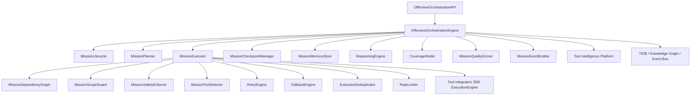

# HunterX v7 — Offensive Tool Orchestration & Full Mission Execution

**Status:** Ratified (Sprint 020)
**Version:** 1.0.0
**Owner:** HunterX Architecture Council

---

## 1. Purpose / Scope

This document defines the **Offensive Tool Orchestration Engine** — the
mission-execution half of HunterX v7. Sprint 012–019 built Target Intelligence,
Vulnerability Intelligence and Safe Validation; Sprint 020 connects them into
complete authorized security missions through a controlled execution graph.

The engine transforms:

```
MISSION OBJECTIVE
→ SCOPE
→ TARGET DISCOVERY
→ ASSET ENUMERATION
→ TECHNOLOGY IDENTIFICATION
→ ATTACK-SURFACE ENUMERATION
→ VULNERABILITY INTELLIGENCE
→ HYPOTHESIS GENERATION
→ SAFE VALIDATION
→ EVIDENCE COLLECTION
→ CORRELATION
→ RISK PRIORITIZATION
→ REPORTING
```

as an adaptive graph: **OBSERVE → DECIDE → PLAN → EXECUTE → LEARN → REPLAN →
VERIFY**. HunterX never behaves like "run every tool against every target".

Hard constraints:

- **Reuse, don't duplicate.** The engine reuses the Tool Integration SDK
  (`ExecutionEngine`), the Tool Intelligence Platform (TIP), the TIDB, the
  knowledge graph, the event bus and the mission planning engine. There is no
  second scheduler, queue, workflow engine, execution engine, tool registry,
  scope engine, evidence system, target database, intelligence framework or
  reporting engine.
- **Gates before every task.** The scope guard, safety enforcer and rate
  limiter execute before every tool task. Out-of-scope identifiers are never
  acted upon.
- **No raw-output reasoning.** The planner never reasons directly over stdout.
  Every result flows through RAW → PARSER → NORMALIZER → CANONICAL RESULT →
  EVIDENCE → CORRELATION → PLANNER.

Scope: `src/hunterx/domain/orchestration/`,
`src/hunterx/domain/ports/orchestration.py`,
`src/hunterx/engines/orchestration/`,
`src/hunterx/application/orchestration.py`,
`src/hunterx/domain/entities/tidb/orchestration.py` and the
`c7d3e9f1a4b8_offensive_orchestration_tables` Alembic migration.

---

## 2. Design Goals

1. **Capability-driven, not tool-count-driven.** Tools are selected because
   they provide a required capability, never because they exist.
2. **Adaptive planning.** Only the phases and steps relevant to the observed
   attack surface are planned; irrelevant capabilities are never executed.
3. **Scope/safety fail-closed.** Every task passes the scope guard, safety
   enforcer and rate limiter before execution; out-of-scope discovery is
   blocked and recorded.
4. **Reusable lifecycle.** The mission lifecycle state machine is explicit and
   every transition is validated.
5. **Resumable.** Checkpoints persist mission state; pause/resume/crash
   recovery never repeat completed destructive or expensive operations.
6. **Explainable.** Coverage and quality metrics carry explanations; every
   gate decision, selection and failure is recorded.

---

## 3. Package Overview

```
src/hunterx/
├── domain/
│   ├── orchestration/                 # orchestration domain models
│   │   ├── enums.py                   # MissionType, MissionState, phases, failure classes, ...
│   │   ├── models.py                  # OffensiveMission, MissionScope, Policies, ExecutionPlan, ...
│   │   └── selection.py               # CapabilityNeed, ToolSelection, ToolSelectionResult
│   ├── ports/orchestration.py         # OffensiveMissionRepository, ExecutionPlanRepository, ...
│   ├── exceptions/orchestration.py    # OffensiveOrchestrationError hierarchy
│   └── entities/tidb/orchestration.py # persisted orchestration entities
└── engines/
    └── orchestration/
        ├── lifecycle.py               # MissionLifecycle state machine
        ├── scope.py                   # MissionScopeGuard (fail-closed)
        ├── safety.py                  # MissionSafetyEnforcer
        ├── selector.py                # MissionToolSelector (TIP + registry)
        ├── planner.py                 # MissionPlanner (adaptive phases)
        ├── graph.py                   # MissionDependencyGraph
        ├── executor.py                # MissionExecutor (runs steps via SDK)
        ├── retry.py                   # FailureClassifier + RetryEngine
        ├── fallback.py                # FallbackEngine (capability-equivalent)
        ├── dedup.py                   # ExecutionDeduplicator (input-hash + freshness)
        ├── ratelimit.py               # RateLimiter (multi-key token bucket)
        ├── checkpoints.py             # MissionCheckpointManager
        ├── memory.py                  # MissionMemoryStore (per-target)
        ├── replan.py                  # ReplanningEngine (never expands scope)
        ├── coverage.py                # CoverageModel
        ├── quality.py                 # MissionQualityScorer
        ├── events.py                  # MissionEventEmitter
        ├── engine.py                  # OffensiveOrchestrationEngine (composition root)
        └── api.py                     # OffensiveOrchestrationAPI (facade)
```



---

## 4. Mission Model

### 4.1 MissionType

`bug-bounty`, `web-pentest`, `api-pentest`, `external-assessment`,
`internal-assessment`, `red-team-recon`, `cloud-assessment`,
`continuous-attack-surface-monitoring`, `vulnerability-assessment`.

### 4.2 MissionState

```
created → scoping → planning → ready → running
                                     ├→ paused → running
                                     ├→ waiting → running
                                     ├→ replanning → running
                                     ├→ blocked → running
                                     ├→ completed
                                     ├→ partial
                                     ├→ failed
                                     └→ cancelled
```

Terminal states: `completed`, `partial`, `failed`, `cancelled`. Every
transition is validated by `MissionLifecycle`; illegal transitions raise
`InvalidStateTransitionError`.

### 4.3 OffensiveMission

The canonical mission aggregate:

| Field | Meaning |
|---|---|
| `mission_id` | stable mission identifier |
| `mission_type` | `MissionType` |
| `objective` | mission objective statement |
| `scope` | `MissionScope` (roots/includes/excludes, follow subdomains/redirects) |
| `exclusions` | explicit out-of-scope identifiers |
| `authorization` | `Authorization` (reference, holder, status, validity) |
| `priority` | `low`/`medium`/`high`/`critical` |
| `policies` | `Policies` (execution/safety/tool/retry/rate-limit) |
| `target_set` | `TargetSet` (targets + stable ids + criticality) |
| `workflow` | workflow reference |
| `state` | current `MissionState` |
| `plan_id` | id of the current execution plan |
| `analysis_version` | analysis version |

### 4.4 Policies

- **ExecutionPolicyLevel:** `passive-only`, `safe-active`,
  `standard-assessment`, `authorized-red-team`. No policy may bypass scope
  enforcement.
- **SafetyPolicy:** allowed safety classes, forbidden actions, forbidden
  parameter markers, `destructive_allowed` (never for default policies).
- **ToolPolicy:** allow/deny/prefer lists, `fallback_enabled`,
  `require_installed`.
- **RetryPolicy:** `max_attempts`, backoff parameters.
- **RateLimitPolicy:** per-second limits for global / mission / target /
  domain / ip / tool keys (`0` = unlimited).

---

## 5. Execution Plan

`ExecutionPlan` decomposes a mission into `Phase`s and `MissionStep`s:

- **Phase** — a reusable mission phase (PHASE 0 Scope … PHASE 12 Reporting)
  with steps, dependencies, parallelism and optionality.
- **MissionStep** — a single unit of work: `phase_id`, `action`, `capability`,
  `target`, `target_type`, `parameters`, `depends_on`, `condition`,
  `timeout_seconds`, `retryable`, `evidence_requirements`, `success_criteria`,
  `tool_id`, `fallback_tools`, `safety_class`, `state`.

The planner selects phases adaptively (see §7) and the graph/executor drive the
steps.

---

## 6. Mission Lifecycle

`MissionLifecycle` owns the state machine; `MissionLifecycleOperator` provides
named operations (`scope`, `plan`, `ready`, `start`, `pause`, `resume`, `wait`,
`replan`, `block`, `complete`, `partial`, `cancel`, `fail`).

The engine persists every transition and emits the canonical `mission.*`
events (`mission.scoping.started`, `mission.plan.created`,
`mission.step.started`, `mission.tool.selected`, `mission.replanned`,
`mission.checkpoint.created`, `mission.blocked`, `mission.partial`,
`mission.quality.computed`, `mission.coverage.computed`, ...).

---

## 7. Mission Planner

`MissionPlanner` consumes an `IntelligenceSummary`:

- `mission_type`, `technologies`, `services`, `endpoints`, `providers`,
  `targets`, `vulnerabilities`, `scope`

and produces an `ExecutionPlan`. Phase selection is adaptive:

- Recon/asset/service/technology phases run against every target.
- Attack-surface steps are included only when the corresponding surface is
  observed (`has_web`/`has_api`/`has_js`/`has_cloud`).
- Vulnerability-intelligence phase runs for assessment mission types.
- Hypothesis + safe-validation phases run only when potential vulnerabilities
  exist.

Phases are topologically ordered (PHASE 0…12) and wired with dependencies. The
planner never executes anything.

---

## 8. Tool Selection

`MissionToolSelector` selects tools for a step's `CapabilityNeed`
(capability + target type + safety class). Selection is capability-driven:

1. Build a `ToolSelectionCriteria` from the need + mission type + tool policy.
2. Query TIP for ranked candidates providing the capability.
3. Filter by the mission tool policy (allow/deny) and registered execution
   adapters.
4. Rank by TIP selection score; preferences add a bonus.

`FallbackEngine` selects a capability-equivalent alternative when the primary
tool is unavailable or failed, preserving the input/output contracts and the
mission tool policy. Tool chaining uses canonical schemas only — one tool's
normalized output becomes the next tool's canonical input; raw stdout is never
parsed inside another adapter.

---

## 9. Scope Guard

`MissionScopeGuard` executes before every tool task and classifies the target
identifier:

- Exact/suffix/wildcard hostname matching against roots/includes.
- CIDR containment and IP membership.
- URL host extraction with redirect rules (redirect targets must themselves be
  in scope; scope is never expanded by discovery).
- Exclusions always win.

Identifiers are classified `IN_SCOPE`, `OUT_OF_SCOPE`,
`REQUIRES_AUTHORIZATION` or `UNKNOWN`. Only `IN_SCOPE` identifiers are acted
upon. Every decision is recorded (`ExecutionPolicyDecision`) and emitted as a
`mission.step.blocked` event when refused.

## 10. Safety Enforcer

`MissionSafetyEnforcer` executes before every tool task and checks:

- The requested safety class is in the allowed set.
- The action contains no forbidden action substring.
- The parameters contain no forbidden marker (e.g. `--exec`, `-e /bin/sh`,
  `nc -e`, `--privileged`, `rm -rf`, `$(`, backticks).
- Destructive behavior is never permitted by default.

A refusal produces a `SafetyDecision` that is recorded and emitted.

## 11. Execution

`MissionExecutor` walks the `MissionDependencyGraph`:

- Compute ready steps (dependencies satisfied).
- For each step: scope guard → safety enforcer → rate limiter → tool
  selection → deduplication → execute.
- Retry only retryable failure classes up to `RetryPolicy.max_attempts`
  (`transient`, `rate-limit`, `timeout`, `network`, `tool-crash`,
  `parser-failure`); scope/safety/authorization failures are never retried.
- Fall back to a capability-equivalent tool after retries are exhausted.
- Collect the canonical `StepOutcome` from the engine's normalized JSON output
  (never raw stdout).

Parallelism: independent steps in the same ready wave may be executed
concurrently by the SDK's `ParallelExecutionManager`, respecting global/target/
tool concurrency and rate limits.

## 12. Retry / Fallback / Dedup / Rate Limit

- **RetryEngine** classifies failures deterministically (status + failure kind
  + message heuristics) and computes backoff.
- **FallbackEngine** returns capability-equivalent alternatives.
- **ExecutionDeduplicator** computes an input hash (tool + target + version +
  normalized parameters + configuration) and suppresses duplicates within the
  configured freshness window; `forced_refresh` bypasses it.
- **RateLimiter** is a multi-key token bucket honouring global/mission/target/
  domain/ip/tool limits and reporting `retry_after_seconds`.

## 13. Checkpoints & Resume

`MissionCheckpointManager` persists a checkpoint containing the mission state,
plan version, completed/pending/failed/blocked steps and the gate records.
`resume_state` reconstructs the resume context so an executor can continue
without repeating completed work (crash recovery, worker restart, network
interruption).

## 14. Mission Memory

`MissionMemoryStore` keeps per-target `TargetMemory`: discovered assets,
technologies, tools used, previous results, vulnerabilities, false positives,
validations, risk, tool reliability, evidence history and first/last-seen.
Memory is scoped per target so cross-target and cross-mission isolation is
guaranteed.

## 15. Replanning

`ReplanningEngine` evaluates a `ReplanRequest` (new assets, technologies,
endpoints, providers, capability changes) and classifies every discovered
asset. Only `IN_SCOPE` assets continue automatically; `OUT_OF_SCOPE` and
`REQUIRES_AUTHORIZATION` assets are blocked. Replanning never expands scope.

## 16. Coverage & Quality

- **CoverageModel** computes scope/asset/port/protocol/technology/endpoint/
  vulnerability/validation/tool/evidence coverage relative to the observed
  attack surface and applicable capabilities. Tool count is never treated as
  coverage.
- **MissionQualityScorer** produces an explainable mission quality score from
  scope completeness, asset discovery, technology identification, attack-
  surface coverage, vulnerability intelligence coverage, validation coverage,
  evidence quality, tool reliability, execution completeness and blind spots.

## 17. Persistence

TIDB entities (migration `c7d3e9f1a4b8`):

`MissionPlanRecord`, `MissionPhaseRecord`, `MissionStepRecord`,
`ExecutionDependency`, `ExecutionCheckpoint`, `ExecutionPolicyDecision`,
`ToolSelectionRecord`, `ToolFallback`, `MissionReplan`, `MissionCoverage`,
`MissionQuality`, `MissionFailure`, `MissionTaskHistory`.

The generic `TidbRepositoryFactory.repository_for(Entity)` persists them; the
repository ports (`OffensiveMissionRepository`, `ExecutionPlanRepository`,
`ToolSelectionRepository`) have in-memory implementations
(`infrastructure/memory/orchestration.py`) used as the default backend.

## 18. Events & Observability

The engine emits the canonical `mission.*` orchestration events (see §6).
Every recorded gate decision, selection, fallback and failure is available via
`MissionExecutor.records()` and persisted to TIDB. Observability ids
(mission/plan/step/execution/tool/correlation) flow through every record.

## 19. Testing

- Unit: lifecycle, scope guard, safety, selector, planner, graph, executor,
  retry, fallback, dedup, rate limit, checkpoints, memory, replan, coverage,
  quality, events.
- Golden: deterministic mission fixtures (see `tests/golden/orchestration/`).
- Security: scope bypass, redirect escape, wildcard abuse, safety refusal,
  forbidden parameters, cross-mission isolation, dedup correctness.
- Integration: platform build + full mission run; Alembic migration up/down.
- Performance: planning, selection, execution, coverage, quality, dedup.

## 20. Error Reference

| Exception | Meaning |
|---|---|
| `OffensiveOrchestrationError` | base orchestration error |
| `OffensiveMissionNotFoundError` | unknown mission |
| `ExecutionPlanNotFoundError` | unknown plan |
| `InvalidMissionStateError` | operation requires a different mission state |
| `ScopeViolationError` | out-of-scope identifier |
| `SafetyViolationError` | safety-policy refusal |
| `ToolSelectionUnavailableError` | no tool satisfies a capability need |
| `RateLimitExceededError` | rate-limit refusal |
| `MissionCancelledError` | operation on a cancelled mission |
