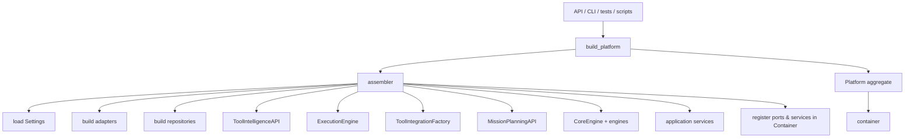
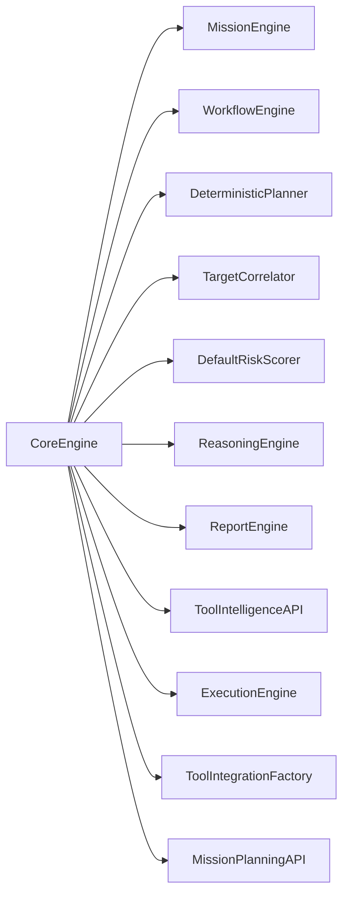

# HunterX v7 Platform Composition Root — Architecture & Reference

**Status:** Ratified (Sprint 006.6)
**Version:** 1.0.0
**Owner:** HunterX Architecture Council

---

## 1. Purpose / Scope

This document defines the **Platform Composition Root** — the single place
where every concrete implementation in HunterX v7 is selected and wired
together at startup.

It has two mandates:

1. **Compose.** Build a fully wired `Platform` runtime aggregate: settings,
   infrastructure adapters, persistence repositories, the four v7 facades,
   the Core Engine, application services, and a dependency container that
   resolves every port and service.
2. **Expose.** Give the API, CLI, and tests one entry point
   (`hunterx.platform.build_platform`) that returns the same wiring
   everywhere, so handlers, commands, and tests never construct
   collaborators directly.

Hard constraints:

- **Single composition root.** Domain, application and engine layers MUST NOT
  import infrastructure or construct their collaborators; all concrete
  selection happens in `hunterx.platform.assembler`.
- **Zero external services by default.** The platform SHALL assemble and run
  with in-memory adapters and repositories — no database, cache, queue, or AI
  provider required.
- **Ports are the contract.** Components depend on abstract ports; the
  assembler binds each port to one concrete adapter.
- **Substitutable persistence.** Entity repositories use in-memory
  implementations unless SQL is explicitly configured; mission-planning and
  factory repositories remain in-memory (no SQL adapters exist for them).

Scope: `src/hunterx/platform/`, `src/hunterx/infrastructure/memory/`, the
`CoreEngine` v7-facade fields, `api/app.py`, `api/deps.py`,
`cli/commands.py` and `tests/unit/test_platform.py`.

Out of scope: real cache/queue/AI adapters (Redis, providers), REST routes
for each service (later sprints), mission scheduling/dispatch, and database
schema design.

---

## 2. Design Goals

1. **One wiring path.** Every entry point (API, CLI, tests, scripts) builds
   the platform the same way and shares the same container.
2. **Explicit dependency graph.** The assembler registers every port and
   service by concrete type, so `container.resolve(X)` is unambiguous.
3. **Runnable out of the box.** Defaults are in-memory; the platform starts
   with zero configuration and zero external services.
4. **Swappable persistence.** SQL entity repositories activate when a
   non-default `database.url` is configured and SQLAlchemy is importable,
   without touching any consumer code.
5. **Observable composition.** The CLI `platform` command reports the exact
   backend, repository, facade and service classes actually wired.

---

## 3. Package Overview

```
src/hunterx/
├── platform/
│   ├── __init__.py        # re-exports Platform, build_platform
│   ├── platform.py        # Platform runtime aggregate (dataclass)
│   └── assembler.py       # build_platform + private wiring helpers
└── infrastructure/
    └── memory/
        ├── __init__.py    # re-exports in-memory repositories
        ├── repositories.py # core entity repositories + builder
        ├── planning.py    # mission planning repositories + builder
        └── factory.py     # tool factory repositories + builder
```



---

## 4. The Platform Aggregate

`Platform` (`src/hunterx/platform/platform.py`) is a slotted dataclass that
owns the runtime. Attributes:

| Attribute | Type | Meaning |
|---|---|---|
| `settings` | `Settings` | resolved typed configuration |
| `container` | `Container[Any]` | dependency container (every port + service) |
| `core` | `CoreEngine` | the aggregated engine (all engines + v7 facades) |
| `tip` | `ToolIntelligenceAPI` | Tool Intelligence Platform facade |
| `execution_engine` | `ExecutionEngine` | Tool Integration SDK engine |
| `tool_factory` | `ToolIntegrationFactory` | Tool Integration Factory facade |
| `mission_planning` | `MissionPlanningAPI` | mission planning engine facade |
| `mission_service` | `MissionService` | mission use-case service |
| `finding_service` | `FindingService` | finding use-case service |
| `report_service` | `ReportService` | report use-case service |
| `tool_factory_service` | `ToolFactoryService` | factory use-case service |
| `mission_planning_service` | `MissionPlanningService` | planning use-case service |
| `event_bus` | `EventBusPort` | event bus adapter |
| `cache` | `CachePort` | cache adapter |
| `queue` | `QueuePort` | work-queue adapter |
| `secrets` | `SecretsPort` | secrets adapter |
| `ai` | `AIPort` | AI provider adapter |
| `telemetry` | `TelemetryPort` | telemetry adapter |
| `knowledge_graph` | `KnowledgeGraphPort` | knowledge graph adapter |
| `repositories` | `dict[str, object]` | concrete repositories keyed by role |

Helpers: `resolve(key)` and `has(key)` delegate to the container.

---

## 5. Assembler Wiring

`build_platform(settings=None)` (in `assembler.py`) is the composition root.
Order of construction:

### 5.1 Settings & infrastructure

- Defaults via `load_default_settings()` unless `settings` is passed.
- Adapters selected from settings (`_build_adapters`):
  - **cache:** `MemoryCache` when `cache.backend == "memory"`, else `NullCache`.
  - **queue:** `MemoryQueue` when `queue.backend == "memory"`, else `NullQueue`.
  - Fixed: `InMemoryEventBus`, `EnvironmentSecrets`, `NullAIClient`,
    `MemoryTelemetry`, `InMemoryKnowledgeGraph`.

### 5.2 Persistence (`_build_repositories`)

All 13 roles default to in-memory repositories
(`_MEMORY_REPOSITORIES` maps role → concrete class):

| Role | In-memory class |
|---|---|
| `missions` | `InMemoryMissionRepository` |
| `findings` | `InMemoryFindingRepository` |
| `targets` | `InMemoryTargetRepository` |
| `scans` | `InMemoryScanRepository` |
| `assets` | `InMemoryAssetRepository` |
| `reports` | `InMemoryReportRepository` |
| `mission_profiles` | `InMemoryMissionProfileRepository` |
| `mission_templates` | `InMemoryMissionTemplateRepository` |
| `mission_plans` | `InMemoryMissionPlanRepository` |
| `checkpoints` | `InMemoryCheckpointRepository` |
| `mission_timeline` | `InMemoryMissionTimelineRepository` |
| `pack_templates` | `InMemoryPackTemplateRepository` |
| `tool_packs` | `InMemoryToolPackRepository` |

**SQL switching:** when `settings.database.url` is set **and** differs from
the default `sqlite:///hunterx.db` **and** SQLAlchemy is importable, the six
entity roles swap to `Sql*Repository(session_factory)`; `create_all()` runs
and `"session_factory"` is added to the repositories dict. Planning and
factory repositories always stay in-memory.

### 5.3 v7 facades

- `ToolIntelligenceAPI()` — TIP facade (no-arg).
- `ExecutionEngine(intelligence=tip.registry)` — SDK engine backed by TIP's
  registry.
- `ToolIntegrationFactory(pack_repository=..., template_repository=...)`.
- `MissionPlanningAPI(plans=, profiles=, templates=, checkpoints=,
  timeline=, event_bus=)`.

### 5.4 Core Engine

`CoreEngine` aggregates the engines and carries the v7 facades. New optional
fields: `tip`, `execution_engine`, `tool_factory`, `mission_planning`.



### 5.5 Container registration (`_register_ports`)

Registered instances:

- **Ports:** `EventBusPort`, `CachePort`, `QueuePort`, `SecretsPort`,
  `AIPort`, `TelemetryPort`, `KnowledgeGraphPort`, `ToolIntelligencePort`,
  `ToolIntelligenceRegistry`, and all 13 repository ports mapped by role.
- **Facades/engines:** `ToolIntegrationFactory`, `ExecutionEngine`,
  `MissionPlanningAPI`, `ToolIntelligenceAPI`, `CoreEngine`, `MissionEngine`,
  `WorkflowEngine`, `ReportEngine`.
- **Managers:** `CacheManager`, `QueueManager`, `EventBus`,
  `DependencyManager`.
- **Services:** `MissionService`, `FindingService`, `ReportService`,
  `ToolFactoryService`, `MissionPlanningService`.

---

## 6. Repository Ports & Adapters

The in-memory adapters in `hunterx.infrastructure.memory` are the canonical
reference implementations of the repository ports. Each class implements one
port and is used both by the platform (default persistence) and the test
suite's framework doubles.

- `repositories.py` — mission/finding/target/scan/asset/report repositories
  plus `build_in_memory_repositories()`.
- `planning.py` — profile/template/plan/checkpoint/timeline repositories plus
  `build_in_memory_planning_repositories()`.
- `factory.py` — pack-template/tool-pack repositories plus
  `build_in_memory_factory_repositories()`.

Behavior notes:

- `InMemoryFindingRepository` tracks content hashes and dedupes on save
  (`exists_by_content_hash`).
- `InMemoryMissionTimelineRepository` preserves append order and returns the
  most recent `limit` entries.

---

## 7. API & CLI Entry Points

### 7.1 REST API (`api/app.py`, `api/deps.py`)

`create_app(settings=None, *, register_health=True, platform=None)`:

- When `platform` is omitted, one is built from settings.
- `configure_container(platform.container)` points the shared
  `AppContainer` (used by FastAPI handlers via `get_container`) at the
  platform's container, so handlers and the rest of the runtime share wiring.
- `register_exception_handlers(app)` maps domain errors to HTTP responses.

### 7.2 CLI (`cli/commands.py`)

`register_default_commands(app, platform=None)` registers `version`, `help`,
`config`, and `platform`. The `platform` command prints a JSON report:
environment, cache/queue backends, repository class per role, facade classes
and service classes — the observable composition of the running platform.

---

## 8. Architecture Rules

1. `hunterx.platform` is the ONLY package allowed to import both domain and
   infrastructure and bind them.
2. Components MUST receive collaborators through constructors or the
   container; no service-locator lookups inside domain/application/engine
   code.
3. The platform MUST assemble with zero configuration using in-memory
   adapters; any external service is an opt-in.
4. Entity repositories MAY be SQL-backed when configured; planning/factory
   repositories are in-memory-only until SQL adapters exist.
5. Every public contract SHALL have a docstring; the package SHALL lint clean
   under the configured ruff gates and pass the test suite.

---

## 9. Developer Guide

### Building a platform

```python
from hunterx.platform import build_platform

platform = build_platform()
core = platform.core
tip = platform.tip                     # ToolIntelligenceAPI
engine = platform.execution_engine     # ExecutionEngine
```

### Configuring SQL persistence

```python
from hunterx.config.settings import DatabaseSettings, Settings

settings = Settings(database=DatabaseSettings(url="postgresql://hx:hx@db/hunterx"))
platform = build_platform(settings)
assert "session_factory" in platform.repositories
```

### Inspecting composition from the CLI

```bash
hunterx platform
# {"environment": "production", "cache_backend": "memory", ...}
```

### Wiring the API

```python
from hunterx.api.app import create_app
from hunterx.platform import build_platform

platform = build_platform()
app = create_app(platform=platform)   # handlers resolve the platform's services
```

### Testing

`tests/unit/test_platform.py` covers assembly (facades, services, adapters,
repository roles), container resolution (every port and service),
backend selection from settings, SQL switching, and API/CLI wiring.

---

## 10. Verification

Gated by:

- `python -m ruff check src` — lint gate (0 errors).
- `python -m compileall -q src` — import/compile smoke.
- `python -m pytest -q` — full suite (511 pre-existing + 21 platform tests =
  532 at Sprint 006.6 close).

### Acceptance Checklist

- [x] `build_platform()` returns a fully wired `Platform` with all four v7
      facades, the Core Engine, application services, adapters and the
      container.
- [x] Every repository port, service, facade, engine and manager resolves
      from `platform.container`; unknown keys raise `RegistrationNotFoundError`.
- [x] Default assembly uses in-memory cache/queue/event-bus/repositories —
      no external services required.
- [x] Configuring a non-default SQL URL switches the six entity repositories
      and registers `session_factory`; planning/factory stay in-memory.
- [x] `create_app(platform=...)` shares the platform container with FastAPI
      handlers via `configure_container`.
- [x] `register_default_commands(app, platform=...)` exposes the `platform`
      command reporting live composition.
- [x] `src/hunterx/infrastructure/memory/*` is the canonical in-memory
      persistence used by the platform.
- [x] Lint clean, compile clean, full test suite green.

---

## 11. Out of Scope

Real cache/queue/AI adapters, per-service REST routes, SQL adapters for
mission-planning and factory repositories, and mission scheduling/dispatch.
