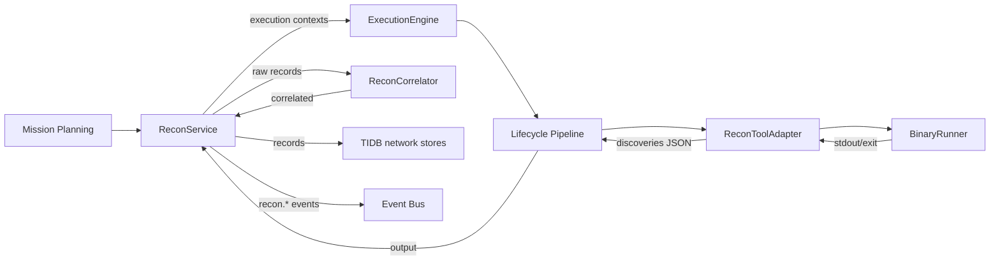

# HunterX v7 Reconnaissance Capability — Architecture & Reference

**Status:** Ratified (Sprint 007)
**Version:** 1.0.0
**Owner:** HunterX Architecture Council

---

## 1. Purpose / Scope

The **Reconnaissance Capability** is the first production capability built on
the v7 Tool Integration SDK. It turns a mission's discovery intent into real
tool executions and structured, correlated asset intelligence.

It has two mandates:

1. **Bridge — Mission to Execution.** `ReconService` (the application use-case)
   is the missing link between Mission Planning and the SDK `ExecutionEngine`:
   for each selected tool it builds an `ExecutionContext` (mission, target,
   posture, correlation id, permissions), runs the full guarded pipeline and
   collects the tool's canonical discovery records.
2. **Correlate & Persist.** Discovery records from several tools are deduplicated
   and merged by a confidence-weighted correlator, then persisted into the TIDB
   `network` entity set and reported through the `recon.*` event stream.

Hard constraints:

- **SDK-only execution.** No recon adapter or service invokes `subprocess`
  directly. All external tool execution flows through
  `hunterx.tools.recon.runner.BinaryRunner`, an injectable seam that tests swap
  for a fake runner.
- **No direct Core access.** Adapters and the service depend on ports, domain
  models and the SDK only.
- **Golden-data tested.** Every adapter is exercised against checked-in golden
  output (`tests/golden/recon/`) with a fake runner; no real external tool is
  required in CI.

Scope: `src/hunterx/domain/recon/`, `src/hunterx/tools/recon/`,
`src/hunterx/application/recon.py`, the `recon.*` event catalog and the
platform wiring in `src/hunterx/platform/assembler.py`.

Out of scope: workflow engines, active exploitation, reporting and the v6
`ReconAgent`. The TIP knowledge plane is described in
`docs/v7-tool-intelligence-platform.md`.

---

## 2. Design Goals

- **One canonical record.** Every tool — whatever its native output — is parsed
  into a single `DiscoveryRecord` shape, so correlation and persistence never
  branch on tool-specific formats.
- **Tool-agnostic correlation.** Records merge on a canonical `key()` — two
  tools finding `www.example.com` are one asset, not two.
- **Defensible confidence.** Every record carries a score that is a pure
  function of tool reliability, asset kind and corroboration count — comparable
  across runs and tools.
- **Binary-free tests.** All six adapters are covered by unit tests that inject
  a fake runner; the platform wires real binaries for production.

---

## 3. Architecture

Data flow for one run:

1. `ReconService.run(mission_id, target, mode, tools, scope)` selects the
   registered recon tools (`ExecutionEngine.adapter_for`).
2. A shared correlation id is generated; per tool an `ExecutionContext` is built
   with mission, target, target type, `recon` profile, `("network",)`
   permissions and the mode/target-id parameters.
3. `ExecutionEngine.execute` runs the guarded lifecycle; on success the adapter's
   JSON payload (`discoveries`) is rebuilt into typed records via
   `records_from_payload`.
4. `ReconCorrelator.correlate(raw, scope)` deduplicates, weights and scopes the
   records.
5. When a `TidbRepositoryFactory` is injected, records are persisted into the
   TIDB network entity set.
6. The `recon.*` event stream is published at every stage.

---

## 4. Domain Models

`src/hunterx/domain/recon/models.py`

| Model | Purpose |
|---|---|
| `DiscoveryKind` | Canonical asset kinds: `domain`, `subdomain`, `hostname`, `ip-address`, `cidr`, `asn`, `dns-record`, `certificate`, `whois`, `organization`, `cloud-provider`, `exposed-asset`. |
| `ReconMode` | Posture: `passive`, `active`, `hybrid`. |
| `ReconTarget` | A target (`value`, `target_type`, optional persisted `target_id`). |
| `DiscoveryRecord` | One observation: kind, canonical name, tool id, source, confidence, target id, evidence `details`, timestamps. Immutable; name is normalized to lowercase. |
| `ReconExecutionSummary` | Per-tool outcome: status, record count, duration, error. |
| `ReconBatch` | The run result: correlated records, execution summaries, mission/correlation ids, target, mode. |

### Canonical deduplication key

`DiscoveryRecord.key()`:

| Kind | Key |
|---|---|
| `ASN` | `asn:<number>` (`AS13335` ≡ `13335`) |
| `DNS_RECORD` | `dns:<name>\|<TYPE>\|<value>` |
| `CERTIFICATE` | `cert:<sha256>` (the `sha256:` prefix is stripped) |
| everything else | `<kind>:<name>` |

---

## 5. Confidence Policy

`src/hunterx/domain/recon/confidence.py`

Base reliability per tool (unknown tools score `0.2`):

| Tool | Base |
|---|---|
| subfinder | 0.90 |
| amass | 0.85 |
| bbot | 0.80 |
| findomain | 0.70 |
| assetfinder | 0.60 |
| theharvester | 0.55 |

Kind factors discount passive-index kinds (`hostname` 0.95, `ip-address` 0.9,
`cidr` 0.85, `asn` 0.8, `exposed-asset` 0.6, ...). Merged confidence takes the
strongest record score and adds `0.1` per corroborating tool beyond the first,
clamped to `1.0`. Scores are pure functions — the same inputs always yield the
same output.

---

## 6. Correlation

`src/hunterx/domain/recon/correlator.py`

`ReconCorrelator.correlate(records, scope)`:

- Groups records by `(kind, key())`.
- Keeps the strongest observation; folds corroborating `tools`/`sources` and
  list-valued details into the merged record; recomputes confidence from the
  group.
- Applies an optional scope filter: hostname-like records outside the in-scope
  domain are dropped, while address-space and metadata records (IPs, CIDRs,
  ASNs, DNS, certificates, WHOIS) are always retained.
- Sorts by kind then name for deterministic output.

---

## 7. Tool Matrix

All six adapters live in `src/hunterx/tools/recon/`, declare a `ToolDescriptor`
(pinned versions, `network` permission, capability IDs) and are registered by
`register_recon_adapters(engine)` in `registry.py`.

| Tool | Version | Output parsed | Emits kinds |
|---|---|---|---|
| subfinder | 2.14.0 | JSONL (`host`, `ip`, `source`) | subdomain, ip-address |
| amass | 4.2.0 | JSON event stream (`amass enum -json`) | subdomain, ip-address, cidr |
| assetfinder | 0.4.0 | plain hostnames | domain, subdomain |
| findomain | 9.0.1 | plain hostnames + resolved IPs | domain, subdomain, ip-address |
| bbot | 2.3.0 | NDJSON events (`DNS_NAME`, `IP_ADDRESS`, `IP_NETWORK`, `ASN`, `ORG`, `URL`) | domain, subdomain, ip-address, cidr, asn, organization, exposed-asset |
| theHarvester | 4.3.0 | JSON result file (`hosts`, `ips`, `interesting_urls`) | hostname, ip-address, exposed-asset |

CLI contracts were verified against upstream documentation and are captured in
each adapter's docstring (e.g. subfinder `-d -silent -oJ -cs`, `-nW -oI` for
active resolution; amass v4 `enum -passive|-active`).

TIP registration (`src/hunterx/tools/recon/tip.py`, `register_recon_tools`)
registers the same six tools with taxonomy capability IDs — `subdomain-discovery`,
`host-discovery`, `dns-records`, `certificate-lookup`, `whois-lookup` — so the
Planner and selection engines can recommend them, and versions stay in sync with
the SDK adapters.

---

## 8. Event Catalog

`EventCategory.RECON = "recon"` (INFO severity). Six catalogued event types:

| Event | Payload highlights |
|---|---|
| `recon.started` | correlation_id, target, mode, tools |
| `recon.tool_completed` | tool_id, status, records, duration_ms, error |
| `recon.correlated` | raw_records, correlated_records, distinct_assets |
| `recon.persisted` | persisted (rows written) |
| `recon.completed` | target, records, distinct_assets |
| `recon.failed` | error |

Typed event classes live in `src/hunterx/domain/events/types.py`; the
`recon.#` pattern matches the whole category for subscribers.

---

## 9. TIDB Persistence

`ReconService` persists only when a `TidbRepositoryFactory` is injected. Kinds
map to the TIDB `network` entities:

| DiscoveryKind | Entity | Rows |
|---|---|---|
| domain | `Domain` | 1 |
| subdomain | `Subdomain` + `Hostname` | 2 |
| hostname | `Hostname` | 1 |
| ip-address | `IPAddress` | 1 |
| cidr | `CIDR` | 1 |
| asn | `ASN` | 1 |
| dns-record | `DNSRecord` | 1 |
| whois | `WHOISRecord` | 1 |
| certificate | `Certificate` | 1 |
| organization / cloud-provider / exposed-asset | — (reporting only) | 0 |

Parent domains are auto-created (`_parent_domain_id`) only for true subdomains
(three or more labels); an apex observed as a subdomain maps back onto itself
and never fabricates a spurious parent like `com`. `target_id` propagates from
the `ReconTarget` into persisted rows.

---

## 10. Platform Wiring

`build_platform` in `src/hunterx/platform/assembler.py`:

1. Registers the six recon tools into TIP (`register_recon_tools`).
2. Registers the six adapters on the `ExecutionEngine` (`register_recon_adapters`).
3. Builds the TIDB factory: `SqlTidbRepositoryFactory` when a SQL session is
   configured, else `InMemoryTidbRepositoryFactory`.
4. Wires `ReconService(engine, stores, event_bus)` and registers it — plus the
   `TidbRepositoryFactory` port — in the dependency container.
5. Exposes `Platform.recon_service` and `Platform.tidb`.

`InMemoryTidbRepositoryFactory` and `SqlTidbRepositoryFactory` both implement the
`TidbRepositoryFactory` port.

---

## 11. Testing Strategy

- `tests/unit/test_recon_domain.py` — key normalization, confidence, correlation.
- `tests/unit/test_recon_adapters.py` — argv generation and golden-output parsing
  for all six adapters via `FakeRunner`; one adapter exercised end-to-end through
  the real SDK pipeline.
- `tests/unit/test_recon_service.py` — selection, correlation across tools,
  TIDB persistence, `recon.*` event stream, failure path (`recon.failed` + re-raise).
- `tests/unit/test_recon_tip.py` — TIP registration, capability providers,
  recommendation, version parity with adapters.
- `tests/unit/test_platform.py` — recon wiring in the composed platform.
- Golden data lives in `tests/golden/recon/`.

All run under the default pytest gate (`-m 'not tools'`); tests that would
invoke real external binaries require the `tools` marker.

---

## 12. Extending the Capability

To add a new recon tool:

1. Add `src/hunterx/tools/recon/<tool>.py` with an adapter subclassing
   `ReconToolAdapter` (declare `descriptor`, implement `build_argv` and
   `parse_output`).
2. Register it in `registry.py` (`RECON_TOOL_IDS`, `ReconAdapterFactory`).
3. Add a goldens file under `tests/golden/recon/` and an adapter test.
4. Add a base-reliability entry in `confidence.py` and, if it exercises new
   taxonomy capabilities, an entry in `tip.py`.
5. Run `pytest`, `python -m ruff check src tests`, `python -m mypy src`.
