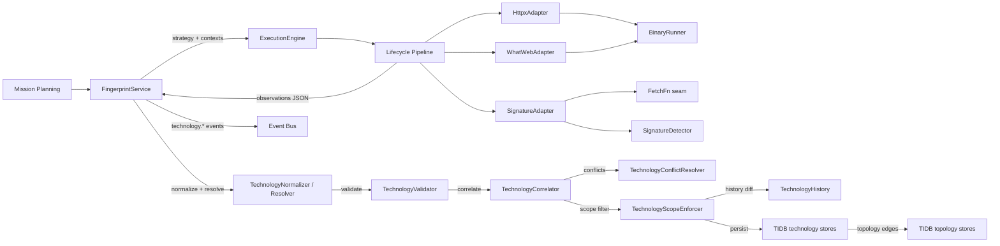

# HunterX v7 Technology Fingerprinting & Stack Intelligence — Architecture & Reference

**Status:** Ratified (Sprint 011)
**Version:** 1.0.0
**Owner:** HunterX Architecture Council

---

## 1. Purpose / Scope

The **Technology Fingerprinting & Stack Intelligence Capability** turns raw
HTTP/HTTPS metadata, TLS certificates, service banners and existing TIDB
intelligence into validated, correlated, historical technology intelligence.
HunterX determines — for every authorized asset — the operating systems, web
servers, application servers, frameworks, languages, CMS platforms, CDN/WAF
infrastructure, reverse proxies, load balancers, hosting providers, cloud
indicators, security products and product versions it exposes.

It has two mandates:

1. **Collect.** `FingerprintService` (the application use-case) validates
   scope, builds a `TechStrategy`, selects the registered fingerprinting
   tools, runs each through the guarded SDK lifecycle, folds in existing
   intelligence (live service fingerprints, TLS metadata, previously persisted
   observations) and collects canonical `TechnologyObservation` records —
   regardless of whether the tool is an external binary (httpx, whatweb) or an
   in-process detector (signature).
2. **Turn observations into intelligence.** Observations are normalized,
   resolved onto a canonical taxonomy, validated, correlated across tools with
   a defensible confidence score, checked for version conflicts, diffed
   against historical state, persisted into the TIDB `technology` entity set,
   projected into the existing attack-surface topology and reported through
   the `technology.*` event stream.

Hard constraints (mirroring Sprint 007–010):

- **SDK-only execution.** No fingerprinting adapter or service invokes
  `subprocess` directly. External execution flows through
  `hunterx.tools.recon.runner.BinaryRunner`; the in-process detector goes
  through an injectable `FetchFn` seam.
- **No direct Core access.** Adapters and the service depend on ports, domain
  models and the SDK only.
- **Golden-data tested.** The binary adapters are exercised against checked-in
  golden output (`tests/golden/tech/`); no real external tool is required in CI.
- **Non-destructive only.** Fingerprinting never exploits, brute-forces or
  performs authentication bypass — it only observes what the asset exposes.

Scope: `src/hunterx/domain/technology/`,
`src/hunterx/tools/tech/`, `src/hunterx/application/technology.py`, the
`technology.*` event catalog, the TIDB `technology` entity set
(`domain/entities/tidb/technology.py` + `tidb_models/technology_models.py` +
Alembic migration `7ab1a304e8bb`), the topology integration in
`domain/topology/{enums,models,deriver}.py` and the platform wiring in
`platform/assembler.py`.

Out of scope: vulnerability scanning, CMS exploitation, web crawling,
JavaScript crawling, credential attacks and any destructive testing. The TIP
knowledge plane is described in `docs/v7-tool-intelligence-platform.md`.

---

## 2. Design Goals

- **One canonical observation.** Every tool — a JSONL binary or an in-process
  detector — is parsed into the same `TechnologyObservation` shape, so
  correlation and persistence never branch on tool-specific formats.
- **Canonical taxonomy.** Free-form tool output (`Apache`, `apache`,
  `Apache httpd`) is resolved onto one canonical technology identity while the
  original observation is always preserved.
- **Evidence-backed versions.** A version is *confirmed*, *probable*, a
  *range* or *unknown* — a weak fingerprint is never promoted to a confirmed
  version, and version evidence is traceable.
- **Multi-source correlation with conflict preservation.** Several tools
  observing the same technology on the same asset become one canonical record;
  conflicting versions are preserved as explicit conflicts, never silently
  overwritten.
- **Defensible confidence.** Every observation carries a score that is a pure
  function of tool reliability, evidence strength, version evidence quality,
  corroboration count and conflict state — comparable across runs and tools.
- **False-positive control.** Weak indicators never create technology
  entities on their own; confidence thresholds and evidence weighting gate
  persistence.
- **Binary-free tests.** All three tools are covered by unit tests that inject
  a fake runner or a fake fetch callable.
- **Posture-aware collection.** Passive runs fail closed: they select no
  fingerprinting tools and consume existing intelligence only.

---

## 3. Architecture



Data flow for one run:

1. `FingerprintService.run(mission_id, target, mode, tools, ...)` validates the
   target against the scope policy, builds a `TechStrategy` and selects the
   registered fingerprinting tools (`ExecutionEngine.adapter_for`).
2. A shared correlation id is generated; per tool an `ExecutionContext` is
   built with mission, target, `technology` profile, `("network",)` permissions
   and the merged parameters.
3. `ExecutionEngine.execute` runs the guarded lifecycle; on success the
   adapter's JSON payload (`technologies`) is rebuilt into typed
   `TechnologyObservation` records via `observations_from_payload`.
4. Existing intelligence is folded in: live service fingerprints (product /
   version), TLS certificate hosting hints and previously persisted TIDB
   observations.
5. Observations are normalized (`TechnologyNormalizer`), resolved onto the
   taxonomy (`TechnologyResolver`), validated (`TechnologyValidator`), then
   correlated across tools by `TechnologyCorrelator` and filtered through
   `TechnologyScopeEnforcer`.
6. When enabled, `TechnologyHistory` diffs current observations against
   `historical`; version conflicts and changes are surfaced on the batch and as
   events.
7. When a `TidbRepositoryFactory` is injected, observations, versions,
   evidence, conflicts, changes and a run record are persisted into the TIDB
   `technology` entity set, and asset-to-technology edges are persisted into
   the TIDB topology relationships (the existing topology, not a second graph).
8. The `technology.*` event stream is published at every stage.

---

## 4. Domain Models

`src/hunterx/domain/technology/models.py`

| Model | Purpose |
|---|---|
| `TechnologyCategory` | Canonical taxonomy categories (`web-server`, `cms`, `framework`, `cdn`, `waf`, `proxy`, `cloud`, `hosting`, ...). |
| `TechnologyFamily` | Canonical families (`web-server`, `frontend-framework`, `reverse-proxy`, ...). |
| `VersionConfidence` | `confirmed` / `probable` / `range` / `unknown`. |
| `EvidenceStrength` / `EvidenceType` | Strong/moderate/weak indicators and their sources (header, cookie, html, meta, TLS, banner, ...). |
| `VersionSpec` | A version value with its evidence-backed confidence state, lower/upper bounds and evidence. |
| `TechnologyEvidence` | One detection evidence fragment. |
| `TechnologyObservation` | One canonical technology detection on one asset: raw/canonical name, vendor, product, version, category, family, confidence, evidence, source, tool, timestamps, ids. Immutable. |
| `TechConflict` | A disagreement (mostly conflicting versions) preserved with full provenance and a resolution reason. |
| `TechChange` | A historical diff entry (`added`/`removed`/`changed`). |
| `TechExecutionSummary` | Per-tool outcome (status, observation counts, duration, error). |
| `TechStrategy` | The collection plan (tools, categories, min confidence, posture, concurrency). |
| `TechnologyBatch` | The run result: raw + correlated technologies, evidence, conflicts, changes, execution summaries. |
| `TechTarget` | A fingerprinting target (hostname, domain, IP or URL). |

Helpers `make_observation(...)` and `observations_from_payload(...)` build
observations from adapter payloads.

---

## 5. Technology Taxonomy

`src/hunterx/domain/technology/taxonomy.py` defines the curated canonical
catalogue (`TECHNOLOGY_CATALOG`) of 69 technologies. Each `TechDefinition`
carries a canonical name, category, family, aliases, vendor, product,
description and a base detection confidence. The catalogue covers the golden
set (Apache, Nginx, IIS, LiteSpeed, Caddy, Tomcat, WordPress, Drupal, Joomla,
React, Vue.js, Angular, Next.js, Nuxt, jQuery, Bootstrap, Tailwind, Webpack,
Vite, PHP, Node.js, Python, Java, Ruby, Go, ASP.NET, MySQL, PostgreSQL,
MongoDB, Redis, Cloudflare, Cloudflare WAF, Amazon CloudFront/ELB/ALB, Fastly,
Akamai, Varnish, HAProxy, Nginx reverse proxy, AWS WAF, ModSecurity, AWS/Azure/
GCP, Heroku, GitHub Pages, Netlify, Vercel, Linux/Ubuntu/Debian/Windows
Server/CentOS, reCAPTCHA, Google Analytics, JWT, OAuth, Datadog, Docker,
Kubernetes) and is extensible by appending entries.

---

## 6. Tool Matrix

All adapters live in `src/hunterx/tools/tech/`, declare a `ToolDescriptor`
(pinned versions, `network` permission, capability IDs) and are registered by
`register_tech_adapters(engine)` in `registry.py`.

| Tool | Version | Mode | Execution | Emits observations |
|---|---|---|---|---|
| httpx | 1.3.9 | external binary | `BinaryRunner`, JSONL via `-json -tech-detect` | `tech[]`, `webserver`, `cdn_name` (ProjectDiscovery) |
| whatweb | 0.5.5 | external binary | `BinaryRunner`, JSON via `--log-json=-` | plugin names with certainty + versions |
| signature | 1.0.0 | in-process | `SignatureAdapter` over injectable `FetchFn` + `SignatureDetector` | curated signature matches over HTTP evidence |

Shared capabilities: `technology-fingerprinting`; httpx adds `http-metadata`.
The adapters accept `mode`, `asset_type`, `cdn`, `tls_grab`, `aggression`,
`scheme`, `fallback`, `timeout` and `threads`/`rate_limit` parameters; each maps
them to its CLI contract. The `SignatureAdapter` performs in-process HTTP
fetches (with an optional URL-scoped fetch cache) and signature matching, and
is the binary-free fallback detector.

**Tool selection rationale.** httpx was selected as the primary machine-readable
detector (active maintenance, JSON output, CDN/TLS metadata, version detection).
WhatWeb was selected for its deep, broad plugin database with explicit version
and certainty fields. Nmap `-sV` service fingerprints are consumed as existing
intelligence (they are already produced by the Sprint 009 live host capability —
not re-run). Nuclei, Webanalyze and Wappalyzer were evaluated and **not**
integrated: nuclei is primarily a vulnerability scanner (out of scope for this
sprint) and its tech-detection is a subset of httpx/WhatWeb; Webanalyze has
minimal maintenance and overlapping coverage; the Wappalyzer dataset is GPL and
its pattern set overlaps the curated signature database. BuiltWith is a
proprietary API and is not integrated.

TIP registration (`src/hunterx/tools/tech/tip.py`, `register_tech_tools`)
registers the same three tools with taxonomy capability IDs so the Planner and
selection engines can recommend them, and versions stay in sync with the SDK
adapters. signature declares an in-process `python` capability dependency.

---

## 7. Detection Sources

Evidence is collected from (and correlated across):

- HTTP headers / response headers (including the `Server` header)
- Cookies
- HTML body, meta tags, titles and script references
- TLS certificates (subject/issuer CN)
- Service banners (from live service fingerprints)
- HTTP status behavior and URL patterns
- Known technology signatures (the curated signature database)
- Tool output (httpx `tech`, WhatWeb plugins)
- Existing TIDB intelligence (previously persisted observations)

A single weak indicator is never trusted when stronger evidence is available:
confidence is a function of the evidence actually matched.

---

## 8. Fingerprint Pipeline

The pipeline stages implemented by `FingerprintService`:

```
Existing Asset Intelligence → Scope Validation → Technology Strategy →
Target Selection → HTTP/HTTPS Collection → Service Metadata → TLS Intelligence
→ Technology Detection → Version Detection → Evidence Collection → Parsing →
Normalization → Technology Resolution → Correlation → Confidence Calculation →
TIDB Persistence → Historical Comparison → Topology Update → Events → Reporting
```

---

## 9. Normalization

`TechnologyNormalizer` lowercases, trims and collapses whitespace; assets are
canonicalized (trailing dots stripped, URL hostnames extracted).
`TechnologyResolver` resolves raw names and aliases onto the catalogue:
`apache`, `Apache`, `Apache httpd` and `Apache/2.4.57` all resolve to the
`Apache HTTP Server` definition, while the raw observation is preserved on the
record. Unknown names are preserved as title-cased canonical names.

---

## 10. Version Intelligence

`VersionResolver` separates **confirmed** from **probable**, **range** and
**unknown** versions:

- An explicit version capture group from a strong indicator (e.g. WhatWeb's
  `version` field) is `confirmed`.
- A version embedded in a product string (`nginx/1.24.0`) is `probable`.
- Range expressions (`>=1.0`, `1.0..2.0`) are `range`.
- Anything else is `unknown`.

A weak fingerprint is never converted into a confirmed version; every version
carries its evidence fragments (`VersionSpec.evidence`).

---

## 11. Confidence

`TechnologyConfidenceEngine` computes deterministic scores as a pure function
of:

- **Tool reliability** — base per tool (unknown tools score `0.2`)
- **Validation status** — `valid` 1.0, `unknown` 0.75, `invalid` 0.3
- **Evidence strength** — strongest matched indicator
- **Version evidence quality** — confirmed/probable/range/unknown factor
- **Corroboration** — `+0.08` per distinct corroborating tool beyond the first
- **Conflict discount** — `× 0.85` when versions conflict

Scores are clamped to `[0, 1]` and explainable through the contributing
factors.

---

## 12. False Positive Handling

- **Evidence weighting** — strong/moderate/weak indicators carry different
  weights; a lone weak signature cannot reach the persistence threshold.
- **Source reliability** — unknown tools score a base `0.2`.
- **Confidence thresholds** — `TechnologyCorrelator` drops observations below
  the strategy's `min_confidence` (default `0.4`); dropped counts are tracked.
- **Insufficient evidence state** — observations with no evidence and no
  resolution are not persisted.
- No technology entity is created solely because a weak signature matches.

---

## 13. Correlation, Conflicts & Scope

`src/hunterx/domain/technology/{correlator,conflicts,scope}.py`

- `TechnologyCorrelator.correlate(observations)` groups by
  `tech:{asset}|{canonical_name}`, merges corroborating observations (folding
  evidence, sources and merged confidence) and reports version disagreements
  as `TechConflict`s.
- `TechnologyConflictResolver` picks the canonical value deterministically
  (`most-confident` default, `most-sources`, `most-recent`) and records the
  reason — intelligence is never silently overwritten.
- `TechnologyScopeEnforcer` enforces a `TechnologyScopePolicy` (`roots`,
  `root_cidrs`, `excludes`, `excluded_cidrs`, `excluded_ip`,
  `excluded_url_patterns`). An empty policy is fail-open. Discovered
  technology intelligence never silently expands mission scope.

---

## 14. WAF / CDN / Cloud / Hosting Detection

Where safely observable, the capability identifies CDN, WAF, reverse proxy,
load balancer, edge provider, cloud and hosting technologies:

- httpx `cdn_name` and CDN markers (`cf-ray`, `x-amz-cf-id`, ...).
- Signature database indicators for Cloudflare, CloudFront, Fastly, Akamai,
  AWS ELB/ALB, Varnish, HAProxy, ModSecurity and Nginx reverse proxy.
- TLS issuer hints (e.g. `Cloudflare Inc ECC CA-3`) folded in as hosting/CDN
  observations.
- IP ownership alone is never treated as definitive proof of hosting; evidence
  and confidence are always preserved.

No WAF bypass is ever attempted.

---

## 15. CMS & JavaScript Intelligence

- CMS detection: WordPress, Drupal, Joomla are identified from generator meta
  tags, marker paths (`wp-content`), cookies and plugin data; versions are
  extracted when the evidence supports them. Plugins/themes are only recorded
  as safely observable evidence. No CMS exploitation is performed; detailed
  CMS assessment belongs to a later capability.
- JavaScript intelligence: client-side frameworks (React, Vue, Angular,
  Next.js, Nuxt, jQuery, Bootstrap, Webpack, Vite, ...) are detected from
  page markers and signatures. No JavaScript crawling is performed here — that
  belongs to the JavaScript Intelligence capability.

---

## 16. Historical Intelligence & Events

`TechnologyHistory` compares current state against historical observations and
detects **added**, **removed** and **changed** technologies (version / category
/ family changes). Events emitted under the `technology.*` namespace:

`technology.fingerprinting.started`, `technology.phase.started`,
`technology.detected`, `technology.updated`,
`technology.version.detected`, `technology.version.changed`,
`technology.conflict`, `technology.removed`,
`technology.fingerprinting.completed`, `technology.fingerprinting.failed`.

Typed event classes live in `src/hunterx/domain/events/types.py`; the
`technology.#` pattern matches the whole category.

---

## 17. TIDB Persistence

`FingerprintService` persists only when a `TidbRepositoryFactory` is injected.
Records map to the TIDB `technology` entities
(`domain/entities/tidb/technology.py`, tables `tidb_technology_*`):

| Technology model | Entity | Rows |
|---|---|---|
| `TechnologyObservation` | `TechnologyObservation` | 1 |
| `VersionSpec` | `TechnologyVersion` | 1 (when a version exists) |
| `TechnologyEvidence` | `TechnologyEvidence` | 1 per fragment |
| `TechConflict` | `TechnologyConflict` | 1 |
| `TechChange` | `TechnologyChange` | 1 |
| run record | `TechnologyRun` | 1 |

The schema is extended through the proper Alembic migration
(`7ab1a304e8bb_technology_intelligence_tables.py`, revising
`7f1c9a2b0e4d`). No technology observation exists only in memory, logs,
reports or temporary files.

---

## 18. Topology Integration

Technology intelligence updates the existing topology — there is no separate
technology graph:

- `EntityKind` gains technology kinds (`technology`, `cms`, `web_server`,
  `framework`, `cdn`, `waf`, `reverse_proxy`, `cloud_platform`, ...).
- `TopologySourceData` gains a `technology_observations` list; the deriver
  derives `asset USES technology` edges.
- `FingerprintService` persists `uses` edges as `TopologyRelationship` entities
  directly, so the composed topology reflects the technology stack without a
  parallel database.

---

## 19. Scope Control & Security

- **Deny-by-default target validation.** `FingerprintService` raises when a
  target is out of scope; every observation is re-checked before persistence.
- **Untrusted sources.** Fingerprint output (headers, HTML, tool stdout) is
  always treated as data — never executed or interpolated into a command line.
- **argv built from typed parameters.** No shell interpretation; flag injection
  and credential parameters never land in argv.
- **URL-scoped cache.** The signature fetch cache keys include the full URL, so
  one target's evidence never leaks into another.
- No exploitation, credential attacks, brute force or destructive testing.

---

## 20. Observability & Caching

- Metrics tracked: targets fingerprinted, technologies detected, unique
  technologies, versions detected, conflicts, false-positive rejections,
  parser/tool failures, execution duration and persistence counts (via the
  `TechnologyRun` record and the `technology.*` event stream).
- Caching uses the existing `CachePort` abstraction; only safe derived data
  (fetched HTTP evidence, URL-scoped, TTL-bounded) is cached.

---

## 21. Reporting

`TechnologyQueryService` answers the reporting queries from persisted TIDB
records: `inventory`, `stack(asset)`, `by_category`, `versions`, `cms`,
`frameworks`, `servers`, `cdn_waf`, `cloud_hosting`, `conflicts` and `changes`.

---

## 22. Testing Strategy

- `tests/unit/test_technology_domain.py` — models, taxonomy, normalization,
  resolution, version, detection, confidence, correlation, conflicts, scope,
  history, validator, strategy, batch (43 tests).
- `tests/unit/test_technology_adapters.py` — httpx/whatweb argv + golden-output
  parsing via `FakeRunner`, signature detector over fake `FetchFn`, registry/TIP
  binding, one adapter exercised end-to-end through the real SDK pipeline
  (22 tests).
- `tests/unit/test_technology_service.py` — tool selection, correlation,
  existing-intelligence folding, TLS hosting hints, passive posture, scope
  rejection, history comparison, TIDB persistence, `technology.*` event stream,
  failure path, query service (12 tests).
- `tests/security/test_technology_security.py` — argv injection resistance,
  flag injection, credential parameters, untrusted/malformed output never
  executed, scope safety, cache isolation, cross-target contamination
  (10 tests).
- `tests/performance/test_technology_benchmarks.py` — normalize, resolve,
  version, detector, confidence, correlate, validate and large-set throughput
  benchmarks (8 tests).
- `tests/acceptance/test_technology_acceptance.py` — end-to-end intelligence
  flow through the assembled platform.
- `tests/integration/test_technology_platform.py` — composed platform wiring
  and round-trip.
- `tests/unit/test_platform.py` — technology wiring in the composed platform.
- Golden data lives in `tests/golden/tech/`.

All run under the default pytest gate (`-m 'not tools'`); tests that would
invoke real external binaries require the `tools` marker.

---

## 23. Performance

- Correlation is O(n) grouping + merge; the 1k-observation correlate benchmark
  completes in well under 100ms (see `tests/performance/test_technology_benchmarks.py`).
- Detection, normalization, resolution, version extraction and validation are
  all benchmarked for the performance quality gate.

---

## 24. Extending the Capability

To add a new fingerprinting tool:

1. Add `src/hunterx/tools/tech/<tool>.py` with an adapter subclassing
   `TechToolAdapter` (declare `descriptor`, implement `build_argv` and
   `parse_output` — or, for in-process tools, a run path over the injectable
   `FetchFn` seam).
2. Register it in `registry.py` (`TECH_TOOL_IDS`, `TechAdapterFactory`).
3. Add a goldens file under `tests/golden/tech/` and an adapter test.
4. Add a base-reliability entry in `confidence.py` and, if it exercises new
   taxonomy capabilities, an entry in `tip.py`.
5. Run `pytest`, `python -m ruff check src tests`, `python -m mypy src`.

To extend the taxonomy: append a `TechDefinition` to `TECHNOLOGY_CATALOG` and
add signatures to `SIGNATURES` in `signatures.py`.

---

## 25. Related Documentation

- `docs/v7-tidb.md` — canonical TIDB (system of record).
- `docs/v7-reconnaissance-capability.md` / `docs/v7-dns-intelligence.md` /
  `docs/v7-live-host-service-discovery.md` / `docs/v7-network-mapping.md` —
  Sprint 007–010 data sources and the topology the capability feeds.
- `docs/v7-tool-integration-sdk.md` — the guarded tool execution pipeline.
- `docs/v7-tool-intelligence-platform.md` — the TIP knowledge plane.
- `docs/v7-event-bus-observability.md` — the `technology.*` event catalog.
