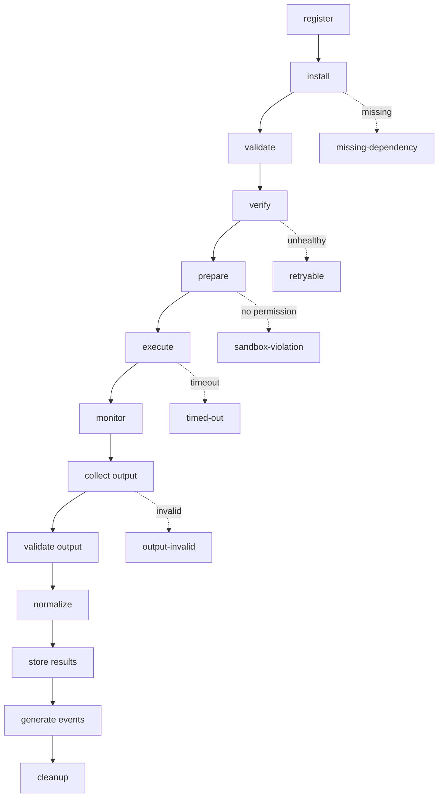

# HunterX v7 Tool Integration SDK & Execution Framework — Architecture & Reference

**Status:** Ratified (Sprint 004)
**Version:** 1.0.0
**Owner:** HunterX Architecture Council

---

## 1. Purpose / Scope

This document defines the **Tool Integration SDK & Execution Framework** —
the one supported mechanism through which every external security tool
(Nmap, Nuclei, Katana, SQLMap, and any future tool) integrates with HunterX.

It has two mandates:

1. **Integrate — the SDK contract.** Tools implement a
   [`ToolAdapter`](#6-sdk-contract-the-tool-adapter) and are registered,
   installed, verified and executed by the framework.
2. **Execute — the lifecycle.** The
   [`ExecutionEngine`](#8-execution-engine) drives a full, guarded lifecycle
   for every tool run, producing structured, classified results.

Hard constraints:

- **No direct Core access.** Tools interact only through the SDK. No adapter
  may import or mutate HunterX Core internals.
- **No tools shipped.** This sprint builds the SDK only. No external tool is
  integrated.
- **Isolation.** Every execution is sandboxed, resource-bounded, timed,
  retry-policy-driven and secret-safe.

Scope: `src/hunterx/tools/sdk/` plus the execution domain models
(`src/hunterx/domain/execution.py`) and the execution event types
(`src/hunterx/domain/events/types.py`).

Out of scope: specific tool adapters, output parsers for specific tools,
workflow engines and reporting. The TIP knowledge plane is described in
`docs/v7-tool-intelligence-platform.md`; the SDK consumes it for dependency
and health decisions.

---

## 2. Design Goals

1. **Adapter-first.** A tool is a `ToolAdapter`; the framework never
   special-cases a vendor.
2. **Guardrails not glue.** Sandbox, resource, timeout, retry, lock and
   validation guardrails are applied uniformly to every execution.
3. **Classified failures.** Every failure is normalized into an
   `ExecutionResult` with a `FailureKind` so retry/rollback policy is data,
   not exception types.
4. **Full observability.** Sessions, monitors and an event bus stream the
   lifecycle for audit, metrics and plugins.
5. **Bible-compliant isolation.** Permission checks mirror the plugin sandbox
   model; secrets never leak into telemetry.

---

## 3. Package Overview

```mermaid
flowchart TD
    SDK[src/hunterx/tools/sdk/]

    SDK --> CTX[context.py<br/>ExecutionContextBuilder]
    SDK --> OUT[output.py<br/>OutputCollector]
    SDK --> RES[result.py<br/>result helpers]
    SDK --> ADP[adapter.py<br/>ToolAdapter / LegacyToolBridge]
    SDK --> ENG[engine.py<br/>ExecutionEngine]
    SDK --> PIP[pipeline.py<br/>ExecutionPipeline]
    SDK --> SAN[sandbox.py<br/>ExecutionSandbox]
    SDK --> RSC[resources.py<br/>ResourceManager]
    SDK --> TIM[timeout.py<br/>TimeoutManager]
    SDK --> RET[retry.py<br/>RetryManager]
    SDK --> LCK[locks.py<br/>ToolLockManager]
    SDK --> CCH[cache.py<br/>ExecutionCache]
    SDK --> QUE[queue.py<br/>ToolQueue]
    SDK --> SCH[scheduler.py<br/>TaskScheduler]
    SDK --> PAR[parallel.py<br/>ParallelExecutionManager]
    SDK --> SES[session.py<br/>ExecutionSession]
    SDK --> MON[monitor.py<br/>ExecutionMonitor]
    SDK --> EVT[events.py<br/>ExecutionEventBus]
    SDK --> DEP[dependencies.py<br/>DependencyResolver]
    SDK --> INS[installer.py<br/>InstallationManager]
    SDK --> VER[version.py<br/>VersionManager]
    SDK --> HLT[health.py<br/>HealthChecker]
    SDK --> CAP[capabilities.py<br/>ExecutionCapabilityRegistry]
    SDK --> PLG[plugin.py<br/>ExecutionPluginManager]
```



---

## 4. Domain Models

Defined in `src/hunterx/domain/execution.py` (frozen, slotted dataclasses
unless noted).

### 4.1 ExecutionStatus

`pending → scheduled → preparing → running → monitoring → collecting →
validating → normalizing → storing → completed`, with failure branches
`failed`, `timed-out`, `cancelled`, `retrying`, `skipped`. Properties:
`is_terminal`, `is_success`.

### 4.2 FailureKind

Classification driving retry/rollback: `not-retryable`, `retryable`,
`timeout`, `cancelled`, `resource-exhausted`, `sandbox-violation`,
`missing-dependency`, `configuration`, `installation`, `output-invalid`,
`normalization-failed`.

### 4.3 ExecutionContext

Everything an execution needs, passed to the tool and the pipeline:

- **Identity:** `execution_id` (auto ULID), `tool_id`, `mission_id`,
  `correlation_id` (falls back to `execution_id`).
- **Target:** `target`, `target_type`, `profile`, `configuration`.
- **Controls:** `timeout_seconds`, `retry_policy`, `resource_limits`,
  `permissions` (tuple of `PermissionFlag` values).
- **Paths:** `working_directory`, `output_directory`, `temp_directory`.
- **Misc:** `parameters`, `environment`, `created_at`.

`timeout_effective` prefers the explicit timeout, else the resource-limit
default. `0` = unlimited.

### 4.4 RetryPolicy

`max_attempts` (1 = no retry), `base_delay_s`, `max_delay_s`,
`backoff_factor`, `retryable_kinds`, `jitter`. `retries() = max_attempts - 1`.

### 4.5 ResourceLimits

Numeric ceilings where `0` = unlimited: `max_cpu_percent`, `max_memory_mb`,
`max_disk_mb`, `network_allowed`, `max_threads`, `max_parallel_jobs`,
`max_queue_size`, `timeout_seconds`. The parallel-job and queue caps are
platform-wide, enforced by the `ResourceManager`.

### 4.6 ExecutionOutput

Mutable collector output: `stdout`, `stderr`, `exit_code`, `files`, `json`,
`xml`, `csv`, `txt`, `yaml`, `html`, `binary`, `screenshots`,
`pcap_references` and a `formats` set of `OutputFormat` values. Properties:
`ok`, `has_content`.

### 4.7 ExecutionResult

The outcome of one execution: `status`, `output`, `error`, `failure_kind`,
`retry_count`, `duration_ms`, timestamps, `normalized`, `stored`,
`events_published` and a `trace` of pipeline stages. `summarize()` returns a
JSON-safe summary.

---

## 5. Lifecycle Pipeline

The `ExecutionPipeline` runs one execution through every stage. A failure at
any stage becomes a structured `ExecutionResult` with a classified
`FailureKind` — the pipeline never raises for execution failures.



Guards applied per stage:

| Stage | Guard | FailureKind |
|---|---|---|
| dependency | `DependencyResolver.assert_satisfied` | `missing-dependency` |
| verify | `HealthChecker.assert_healthy` | `retryable` |
| permissions | `ExecutionSandbox.enforce_permission` | `sandbox-violation` |
| execute | `TimeoutManager.check` | `timeout` → status `timed-out` |
| execute | exception classification | `retryable` / `not-retryable` |
| collect | `ToolAdapter.validate_output` | `output-invalid` |

Retries are evaluated by `RetryManager.eligible(policy, kind, attempt)` after
each non-successful attempt; delays follow exponential backoff with optional
jitter.

---

## 6. SDK Contract: The ToolAdapter

```python
from hunterx.tools.sdk import OutputCollector, ToolAdapter
from hunterx.domain.tools import ToolDescriptor

class MyTool(ToolAdapter):
    descriptor = ToolDescriptor(
        name="my-tool", version="1.0.0", targets=("url",),
        capabilities=("http-enumeration",), permissions=("network",),
    )

    def prepare(self, context): ...            # optional
    def run(self, context, collector: OutputCollector): ...   # required
    def validate_output(self, context, output): ...  # default: exit code + content
    def normalize(self, context, output): ...   # default: JSON findings -> ToolOutput
    def cleanup(self, context): ...             # optional
```

- `run` writes text via `collector.attach_stdout`, structured data via
  `collector.set_json`, and artifacts via `collector.attach_file`,
  `attach_screenshot`, `attach_pcap`.
- `prepare`/`cleanup` are optional no-op hooks.
- Legacy `BaseTool` adapters are wrapped by `LegacyToolBridge` unchanged; the
  engine bridges them automatically on registration.

### 6.1 Context, Output, Result helpers

- `ExecutionContextBuilder(tool_id, target).with_timeout(...).build()` —
  fluent, frozen-model-safe, auto-fills `execution_id`/`correlation_id`.
- `OutputCollector` — accumulates output; `build()` auto-detects JSON from
  stdout and tracks `duration_ms`.
- `result` helpers — `new_result`, `start_execution`, `finish_success`,
  `finish_failure`, `finish_timeout`, `finish_cancelled`, `mark_stored`,
  `mark_normalized`, `mark_events`, `to_evidence` (bridges to
  `ToolExecutionEvidence`).

---

## 7. Sandbox & Isolation

`ExecutionSandbox` is the single place execution security policies are
applied.

- **Permissions** — `enforce_permission(context, flag)` requires the flag in
  `context.permissions` and the platform policy; `grants(...)` returns a
  boolean. The pipeline enforces the adapter's declared `permissions` before
  every run.
- **Filesystem** — `create_temp_directory` / `create_output_directory`
  produce execution-scoped directories under the context's temp/output base.
- **Environment** — `prepare_environment` injects secrets only when the
  execution holds the `secrets` permission; `sanitized_environment` strips
  them for telemetry.
- **Secrets** — `mask_secrets` redacts secret values from a copy of the
  output (the raw output is preserved for protected storage).

---

## 8. Execution Engine

`ExecutionEngine` is the composition root. It wires every component and
exposes the integration API:

```python
engine = ExecutionEngine(intelligence=tip.registry,
                         max_parallel_jobs=4, max_queue_size=100,
                         cache_ttl_s=300)

engine.register_adapter("nmap", "hunterx_tools.nmap:NmapAdapter")  # or instance
engine.install("nmap", version="7.94")
engine.health_check("nmap", requirement=">=7.80")

context = (ExecutionContextBuilder(tool_id="nmap", target="10.0.0.5")
           .with_timeout(120.0).build())

outcome = engine.execute(context)      # PipelineResult(result, session, attempts)
engine.submit(context); engine.drain()  # queue + scheduler
engine.run_parallel([ctx_a, ctx_b])     # bounded concurrency
```

Attached components (all public attributes): `sandbox`, `resources`,
`timeout`, `retry`, `locks`, `cache`, `queue`, `versions`, `installer`,
`health`, `monitor`, `events`, `plugins`, `parallel`, `scheduler`.

---

## 9. Reliability Components

| Component | Responsibility |
|---|---|
| `ResourceManager` | parallel-job and queue caps; usage accounting; per-execution limits |
| `TimeoutManager` | monotonic deadline per execution; `check` raises `ToolTimeoutError` |
| `RetryManager` | eligibility by `FailureKind`; exponential backoff + jitter |
| `ToolLockManager` | exclusive (tool, target) locks; re-entrant per thread |
| `ExecutionCache` | deterministic key = (tool, target, profile, version, config); TTL |
| `ToolQueue` | bounded FIFO with optional (tool,target) deduplication |
| `TaskScheduler` | drains the queue under the parallel cap |
| `ParallelExecutionManager` | thread pool for `run_parallel` |

### 9.1 Events

`ExecutionEventBus` emits typed domain events: `execution.started`,
`execution.completed`, `execution.failed`, `execution.timed_out`,
`execution.retried`, `output.collected`, `normalization.complete`,
`database.updated`. Each has a matching typed `DomainEvent` in
`src/hunterx/domain/events/types.py`.

### 9.2 Sessions & Monitoring

`ExecutionSession` owns one execution's timing, artifacts and status.
`ExecutionMonitor` records a timeline of `ProgressPoint`s and streams callbacks
for observability.

---

## 10. Install, Version, Health, Dependencies

| Component | Role |
|---|---|
| `InstallationManager` | records installs via adapter-supplied hooks; no vendor logic in the SDK |
| `VersionManager` | semver records and `>=` / `>` / `==` / `<=` / `<` constraint checks |
| `HealthChecker` | verdict = installed + version-satisfied + probe-ok |
| `DependencyResolver` | TIP capability graph + install state; blocks runs on unmet prerequisites |
| `ExecutionCapabilityRegistry` | capability → provider mapping for eligibility |
| `ExecutionPluginManager` | hot load/unload of plugins declaring `__hunterx_plugin__` |

---

## 11. Developer Integration Guide

### Step 1 — Implement a ToolAdapter

Implement `run` and declare a `ToolDescriptor`. Write output to the
`OutputCollector`.

### Step 2 — Register

```python
engine.register_adapter("nmap", "my_tools.nmap:NmapAdapter")
```

Entry points are `module.path:ClassName`. Legacy `BaseTool` instances are
accepted and bridged.

### Step 3 — Install & Verify

```python
engine.install_hook("nmap", install_callable)   # optional, or adapter.installer
engine.install("nmap", version="7.94")
engine.health_probe("nmap", lambda _: which("nmap") is not None)
```

### Step 4 — Run

Build a context and execute. The engine enforces dependencies, health,
permissions, resources, timeout and retry automatically.

### Rules for tool authors

- Never import HunterX Core internals; use only the SDK surface.
- Write findings as JSON `{"findings": [...]}` records or via the normalizer
  contract so results bridge to `ToolExecutionEvidence`.
- Declare required permissions truthfully — the sandbox will deny execution
  that lacks them.

---

## 12. Testing & Gates

The SDK ships 81 unit tests under `tests/unit/test_execution_*.py` plus the
shared fixture `tests/framework/execution.py` (`FakeAdapter`, `make_context`).
Acceptance gates are identical to Foundation:

```bash
python -m ruff check src tests/unit tests/component tests/integration tests/golden tests/security tests/acceptance tests/performance tests/framework tests/conftest.py
python -m compileall -q src
python -m pytest -q
```
