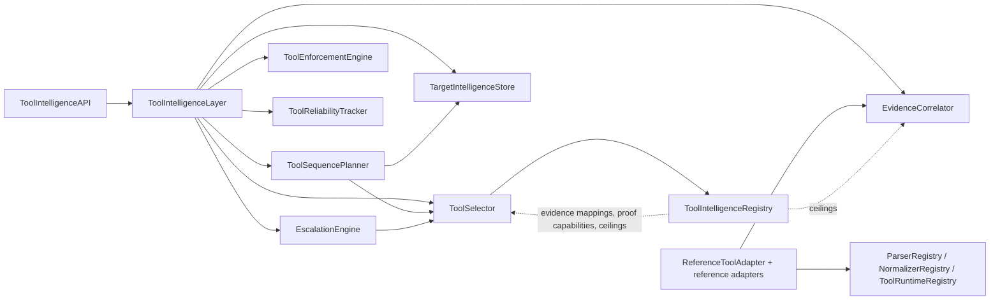

# HunterX v7 Tool Intelligence Layer — Architecture & Reference

**Status:** Ratified (Sprint 023)
**Version:** 1.0.0
**Owner:** HunterX Architecture Council

---

## 1. Purpose / Scope

Sprint 021–022 established the *evidence* and *proof* planes: how observations
become findings and how findings become provable. Sprint 023 closes the loop on
the *tool* plane. The **Tool Intelligence Layer** decides, for a given mission:

- **Which tool?** — safety-ceiling-aware selection (extends TIP selection).
- **In what order?** — dependency-aware tool chains.
- **Under what guardrails?** — safety, scope, input, resource enforcement and
  prompt-injection resistance.
- **When to escalate?** — adaptive escalation bounded by authorization.
- **What did we learn?** — evidence correlation, target intelligence, tool
  reliability and availability.

The layer is a *facade* (`ToolIntelligenceLayer`) over the Sprint 023 engines
and is exposed through `ToolIntelligenceAPI`. It is safe to run in CI and at
startup: the engines never execute a binary by themselves. Tools are executed
only through the existing SDK/execution framework; the reference adapters are
in-process and emit structured records for integration, not real attacks.

Scope: `src/hunterx/tools/intelligence/{parsers,normalizers,selector,planner,
escalation,correlation,enforcement,target,reliability,layer,adapters}.py`,
`src/hunterx/tools/intelligence/api.py`, the extended registry and the Sprint
023 domain contracts in `src/hunterx/domain/tool_intelligence.py`.

Out of scope: binary execution, real tool integration packs and reporting
pipelines. The SDK execution framework is described in
`docs/v7-tool-integration-sdk.md`; the knowledge plane in
`docs/v7-tool-intelligence-platform.md`; evidence and proof planes in
`docs/v7-vulnerability-intelligence.md` and
`docs/v7-vulnerability-proof-and-poc.md`.

---

## 2. Design Goals

1. **Safety by default.** A tool whose `safety_class` exceeds the mission
   authorization ceiling is never selected, planned or escalated.
2. **Deterministic guardrails.** Every pre-execution gate (safety, scope,
   input validation, resources) is a check that either passes or raises a typed
   violation — no silent mutation of intent.
3. **Explainable decisions.** Selections carry reasoning; escalations carry
   level, capability and evidence; enforcement violations carry the field and
   the reason.
4. **Tool output is not truth.** Evidence mappings define what additional
   validation is required; confidence ceilings cap what a tool may contribute
   to a finding.
5. **Memory.** Target intelligence records what has already been done to a
   target so the planner does not repeat work.
6. **In-process by default.** Reference adapters exercise the full flow
   without any external binary.

---

## 3. Package Overview



---

## 4. Data Model

The Sprint 023 contracts live in `src/hunterx/domain/tool_intelligence.py`:

| Contract | Purpose |
|---|---|
| `ToolInvocationContract` | Command, arguments, network/filesystem/scope policy, exit codes, timeout. |
| `ToolInputField` / `ToolInputSchema` | Field kinds, required inputs, target type, timeout. |
| `ToolSafetyProfile` / `ToolSafetyClass` | Passive → high-impact safety classes, escalation levels, `requires_authorization`. |
| `ToolScopeProfile` | Redirect handling, scope inheritance, network boundary, scope expansion. |
| `ToolResourceRequirements` / `ToolRateLimitProfile` | CPU/memory/disk/timeout estimates, concurrency class, rate limits. |
| `ToolEvidenceMapping` | Maps a tool observation kind to a canonical evidence type + strength. |
| `ToolProofCapability` | Declares the proof strategies a tool can support. |
| `ToolConfidenceCeiling` | Max confidence a tool may contribute per strength (detection/behavioral/proof). |
| `CanonicalObservation` | Normalized observation produced by adapters. |
| `ToolChain` / `ChainStep` | Dependency-aware execution plan. |
| `ToolSelection` | Ranked, explained safety-aware selection. |
| `EscalationDecision` | Allowed/denied escalation with reason. |
| `ToolExecutionRecord` | Per-target execution record. |
| `TargetIntelligenceSnapshot` | What is known about a target and what to not repeat. |
| `ToolReliabilityStats` / `ToolAvailabilityReport` | Reliability and availability tracking. |
| `ChainStatus` / `ChainStepState` / `ChainStepResult` | Plan/execution state. |

---

## 5. Engine Reference

### 5.1 Selection — `selector.py`

`ToolSelector.select(criteria, authorization=...)` extends the classic
selection engine. Invariants:

- Safety ceiling: `safety.safety_class.exceeds(authorization)` → excluded.
- Authorization: `safety.requires_authorization and not authorization_granted`
  → excluded.
- `expected_evidence` comes from registered evidence mappings (or the
  knowledge's supported evidence types).
- `confidence_ceiling` comes from the registered ceiling
  (`ToolConfidenceCeiling.proof_ceiling`), never from raw output.

### 5.2 Planning — `planner.py`

`ToolSequencePlanner.plan(...)` produces a `ToolChain` from requested
capabilities: each step selects the best available tool for one capability,
records declared dependencies, and materializes inter-step edges
(`ToolChain.dependencies`). The planner consults target intelligence so steps
already completed against the target can be skipped or annotated.

### 5.3 Escalation — `escalation.py`

`EscalationEngine.escalate(...)` maps an `EscalationLevel` and evidence
strength to an `EscalationDecision`. Escalation is allowed only when the level
is within the authorization ceiling and scope permits; denials carry the
reason (`scope_required`, `authorization_required`, etc.).

### 5.4 Enforcement — `enforcement.py`

`ToolEnforcementEngine` runs the pre-execution gates:

- `enforce_safety` — the tool's class must fit the authorization ceiling.
- `enforce_scope` — target must be within the authorized scope.
- `validate_inputs` — validates required inputs against the declared schema,
  and rejects **prompt-injection patterns** and **shell metacharacters**
  (`[;&|`$<>]`) in every string value.
- `enforce_resources` — required resources must fit the available budget.

Any failure raises `EnforcementViolation` with the offending field and reason.
There is no partial enforcement: a tool is either fully cleared or not.

### 5.5 Evidence correlation — `correlation.py`

`EvidenceCorrelator` ingests `CanonicalObservation`s, deduplicates observations
sharing a `correlation_key`, and groups them into `CorrelatedEvidenceChain`s.
Key rules:

- Aggregated confidence respects each contributing tool's ceiling.
- The strongest observed strength drives the chain (`PROOF` > behavioral).
- **Conflicting evidence is preserved, never averaged.** `conflicts()` returns
  groups where two or more tools report the same key with different values.

The layer wires ceilings from the registry per observation tool
(`layer._ceilings`), so correlation never exceeds a registered ceiling even
when the observation itself reports a higher confidence.

### 5.6 Target intelligence — `target.py`

`TargetIntelligenceStore` is a thread-safe per-target memory:

- `record(execution, observations)` persists executions and observations.
- `snapshot(target)` composes known assets/services/technologies/endpoints/
  parameters/vulnerabilities/evidence, tool coverage, first/last seen and
  confidence state.
- `has_executed(target, tool_id)` answers "have we already done this?"
- `exclude(target, reason)` marks checks never to re-run.

### 5.7 Reliability & availability — `reliability.py`

`ToolReliabilityTracker` records successes/failures with durations, reports
availability status (`ToolAvailabilityStatus`), and produces
`ToolReliabilityStats` (successful/failed executions, success rate, average
duration) for the selector and the AI engine.

### 5.8 Parsers & normalizers — `parsers.py`, `normalizers.py`

- `ParserRegistry` maps parser ids to record-parsing callables.
- `NormalizerRegistry` maps normalizer ids to observation-normalizing
  callables.
- `ToolRuntimeRegistry` resolves a (parser, normalizer) pair from the two
  registries.
- Built-in normalizers cover domain, url, ip, port and technology kinds.
  `_common` derives a deterministic `correlation_key`
  (`{kind}:{target}:{value}`) and `observation_id` when records do not supply
  one, so adapter output flows straight into correlation and target
  intelligence.

### 5.9 Reference adapters — `adapters.py`

`ReferenceToolAdapter` shows the integration contract: a subclass declares
`tool_id`, `parser_id`, `normalizer_id` and `_produce_records(...)`, then `run`
parses, normalizes and returns a `ToolExecutionResult` with canonical
observations. Shipped reference adapters (in-process, no binary required):

| Adapter | tool_id | normalizer | produces |
|---|---|---|---|
| `PortScannerAdapter` | `portscanner` | `port` | port observations |
| `WebProbeAdapter` | `webprobe` | `url` | url observations |
| `TechDetectorAdapter` | `techdetector` | `technology` | technology observations |

`REFERENCE_ADAPTERS` keys the registry by `tool_id`.

### 5.10 Facade & API — `layer.py`, `api.py`

`ToolIntelligenceLayer` composes the engines; `ToolIntelligenceAPI` exposes the
public surface:

`select_intelligence`, `plan_chain`, `escalate`, `enforce_execution`,
`correlate`, `conflicts`, `record_execution`, `target_snapshot`,
`report_availability`, `reliability`, `register_evidence_mapping`,
`register_proof_capability`, `register_confidence_ceiling`.

---

## 6. Integration Guide

Register a tool with full Sprint 023 knowledge, install/verify it, then use the
facade:

```python
from hunterx.domain.tool_intelligence import (
    ToolConfidenceCeiling,
    ToolEvidenceMapping,
    ToolSafetyClass,
    ToolSelectionCriteria,
    EvidenceStrength,
)
from hunterx.tools.intelligence.api import ToolIntelligenceAPI
from tests.framework.tip import make_compatibility, make_knowledge, make_metadata

tip = ToolIntelligenceAPI()
tip.register_tool(
    make_metadata("scanner", category="recon", subcategory="network"),
    knowledge=make_knowledge("scanner", capabilities=("port-scanning",)),
    compatibility=make_compatibility("scanner"),
)
tip.register_evidence_mapping(ToolEvidenceMapping(
    tool_id="scanner", observation_kind="port",
    evidence_type="port-open", strength=EvidenceStrength.DETECTION,
))
tip.register_confidence_ceiling(ToolConfidenceCeiling(tool_id="scanner", detection_ceiling=0.6))
tip.install("scanner"); tip.verify("scanner"); tip.make_available("scanner")

selections = tip.select_intelligence(
    ToolSelectionCriteria(required_capabilities=("port-scanning",), require_installed=True),
    authorization=ToolSafetyClass.ACTIVE,
)
```

Planner note: `ToolSelectionCriteria.require_installed` defaults to `True`, so
tests and callers must `install`/`verify`/`make_available` tools before
selection.

---

## 7. Testing

- `tests/unit/test_tool_intelligence_layer.py` — registries, selection,
  planning, escalation, enforcement (incl. injection + shell metacharacter
  blocking), correlation and ceilings, target intelligence, reliability.
- `tests/unit/test_tool_intelligence_adapters.py` — reference adapters and the
  parser/normalizer flow.
- `tests/acceptance/test_tool_intelligence_acceptance.py` — the full Sprint 023
  loop (register → select → plan → enforce → escalate → run adapter → correlate
  → record → snapshot → reliability), plus the ceiling test proving selection
  never exceeds the authorization ceiling.
- Architecture suite verifies layering and import cycles across the new
  modules.
