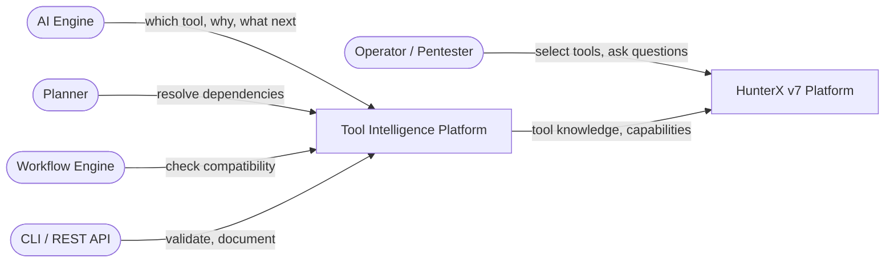
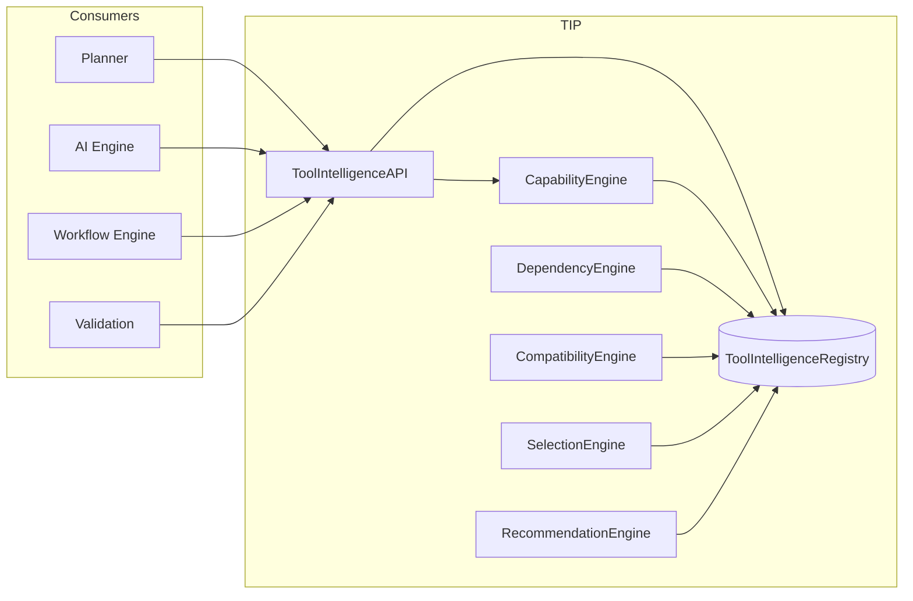
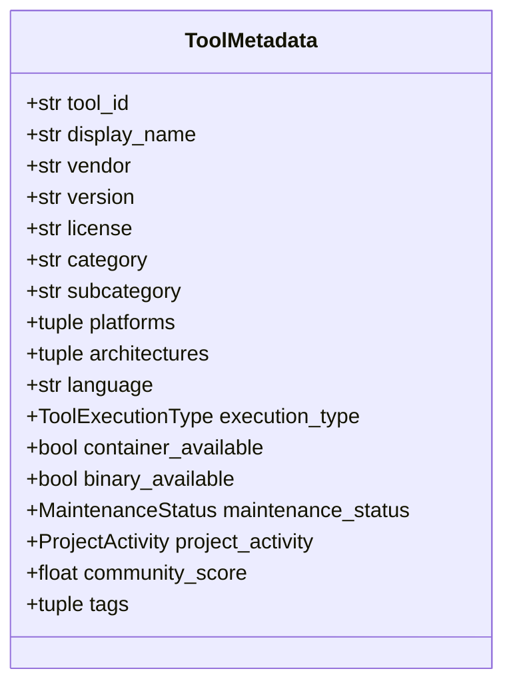
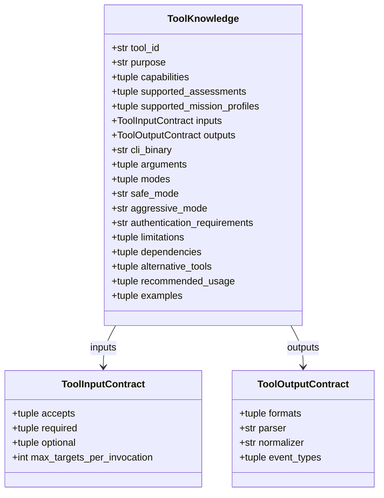
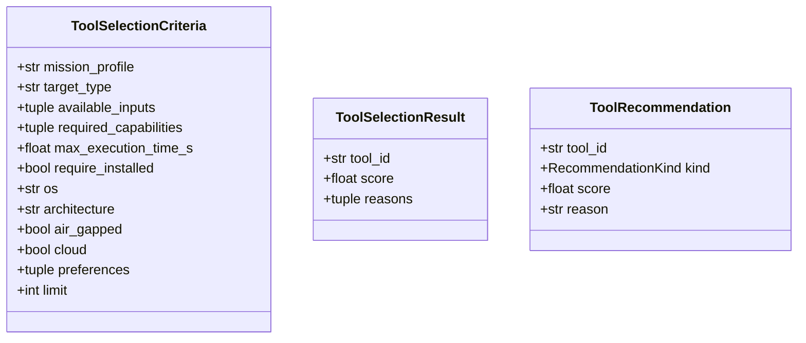
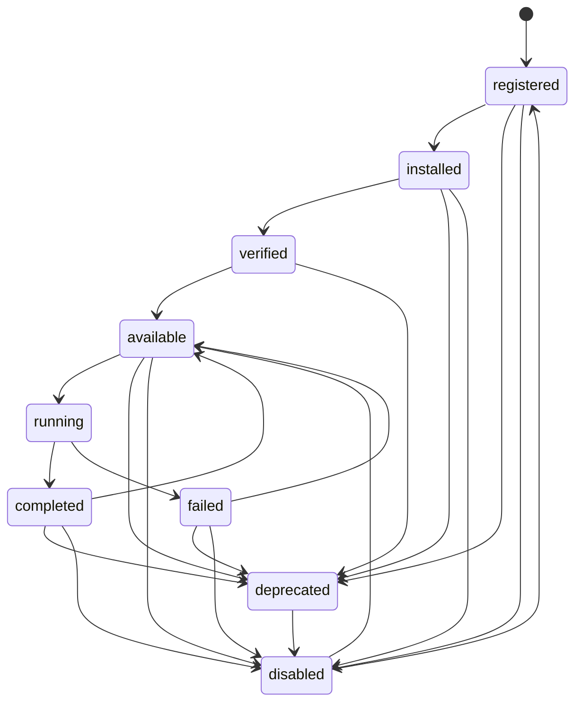
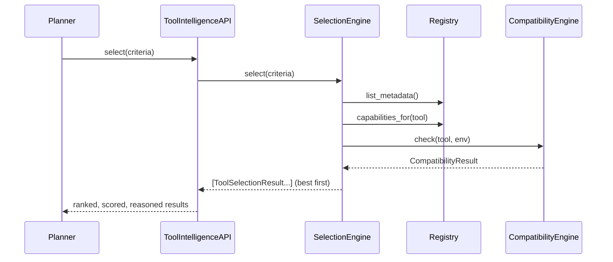
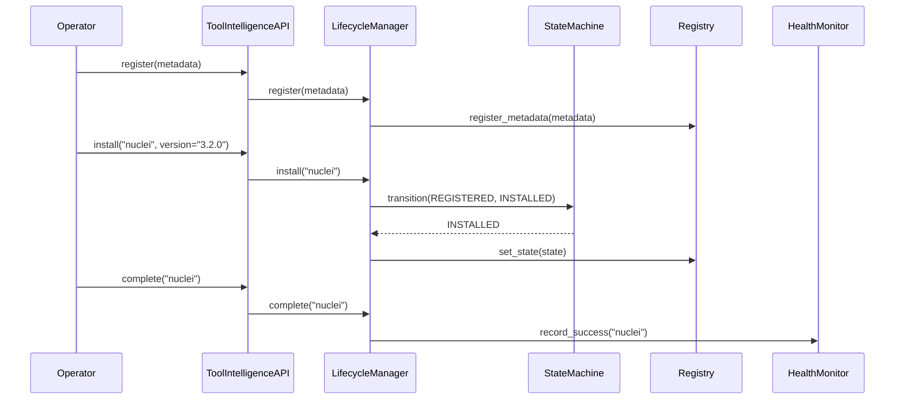
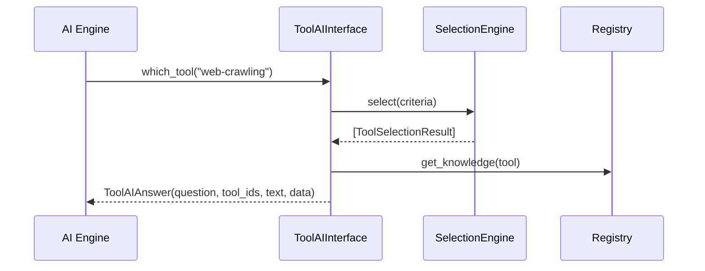

# HunterX v7 Tool Intelligence Platform (TIP) - Architecture & Module Reference

**Status:** Ratified (Foundation Sprint 003)
**Version:** 1.0.0
**Owner:** HunterX Architecture Council

---

## 1. Purpose / Scope

This document describes the **Tool Intelligence Platform (TIP)** — the
intelligence layer of HunterX v7 that lets the platform understand, evaluate,
orchestrate and optimize security tools **without executing them**.

TIP is a pure knowledge plane: it never runs a tool, never parses output, never
touches a target. Instead, it answers the questions every other subsystem asks:

- **Which tool?** — capability-first selection and recommendation.
- **Why this tool?** — scored, explained, transparent decisions.
- **What inputs?** — input contracts and required arguments.
- **What outputs?** — output contracts, formats, event types.
- **What next?** — dependency-ordered downstream tools.
- **Better tool?** — alternative and replacement suggestions.
- **Combine tools?** — complementary tool chains.

Scope: the `src/hunterx/tools/intelligence/` package, its domain contracts
(`src/hunterx/domain/tool_intelligence.py`), the port
(`src/hunterx/domain/ports/tool_intelligence.py`) and the runtime composition
(the `ToolIntelligenceAPI` facade).

Out of scope: tool adapters, output parsers, executors, binary execution,
scanning logic and workflows — those live in the sibling `hunterx.tools`
modules and later sprints. The authoritative knowledge contract is
`docs/bible/07 - Tool Knowledge Base Specification.md`; TIP mirrors it.

---

## 2. Design Goals

1. **No execution, pure knowledge.** TIP must be safe to run in CI and at
   startup; it SHALL never execute a tool or touch a target.
2. **Capability-first.** Tools are selected by what they do (capability), not
   by name; the taxonomy is the shared vocabulary.
3. **Port-driven.** Consumers depend on `ToolIntelligencePort`; the facade is
   the single concrete composition root.
4. **Explainable.** Every selection and recommendation carries reasons and a
   score, so the AI engine and operators can trust and audit decisions.
5. **Data-driven taxonomy.** New capabilities and categories are added as data,
   not as engine changes.

---

## 3. Package Overview

```mermaid
flowchart TD
    TIP[src/hunterx/tools/intelligence/]

    TIP --> API[api.py - ToolIntelligenceAPI facade]
    TIP --> REG[registry.py - ToolIntelligenceRegistry]
    TIP --> TAX[taxonomy.py - ToolTaxonomy]
    TIP --> CAP[capability.py - CapabilityEngine]
    TIP --> DEP[dependency.py - DependencyEngine]
    TIP --> COM[compatibility.py - CompatibilityEngine]
    TIP --> SEL[selection.py - ToolSelectionEngine]
    TIP --> REC[recommendation.py - ToolRecommendationEngine]
    TIP --> STM[state.py - ToolStateMachine]
    TIP --> LIF[lifecycle.py - ToolLifecycleManager]
    TIP --> HEA[health.py - ToolHealthMonitor]
    TIP --> PER[performance.py - ToolPerformanceAnalyzer]
    TIP --> VAL[validation.py - ToolValidationFramework]
    TIP --> DOC[docs.py - ToolDocumentationGenerator]
    TIP --> SCH[schema.py - metadata/knowledge schema]
    TIP --> AI[ai.py - ToolAIInterface]

    API --> REG
    API --> CAP
    API --> DEP
    API --> COM
    API --> SEL
    API --> REC
    API --> LIF
    API --> VAL
    API --> DOC
```

The layer rules:

- **Domain models** (`hunterx.domain.tool_intelligence`) are pure dataclasses:
  `ToolMetadata`, `ToolKnowledge`, `ToolCapability`, `ToolCompatibility`,
  `ToolRuntimeState`, `ToolHealthStats`, `ToolPerformanceStats`,
  `ToolRecommendation`, `ToolSelectionCriteria`, `ToolSelectionResult`,
  `ToolTaxonomyNode`, plus the `ToolState`, `ToolExecutionType`,
  `MaintenanceStatus`, `ProjectActivity`, `RecommendationKind` enums.
- **Engines** live under `hunterx.tools.intelligence` and read/write the
  registry; they never depend on each other except through the registry.
- **The facade** composes engines and implements `ToolIntelligencePort`.

---

## 4. System Context (C4 Level 1)

TIP is a service the platform composes at runtime. It is read-mostly: the
Planner and AI Engine query it; lifecycle operations (register, install,
deprecate) happen through the Lifecycle Manager.

---

## 5. Component View - Registry & Data Flow (C4 Level 2)

All engines share one in-memory, thread-safe registry (`RLock`). Capabilities
are indexed both by id and by provider, so `providers_for(capability)` is O(1)
after registration.

---

## 6. Key Data Models

### 6.1 Tool Metadata (registration record)

### 6.2 Tool Knowledge (the machine-readable contract, mirrors Bible 07)

### 6.3 Selection & Recommendation

---

## 7. State Machine

The machine (`ToolStateMachine`) rejects illegal transitions with
`ToolStateTransitionError`. `deprecated` and `disabled` are terminal modifier
states; `available`/`installed`/`verified`/`completed` are "usable".

---

## 8. Key Runtime Flows

### 8.1 Selection

### 8.2 Lifecycle

### 8.3 AI Question / Answer

---

## 9. Module Reference

### 9.1 `domain/tool_intelligence.py`
Pure data models (see section 6). Frozen, slotted dataclasses except
`ToolRuntimeState`, `ToolHealthStats`, `ToolPerformanceStats` (mutable).

### 9.2 `domain/ports/tool_intelligence.py`
`ToolIntelligencePort` ABC: `get_tool`, `list_tools`, `get_knowledge`,
`search_tools`, `tools_by_capability`, `capabilities`, `taxonomy`,
`resolve_dependencies`, `check_compatibility`, `health`, `performance`,
`select`, `recommend`.

### 9.3 `tools/intelligence/registry.py`
`ToolIntelligenceRegistry` — thread-safe (`RLock`) stores for metadata,
knowledge, capability definitions, capability→provider index, compatibility,
runtime state, health and performance. `to_dict()` serializes via
`dataclasses.asdict`. `register_metadata` rejects duplicate and non-lowercase
ids (`ToolRegistrationError`).

### 9.4 `tools/intelligence/taxonomy.py`
`ToolTaxonomy` — canonical 6-category tree (recon / assessment / cloud /
directory / analysis / reporting), ~50 capabilities, T-code techniques and
mission profiles. `classify(capability)` → `(category, subcategory)`.

### 9.5 `tools/intelligence/capability.py`
`CapabilityEngine` — `sync_taxonomy()` seeds canonical definitions,
`search()`, `by_category()`, `providers()`, `capabilities_for()`.

### 9.6 `tools/intelligence/dependency.py`
`DependencyEngine` — `requires`, `provides`, `providers_of`,
`resolve_dependencies` (BFS topological order, excludes self, raises
`ToolNotFoundError`), `is_satisfied` → `(ok, missing)`,
`required_tool_chain`, `dependency_map`, `cycle_report`.

### 9.7 `tools/intelligence/compatibility.py`
`CompatibilityEngine` — `check()` returns `CompatibilityResult`
(compatible / reasons / missing) for OS, architecture, docker, cloud and
air-gapped environments; empty os/arch skips those checks.
`available_backends()` lists supported execution backends.

### 9.8 `tools/intelligence/selection.py`
`ToolSelectionEngine` — `select(criteria)` ranks best-first with additive,
normalized `[0,1]` scores; excludes tools missing required capabilities, wrong
mission profile, wrong target type, unsatisfied required inputs, over time
budget, environment-incompatible or uninstalled (when `require_installed`);
raises `ToolSelectionError` when empty.

### 9.9 `tools/intelligence/recommendation.py`
`ToolRecommendationEngine` — `recommend(capability)` → BEST, ALTERNATIVE,
FALLBACK, COMPLEMENTARY; `replacement_for(deprecated)`,
`deprecated_providers(capability)`.

### 9.10 `tools/intelligence/state.py`
`ToolStateMachine` — legal transitions table, `transition` (raises
`ToolStateTransitionError`), `is_usable`, `is_terminal`, `allowed_targets`.

### 9.11 `tools/intelligence/lifecycle.py`
`ToolLifecycleManager` — `register`, `unregister`, `install`, `verify`,
`make_available`, `start`, `complete`, `fail`, `disable`, `enable`,
`deprecate`, `update` (re-verify required), `is_usable`.

### 9.12 `tools/intelligence/health.py`
`ToolHealthMonitor` — `record_success` (+0.05 reliability), `record_failure`
(−0.15, crash/timeout tracking), `record_usage`, `set_availability`.

### 9.13 `tools/intelligence/performance.py`
`ToolPerformanceAnalyzer` — rolling `record_execution` (duration / findings /
success / failure / cost), `record_false_positive`, `reset`.

### 9.14 `tools/intelligence/validation.py`
`ToolValidationFramework` — `validate(tool_id)` checks configuration,
installation, compatibility, dependencies (required unmet = ERROR, optional =
WARNING) and permissions; `validate_mapping(raw)` for pre-registration checks.
`ValidationReport.valid` is False when any ERROR exists.

### 9.15 `tools/intelligence/docs.py`
`ToolDocumentationGenerator` — `generate(tool_id)` produces a Markdown
reference page from metadata/knowledge/capabilities; `generate_all()`.

### 9.16 `tools/intelligence/schema.py`
Permanent metadata schema — `metadata_to_dict/from_dict`,
`knowledge_to_dict/from_dict`, `compatibility_from_dict`,
`load_knowledge_file(path)` (YAML → `ToolKnowledge`).

### 9.17 `tools/intelligence/ai.py`
`ToolAIInterface` — structured Q&A bridge for the AI engine:
`which_tool`, `why`, `required_inputs`, `expected_outputs`, `what_next`,
`better_tool`, `combine`; `ToolAIAnswer(question, tool_ids, text, data)`;
`build_recommendation_prompt`. It never calls an LLM itself.

### 9.18 `tools/intelligence/api.py`
`ToolIntelligenceAPI(ToolIntelligencePort)` — the composition root.
Constructor wires registry, taxonomy, capability, dependency, compatibility,
state machine, health, performance, selection, recommendation, lifecycle,
validation and docs engines. Adds convenience wrappers (`register_tool`,
`install`, `verify`, `make_available`, `disable`, `enable`, `deprecate`,
`record_success`, `record_failure`, `record_performance`, `generate_docs`,
`validate`).

---

## 10. Architecture Rules

1. TIP SHALL never execute a tool or touch a target.
2. Consumers SHALL depend on `ToolIntelligencePort`, not on concrete engines.
3. Engines SHALL communicate through the registry, never directly.
4. Selection and recommendation results SHALL carry a score and reasons.
5. New capabilities SHALL be added to the taxonomy as data.
6. `ToolCompatibility` SHALL be keyed by `tool_id`.
7. Registry serialization SHALL use `dataclasses.asdict` (all models are
   slots dataclasses without `__dict__`).

---

## 11. Verification

- `python -m ruff check src tests/...` — clean.
- `python -m compileall -q src` — clean.
- `python -m pytest -q` — 183 passed (including 111 TIP tests in
  `tests/unit/test_tool_intelligence_*.py`).
- Test doubles live in `tests/framework/tip.py`; the standard tool set models
  katana / nmap / httpx / ffuf without integrating them.

---

## 12. References

- `docs/bible/07 - Tool Knowledge Base Specification.md` (knowledge contract).
- `docs/bible/03 - Folder Structure.md` (package layout).
- `docs/bible/16 - Documentation Standards.md` (this document's format).
- `docs/v7-foundation.md` (Foundation Sprint 001 module reference).
- `src/hunterx/tools/intelligence/` (implementation).
