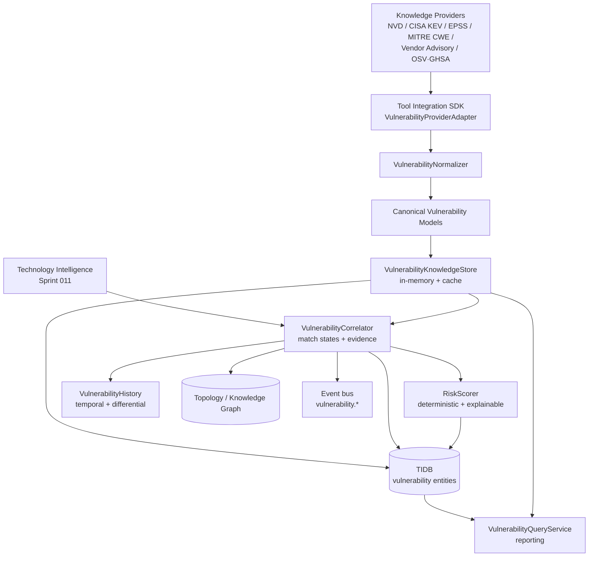

---
layout: default
title: HunterX v7 Vulnerability Knowledge & Risk Correlation Intelligence — Architecture & Reference
description: >-
  Architecture and reference for the Wave 12 Vulnerability Knowledge & Risk
  Correlation Intelligence capability: the canonical vulnerability knowledge
  layer (CVE, CWE, CPE, PURL, CVSS, EPSS, CISA KEV, exploitability metadata,
  vendor advisories, version ranges, affected products), technology-to-CVE
  correlation with explicit match states, false-positive management, conflict
  resolution, deterministic explainable risk scoring, temporal intelligence,
  differential analysis, TIDB mapping, Knowledge Graph relationships, events,
  reporting and the security boundary.
permalink: /v7-vulnerability-intelligence/
---

# HunterX v7 Vulnerability Knowledge & Risk Correlation Intelligence — Architecture & Reference

**Status:** Ratified (Sprint 018)
**Version:** 1.0.0
**Capability:** Vulnerability Knowledge & Risk Correlation Intelligence · Wave 12
**Owner:** HunterX Architecture Council

---

## 1. Purpose / Scope

The Vulnerability Knowledge & Risk Correlation Intelligence capability transforms
observed technology and asset intelligence into a **structured, persistent,
evidence-backed vulnerability-knowledge layer**. It correlates technology →
product → vendor → version → CPE → CVE → CWE → CVSS → EPSS → KEV →
exploitability indicators → asset exposure → authentication/authorization context
→ cloud/API context → historical state → risk, and answers:

- Which technologies exist on which assets?
- Which vulnerabilities **may** affect them?
- Why is each CVE considered relevant, and how confident is the match?
- Is the CVE in CISA KEV? What is its EPSS? What is its CVSS?
- Is public exploitation known?
- Which assets are exposed / production / critical?
- Which vulnerabilities deserve priority, and why (an explainable risk score)?
- What changed since the previous observation?
- Which matches are false positives, and why?
- How fresh is the underlying vulnerability knowledge?

**Security boundary — this is intelligence, not a scanner.** The capability
produces **potential vulnerability matches** only. It never executes exploits,
never runs PoCs, never downloads exploit code, never authenticates to targets,
never performs vulnerability verification and never modifies target state. Only
a future validation capability may transition a match from `POTENTIAL_MATCH`
towards `VALIDATED` / `CONFIRMED`.

Hard constraints:

- **No second database or graph.** The TIDB is the system of record; vulnerability
  edges live in the existing `tidb_topology_relationships` table.
- **No bypass of the Tool Integration SDK.** Every knowledge provider integrates
  through the SDK `ToolAdapter` lifecycle.
- **No hard-coded provider in the correlation engine.** The correlation engine
  operates on canonical vulnerability records regardless of source.
- **No conflated states.** Observed facts, inferred facts, known vulnerabilities,
  potential matches, validated vulnerabilities and exploited states are modeled
  as distinct, explicit values.
- **No opaque scores.** Every risk score carries the named factor breakdown that
  produced it.

---

## 2. Architecture



The lifecycle is:

```
INGEST → NORMALIZE → DEDUPLICATE → MATCH → CORRELATE → SCORE → PERSIST → GRAPH → DIFF → HISTORIZE → REPORT
```

---

## 3. Knowledge Sources

External vulnerability knowledge is ingested through an approved data-source
abstraction. Each provider is a `ToolAdapter` registered with the Tool
Integration SDK under `src/hunterx/tools/vuln/`:

| Provider | Adapter | Kind | Input |
|---|---|---|---|
| NVD | `NvdCveAdapter` | `nvd` | NVD 2.0 `CVE_Items` / API `vulnerabilities[]` JSON |
| CISA KEV | `KevAdapter` | `cisa-kev` | KEV catalog JSON (`vulnerabilities[]`) |
| EPSS | `EpssAdapter` | `epss` | first.org score CSV rows or JSON |
| MITRE CWE | `CweAdapter` | `mitre-cwe` | CWE weakness records |
| Vendor advisories | `AdvisoryAdapter` | `vendor-advisory` | vendor advisory JSON |
| OSV / GHSA | `OsvAdapter` | `osv` | OSV-style advisory JSON |

Provider adapters are **in-process normalizers**: they receive static payloads
through the execution parameters and serialize canonical knowledge into the
pipeline JSON payload. They never contact providers at runtime, never fetch
remote content and never execute anything. Registration is centralized in
`tools/vuln/registry.py` (`register_vulnerability_providers`) and mirrored into
the Tool Intelligence Platform via `tools/vuln/tip.py`.

---

## 4. Canonical Vulnerability Model

The canonical model lives in `src/hunterx/domain/vulnerability/models.py` and is
persisted 1:1 into TIDB entities (`domain/entities/tidb/vulnerability.py`):

| Concept | Domain model | TIDB entity |
|---|---|---|
| Vulnerability | `Vulnerability` | `Vulnerability` |
| CVE record | `Vulnerability` (CVE projection) | `CVERecord` |
| CWE | `Cwe` | `CWERecord` |
| CPE 2.3 | `Cpe` | `Cpe` |
| PURL | `PackageUrl` | `Purl` |
| Vendor / Product | — | `Vendor`, `Product` |
| Version / Version range | `VersionRange` | `Version`, `VersionRange` |
| CVSS | `Cvss` | `CvssRecord` |
| EPSS | `Epss` | `EpssRecord` |
| KEV | `KevRecord` | `KevRecord` |
| Exploitability | `Exploitability` | `ExploitabilityIndicator` |
| Affected product | `AffectedProduct` | `AffectedProduct` |
| Fixed version | — | `FixedVersion` |
| Vendor advisory | `VendorAdvisory` | `Advisory` |
| Match | `VulnerabilityMatch` | `VulnerabilityMatch` |
| Risk | `RiskAssessment` | `RiskAssessment`, `AssetRisk` |
| Evidence | `MatchEvidence` | `VulnerabilityEvidence` |
| History | `HistoricalVulnerabilityState` | `HistoricalVulnerabilityState` |
| Knowledge source | `KnowledgeSourceStatus` | `KnowledgeSource`, `KnowledgeRefresh` |

Every record carries source provenance, an analysis version, and the shared TIDB
envelope (ULID id, UTC stamps, version/revision, first/last seen).

---

## 5. CVE Intelligence

`VulnerabilityNormalizer.normalize_cve` parses NVD records into the canonical
`Vulnerability` model: CVE id, description, published/modified timestamps,
status, references, affected products (with CPEs and version ranges) and CVSS.
Descriptions are preserved verbatim as untrusted content; they are never rendered
or executed by the domain layer. External advisories are not copied wholesale —
canonical structured data plus source references are stored.

---

## 6. CWE Intelligence

`normalize_cwe` parses CWE weakness records into the canonical `Cwe` model with
name, description, category and the parent/child hierarchy relations. CWE
entries are stored read-mostly in the TIDB (`CWERecord`) and referenced by
CVE records through the `cwes` list.

---

## 7. CPE Intelligence

`src/hunterx/domain/vulnerability/cpe.py` implements canonical CPE 2.3 handling:

- `parse_cpe` supports both 2.3 formatted strings (`cpe:2.3:a:...`) and 2.2 URIs
  (`cpe:/a:...`).
- `cpe_matches` compares candidate vs target CPEs honoring wildcard (`*`) and
  not-applicable (`-`) segments; vendor/product mismatches always refuse.
- `candidate_cpes` derives candidate CPEs from normalized vendor/product/version
  observations. **The engine never asserts an exact CPE match when evidence is
  insufficient** — ambiguous wildcard matches produce a candidate-only result.

---

## 8. PURL Intelligence

`src/hunterx/domain/vulnerability/purl.py` parses Package URLs for the common
ecosystems (npm, pypi, maven, golang, deb, rpm, apk, cargo, nuget, composer,
gem, docker, oci, generic). It normalizes ecosystem, namespace, name, version,
qualifiers and subpath. Malformed inputs return `None` rather than a lossy
partial object.

---

## 9. SBOM Intelligence

`normalize_cyclonedx` and `normalize_spdx` extract `SbomComponent` records
(name, version, supplier, ecosystem, CPE, PURL) from CycloneDX and SPDX
documents. Package manifests and dependency graphs are supported through the
same component model. HunterX never installs vulnerable packages.

---

## 10. Version Intelligence

`src/hunterx/domain/vulnerability/versions.py` provides deterministic version
handling:

- `parse_version` — parses exact versions, pre-release suffixes and build
  metadata. `latest` / `stable` / `current` / `*` are **never** concrete.
- `compare` — deterministic ordering (numeric core, release rank, prerelease).
- `VersionRange` + `version_satisfies_range` — inclusive/exclusive bounds,
  open-ended ranges, deterministic matching.
- `VersionMatcher` — evaluates an observed version against affected ranges,
  explicit versions and fixed versions, producing verdicts (`version-unknown`,
  `fixed-version-observed`, `version-outside-range`).

Version confidence (`VersionConfidence`) classifies how strongly the evidence
supports a version: `EXACT`, `STRONG`, `INFERRED`, `RANGE`, `UNKNOWN`.

---

## 11. CVSS Intelligence

`src/hunterx/domain/vulnerability/cvss.py` parses CVSS v3.0/v3.1/v4.0 vectors
into normalized metrics (attack vector, complexity, privileges required, user
interaction, scope, CIA). A base score is only asserted when the vector carries
every metric required to compute it — **missing values are never invented**.
Severity bands follow the standard CVSS bands.

---

## 12. EPSS Intelligence

EPSS probability, percentile, prediction date and source are normalized into the
canonical `Epss` model. EPSS is used as a **risk signal only** — never
interpreted as "vulnerability exists" or "exploit will succeed".

---

## 13. CISA KEV

KEV membership (`in_kev`), date added, due date, vendor/product and source are
normalized into `KevRecord`. KEV membership significantly influences risk
prioritization (a KEV CVE is promoted by one priority band). HunterX never
automatically exploits KEV entries.

---

## 14. Exploitability Intelligence

`Exploitability` carries safe metadata only: public-exploit indicator,
Metasploit/Exploit-DB/GitHub-PoC indicators, known-exploitation flag and public
references. HunterX never downloads, executes or verifies any of these against a
target; the existence of a PoC is never treated as proof of exploitability
against the observed asset.

---

## 15. Vendor Advisory Intelligence

`normalize_advisory` parses vendor advisories into `VendorAdvisory` with vendor,
title, referenced CVEs, affected products/version ranges, fixed versions,
severity, release date and URL.

---

## 16. Technology → Vulnerability Correlation

`VulnerabilityCorrelator` (`src/hunterx/domain/vulnerability/matching.py`)
correlates a `TechnologyReference` (asset, canonical name, vendor, product,
version, version confidence, candidate CPE, category) against the canonical
knowledge store. Every match carries:

- `state` — one of `MATCH`, `PARTIAL_MATCH`, `POSSIBLE_MATCH`, `NO_MATCH`,
  `UNKNOWN`.
- `reason` — one of `MatchReason` (version-unknown, version-outside-range,
  fixed-version-observed, product-ambiguous, CPE-ambiguous, vendor-mismatch,
  conflicting-evidence, ...).
- `confidence` — numeric match confidence in `[0, 1]`.
- `evidence` — `MatchEvidence` fragments (matched CPE, matched version, version
  confidence, reason, confidence).
- Knowledge summary snapshot (CVSS severity, EPSS, KEV, public-exploit) so risk
  scoring is fully self-contained.

The correlation engine never hard-codes a provider; it operates on canonical
records regardless of which knowledge source produced them.

---

## 17. Cloud Correlation

The correlation service consumes Sprint 017 cloud intelligence (via
`TechnologyReference.category == "cloud"` / cloud-hosted asset context and the
exposure context supplied to risk scoring). Cloud exposure indicators are
correlated as **intelligence**, never declared as CVEs unless supported by
knowledge.

---

## 18. Web / API Correlation

Sprints 012–016 web/API/authentication/authorization intelligence is consumed
through the exposure context (internet-facing, authenticated, admin, API) and
asset criticality supplied to the risk scorer. Framework/web-server/API
framework/database versions observed by technology fingerprinting flow directly
into correlation. HunterX never actively tests vulnerabilities.

---

## 19. Risk Model

`RiskScorer` (`src/hunterx/domain/vulnerability/risk.py`) computes a
deterministic, explainable risk score in `[0, 10]` from named, bounded factors:

- CVSS severity factor
- EPSS factor
- KEV factor (plus priority promotion)
- Public-exploit factor
- Match confidence
- Version confidence
- Exposure factor (internet-facing/public/authenticated/isolated)
- Production factor
- Asset criticality factor (observed/configured/inferred/unknown)

The score is never opaque: `RiskAssessment.factors` carries the full breakdown
and the formula version. Priority classification (`CRITICAL`, `HIGH`, `MEDIUM`,
`LOW`, `INFO`, `UNKNOWN`) is deliberately distinct from CVSS severity — a
medium-CVSS KEV CVE on an internet-facing production asset outranks a critical
CVSS CVE on an isolated development asset.

---

## 20. False-Positive Management

Matches are never silently asserted or dropped. Every match is classified into
an explicit `MatchState` with a recorded `MatchReason`:

| State | Meaning |
|---|---|
| `MATCH` | Product + version evidence assert an affected-range hit. |
| `PARTIAL_MATCH` | Some evidence supports the match but is incomplete. |
| `POSSIBLE_MATCH` | Product matches but the version is unknown. |
| `NO_MATCH` | Fixed version observed, version outside the affected range, vendor mismatch, CPE mismatch, or conflicting evidence. |
| `UNKNOWN` | Insufficient evidence to decide. |

Refusal reasons are first-class (`fixed-version-observed`, `version-outside-range`,
`version-unknown`, `product-ambiguous`, `CPE-ambiguous`, `vendor-mismatch`,
`conflicting-evidence`, ...) and are persisted with each match.

---

## 21. Conflict Resolution

`resolve_conflict` (`src/hunterx/domain/vulnerability/conflicts.py`) preserves
disagreeing source observations and resolves them deterministically. Conflicting
values are never silently overwritten; the resolution records the source
observations, the policy applied (`prefer-newest`, `prefer-highest`,
`prefer-source`, `discard`), the final normalized value, its confidence and the
conflict state (`resolved` / `unresolved` / `dismissed`).

---

## 22. Temporal Intelligence & Differential Analysis

`VulnerabilityHistory` (`src/hunterx/domain/vulnerability/history.py`):

- `diff(current, previous)` compares matches by (asset, technology, CVE) and
  emits `new` / `removed` / `changed` changes with per-field deltas (version,
  state, KEV status, EPSS, CVSS severity, public-exploit).
- `snapshot(...)` persists an immutable `HistoricalVulnerabilityState` per asset
  per mission.
- `diff_snapshots(...)` compares historical snapshots for cross-mission change
  detection.

This powers the report "what changed since the previous observation" answers.

---

## 23. Knowledge Store & Caching

`VulnerabilityKnowledgeStore` (`src/hunterx/domain/vulnerability/knowledge.py`)
is the in-memory, cache-backed view of canonical vulnerability knowledge. KEV and
EPSS records are merged onto the corresponding vulnerability records on load so
correlation carries the full risk-relevant context. Caching is:

- deterministic (canonical `vuln:cve:v1:<cve_id>` keys),
- provider-aware (records carry their source),
- versioned (schema/analysis version embedded in the key prefix),
- TTL/freshness-controlled via the shared `CachePort`,
- isolated (no cross-target contamination — matches carry their asset/mission).

---

## 24. Data Freshness

`KnowledgeSource` and `KnowledgeRefresh` TIDB entities track: source last
refreshed, record count, effective date, schema version, analysis version, stale
flag and last error. Every knowledge refresh run writes a `KnowledgeRefresh`
record. Stale knowledge is never silently used — source status is queryable and
reported.

---

## 25. TIDB Mapping

New TIDB entities are defined in
`src/hunterx/domain/entities/tidb/vulnerability.py`, mirrored 1:1 by ORM models
in `src/hunterx/infrastructure/db/sql/tidb_models/vulnerability_models.py`, and
registered through the name-derived registry (no manual registry edits). The
Alembic migration `ec9883419830_vulnerability_intelligence_tables` creates the
23 new tables. See the companion
[gap analysis](./v7-vulnerability-intelligence-tidb-gap-analysis.md).

---

## 26. Knowledge Graph

Relevant matches are projected into the existing topology via
`GraphRelationship` → `tidb_topology_relationships`:

- `HAS_VULNERABILITY` edge from the asset (hostname/domain/ip/url/service) to a
  `VULNERABILITY` node (the CVE id), carrying technology, match state,
  confidence, CVSS severity and KEV membership in the edge evidence.

New `RelationshipType` values (`affects`, `has_vulnerability`,
`references_cve`, `relates_to_cwe`) and `EntityKind` values (`vulnerability`,
`cve`, `cwe`, `product`, `vendor`, `knowledge_source`) were added to the
topology enums. The Knowledge Graph is **not a separate store** — it is the
existing TIDB topology.

---

## 27. Events

The capability publishes `vulnerability.*` events through the canonical event
bus:

```
vulnerability.knowledge.refresh.started
vulnerability.knowledge.source.updated
vulnerability.cve.discovered
vulnerability.cwe.discovered
vulnerability.cpe.discovered
vulnerability.advisory.discovered
vulnerability.match.created
vulnerability.match.removed
vulnerability.version_match.changed
vulnerability.kev.changed
vulnerability.epss.changed
vulnerability.exploitability.changed
vulnerability.risk.created
vulnerability.risk.changed
vulnerability.intelligence.completed
vulnerability.intelligence.failed
```

A new `VULNERABILITY` event category was added with default `WARNING` severity.

---

## 28. Reporting

`VulnerabilityQueryService` answers the reporting queries directly from persisted
TIDB records:

- `vulnerabilities()` — vulnerability knowledge inventory
- `cves()` / `cwes()` — CVE / CWE inventories
- `kev()` / `epss()` — KEV / EPSS inventories
- `matches()` — technology-to-CVE mapping with match states and reasons
- `risks()` — risk assessments with factor breakdowns
- `asset_risk()` — asset risk ranking
- `knowledge_sources()` — knowledge freshness
- `history()` — historical vulnerability state snapshots

---

## 29. Evidence & Confidence

Every conclusion is backed by evidence:

- Matches carry `MatchEvidence` (matched CPE, version, confidence, reason).
- Risk assessments carry the full factor breakdown and formula version.
- Version confidence is modeled explicitly (`EXACT`/`STRONG`/`INFERRED`/`RANGE`/
  `UNKNOWN`).
- False positives carry explicit reasons.
- Knowledge provenance (source + analysis version) is persisted on every record.

---

## 30. Security

The capability enforces the Wave 12 security boundary:

- No exploitation, PoC execution, exploit payload generation, credential
  attacks, authentication/authorization bypass, RCE/SQLi/SSRF/XSS/command
  injection/deserialization/file-inclusion exploitation, cloud exploitation or
  active vulnerability verification.
- Provider adapters perform data normalization only; no socket, subprocess or
  HTTP client imports.
- Reference URLs are stored, never fetched.
- Descriptions are stored verbatim as untrusted content, never rendered.
- Datasets are bounded (match count per technology capped, large datasets
  normalized defensively).
- No cross-mission or cross-target contamination: matches carry asset/mission,
  and the store is keyed per record.

---

## 31. Testing

Test suites under `tests/`:

| Suite | Coverage |
|---|---|
| `tests/unit/test_vulnerability_versions.py` | version parse/compare/range/matcher |
| `tests/unit/test_vulnerability_parsing.py` | CPE, PURL, CVSS, confidence |
| `tests/unit/test_vulnerability_matching.py` | correlation, match states, risk scoring |
| `tests/unit/test_vulnerability_history.py` | conflict resolution, temporal/differential |
| `tests/unit/test_vulnerability_normalizer.py` | NVD/KEV/EPSS/CWE/advisory/OSV/SBOM |
| `tests/unit/test_vulnerability_adapters.py` | provider adapters, registry, engine |
| `tests/unit/test_vulnerability_service.py` | knowledge refresh + correlation services |
| `tests/acceptance/test_vulnerability_acceptance.py` | end-to-end platform flow |
| `tests/integration/test_vulnerability_platform.py` | platform wiring + catalog |
| `tests/security/test_vulnerability_security.py` | boundary, malformed input, contamination |
| `tests/performance/test_vulnerability_benchmarks.py` | throughput baselines |

Golden datasets live in `tests/golden/vulnerability/`: `nvd_feed.json`,
`kev_catalog.json`, `epss_scores.csv`, `cwe_data.json`, `vendor_advisory.json`,
`osv_advisory.json`, `cyclonedx_bom.json`, `spdx_bom.json`.

---

## 32. Verification Gates

```bash
python -m ruff check src tests/unit tests/integration tests/acceptance tests/security tests/performance
python -m compileall -q src
python -m pytest tests/architecture tests/unit tests/integration tests/acceptance tests/security tests/component
python -m alembic upgrade head && python -m alembic downgrade base && python -m alembic upgrade head
```

---

## 33. References

- `src/hunterx/domain/vulnerability/` — canonical models, versions, CPE, PURL,
  CVSS, matching, risk, conflicts, history, knowledge store, normalizer
- `src/hunterx/tools/vuln/` — provider adapters, registry, TIP
- `src/hunterx/application/vulnerability.py` — knowledge refresh, correlation,
  query services
- `src/hunterx/domain/entities/tidb/vulnerability.py` — TIDB entities
- `src/hunterx/infrastructure/db/sql/tidb_models/vulnerability_models.py` — ORM
- `alembic/versions/ec9883419830_vulnerability_intelligence_tables.py` — migration
- `config/capabilities/vulnerability-intelligence.json` — machine-readable contract
- `docs/v7-vulnerability-intelligence-tidb-gap-analysis.md` — TIDB gap analysis
- `docs/bible/13 - Security Standards.md`, `docs/v7-foundation.md`
